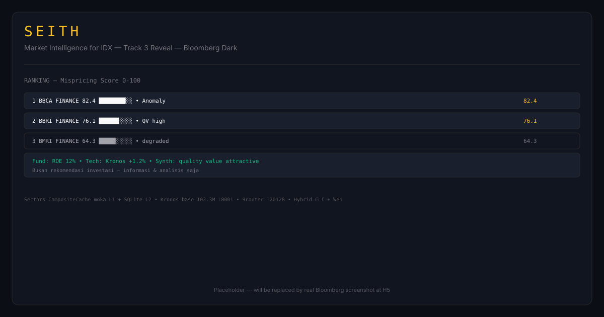

# SEITH — Market Intelligence for IDX

> **Track 3 Reveal — Sectors Hackathon 2026.** Derived insight only: **Mispricing Score 0-100 + Anomaly Rank + Comparative Dossier 1-page.** Raw display = FAIL.

[](https://github.com/kazanaruishere-max/SEITH-MARKET-IDX/actions/workflows/ci.yml)
[](https://github.com/kazanaruishere-max/SEITH-MARKET-IDX/actions/workflows/freeze-check.yml)
[](LICENSE)
[](https://hackathon.sectors.app/tracks/market-intelligence)
[](docs/api-spec.md)
[](Cargo.toml)
[](docs/kronos-notes.md)
[](docs/adr/0001-stack.md)

[🇬🇧 English](#english) | [🇮🇩 Indonesia](#indonesia)



---

<a id="english"></a>
## 🇬🇧 English

### Table of Contents
1. [What is SEITH?](#what-is-seith) · 2. [Why SEITH Wins Track 3](#why-seith-wins-track-3) · 3. [Architecture](#architecture) · 4. [Pipeline — Intelligence Loop](#pipeline--intelligence-loop) · 5. [Tech Stack](#tech-stack) · 6. [Market — IDX & STI](#market--idx--sti) · 7. [Quick Start](#quick-start) · 8. [Security](#security) · 9. [Workflow — Handoff & Branch](#workflow--handoff--branch) · 10. [Judging & Video](#judging--video) · 11. [Roadmap H1–H6](#roadmap-h1h6) · 12. [Contributing & License](#contributing--license)

### What is SEITH?

**One-sentence problem:** Retail and junior analysts on IDX struggle to distinguish cheap quality from value traps because generic Screens only show raw data without explainable scores and sector comparison.

**Personas:**
- **Rina — Retail 26, <50jt:** needs a daily ranking she can understand in 60 seconds, not a raw PE/PB table. Job: pick 5 quality candidates quickly.
- **Budi — Junior Analyst 29:** needs a peer-comparative dossier + anomaly flag for the morning briefing. Job: justify a pick with evidence.
- **Non-persona:** day trader needing auto-execution (prohibited on all tracks — SEITH is information & analysis only).

**Vision:** SEITH turns raw Sectors data into **derived insight usable today**: explainable mispricing score, sector-aware ranking, anomaly flag, and 1-page dossier per ticker. Remove Sectors = product dies (core source).

### Why SEITH Wins Track 3

Track 3 `Reveal` rule: **What must be true = derived insight** (`hackathon.sectors.app/tracks/market-intelligence`). Raw display, however beautiful, does **not qualify**.

| Qualifier (must have ≥1) | SEITH answer | FAIL if absent |
|---|---|---|
| Signals / scores | **Mispricing Score 0-100** — `0.30*ER(Kronos) + 0.20*(100-|Z|) + 0.30*QV(Sectors) + 0.20*SectorMom`, breakdown explainable | Only PE/PB |
| Rankings | **IDX Anomaly Rank** — market-wide & per-sector | Sort by PE only |
| Screener custom logic | Filter + rank with team logic, not `PE>10` generic | Generic BEI screener |
| Anomaly detection | Flag `|Z|>2` + volume spike `>2σ` without catalyst + `reason` | Flag without reason |
| Comparative analysis | Peer 5 + sector median per `market` (`id` vs `sg` separated) | Solo ticker |
| Synthesized research | **Dossier 1-page:** breakdown + peer + Kronos chart + 3-agent memo (Fund/Tech/Synth → 9router) | Chart only |

### Architecture

```mermaid
flowchart LR
  S[Sectors REST/MCP<br/>1000 credits<br/>CompositeCache] --> N[Normalize & Cleansing<br/>Rust seith-core]
  N --> K[Kronos-base :8001<br/>predict_batch 400→20<br/>T1.0 top_p0.9]
  K --> SC[Scoring 0-100<br/>Rust 30/20/30/20]
  SC --> R[Ranking + Flag<br/>|Z|>2]
  R --> A[Agents Lite :8002<br/>Fund/Tech/Synth<br/>→ 9router :20128]
  A --> D[Dossier 1-page<br/>JSON → PDF]
  D --> H[Hybrid Delivery<br/>Axum /api/v1 + seith-cli + Next.js]
```

*Whitepaper:* [`2508.02739v1.pdf`](2508.02739v1.pdf) (AAAI 2026, hierarchical K-line tokenizer) distilled in [`docs/kronos-notes.md`](docs/kronos-notes.md).

### Pipeline — Intelligence Loop

**`analisa → signal` alone FAILS 40% usability.** SEITH locks the 8-gate loop:

| Gate | Component | Key detail |
|---|---|---|
| 1 | **Sectors Batch+CompositeCache** | `moka` L1 `<1ms` hot + `SQLite` L2 `data/seith.db` `~2ms` persistent, key `market:sector:ticker:date`, `24h` raw / `1h` ranking, batched per sector. **Redis 30MB rejected** (IDX raw ~45MB, ADR 0001). |
| 2 | **Normalize & Cleansing** | `open/high/low/close` required → exclude + `excluded:[{ticker,reason}]`; `volume/amount` missing → `0.0`; ratios (`ROE/margin/leverage/PE/PB`) missing → sector median per market + `insufficient_data:true`; `lookback>512 → 422` (Kronos `max_context 512`). |
| 3 | **Kronos-base Sidecar** | `Python uv` `:8001` `POST /predict_batch` (102.3M, `NeoQuasar/Kronos-base` + `Tokenizer-base`), equal `lookback/pred_len` guard, `30s` timeout retry 1 → fallback `degraded:true`. |
| 4 | **Scoring Engine** | `Mispricing 0-100`, clamp, store 4 components for `BarStack` breakdown. |
| 5 | **Ranking + Flag** | Sort `mispricing` desc; flag `|Z|>2` or `volume>2σ`. |
| 6 | **TradingAgents-Lite** | `Python uv` `:8002` `POST /synthesize` — **copy workflow** 3-agent (Fund/Tech/Synth) from `TauricResearch/TradingAgents`, `Sectors` adapter (not Yahoo), no Trader execution, via **9router** `:20128/v1`. Only Top-N (save LLM). |
| 7 | **Dossier** | `score breakdown + peerComparison + kronos chartPoints + research memo` → `JSON` → `PDF` web. |
| 8 | **Hybrid Delivery** | `Axum /api/v1/*` envelope + `seith-cli` (`clap`) + `Next.js 14` consumer — same contract. |

Integration via **REST sidecar** (not PyO3/maturin) — avoids `GIL+Tokio` clash, lets 2 terminals parallel (`T1 Rust` + `T2 Python`), easy mock.

### Tech Stack

| Layer | Stack | Framework |
|---|---|---|
| Core | Rust edition 2021 | `Axum + Tokio`, `serde`, `validator`, `chrono`, `reqwest`, `moka`, `thiserror/anyhow`, `tracing`, `tower-http` |
| Cache | **Composite** | `moka` L1 + `SQLite` L2 (`data/seith.db`) — `trait Cache`, **Redis 30MB rejected**, Supabase `defer H5` |
| CLI | Rust | `clap` — `seith ranking`, `seith dossier`, `seith scan` |
| Quant sidecar | Python `uv` | `FastAPI + Uvicorn`, `torch`, `Kronos-base` (`apps/kronos-sidecar :8001`) |
| Research sidecar | Python `uv` | `FastAPI`, `LangGraph-inspired`, `httpx → 9router` (`apps/analysis :8002`) |
| LLM | **9router** | `http://localhost:20128/v1/chat/completions` (OpenAI-compatible), `Tier-0 NEVER kill` |
| Web | Next.js 14 | `App Router + TS + Tailwind + shadcn`, `Zod` (FE), `recharts` + `react-to-pdf` |
| Test | Rust+Python+FE | `cargo test+mockito+rusqlite`, `uv pytest+ruff`, `pnpm test` |

Design: **Bloomberg dark** (`#0B0E14` + `JetBrains Mono` numbers) — skill `design-taste-frontend` enforced at H5.

### Market — IDX & STI

| Market | Sectors endpoint | Default | Flag |
|---|---|---|---|
| **IDX** (primary) | `v2/indonesia/transaction/daily` | `market=id` (900 tickers) | `?market=id` / `MARKET=id` |
| **STI** (stretch H5) | `v2/singapore/transaction/daily` | optional | `?market=sg` / `--market sg` |

`sectors-client` `enum Market { Id, Sg }` — `as_str()` + `base_path()`. STI not default: saves 1000 credits, avoids `QV sector median` noise. `seith ranking --market sg --sector FINANCE` vs `GET /api/v1/ranking?market=sg&sector=FINANCE`.

### Quick Start

```powershell
# 0) Clone (submodules depth 1, 19 Aug–30 Sep valid)
git clone --recurse-submodules --depth 1 https://github.com/kazanaruishere-max/SEITH-MARKET-IDX.git
cd SEITH-MARKET-IDX

# 1) Env (server-only, never to client/log) — revoked key 0843… on 2026-09-05
Copy-Item .env.example .env
# edit .env: SECTORS_API_KEY=...  MARKET=id  LLM_BASE_URL=http://localhost:20128/v1

# 2) Rust — contracts + scoring + CLI (verifiable)
cargo check
cargo fmt --check
cargo clippy -- -D warnings
cargo test -- --nocapture
cargo run -p seith-cli -- ranking --sector FINANCE --market id
cargo run -p seith-cli -- ranking --market sg --sector FINANCE
cargo run -p seith-cli -- dossier BBCA --market id --pdf
cargo run -p seith-cli -- scan --tickers BBCA,BMRI,BBRI --market id --json

# 3) Quant sidecar :8001 (Python uv, isolated venv)
#   workdir apps/kronos-sidecar — do NOT uv sync from root
uv sync
uv run ruff check .
uv run pytest -q
#   run: uv run uvicorn main:app --port 8001

# 4) Research sidecar :8002 → 9router :20128
#   workdir apps/analysis
uv sync
uv run pytest -q
#   run: uv run uvicorn main:app --port 8002
.\scripts\check-9router.ps1  # must 200 before dossier

# 5) Web :3000 (Bloomberg dark)
pnpm --dir apps/web install
pnpm --dir apps/web lint
pnpm --dir apps/web typecheck
pnpm --dir apps/web dev      # http://localhost:3000

# 6) Cache + market check
#   data/seith.db auto-creates (migrations/001_cache.sql)
#   check L2: sqlite3 data/seith.db "SELECT count(*) FROM ohlcv;"
```

> **Gotcha:** `uv sync --project X` from root pours into root `.venv` (WRONG) — always set workdir to sidecar. `cargo test` from sub-crate without workspace → wrong resolve — use `-p`.

### Security

3-layer anti-leak (key `0843…ff004` **revoked 2026-09-05**):

1. **Pre-commit local:** `.pre-commit-config.yaml` + `.gitleaks.toml` + `.githooks/pre-commit` (`grep SECTORS_API_KEY=…{10,}` + `cargo fmt --check`) + `scripts/install-hooks.ps1` (`git config core.hooksPath .githooks`).
2. **CI remote:** `ci.yml` `permissions: contents:read` + `rustsec/audit-check` + `freeze-check.yml` `gitleaks-action@v2` + fallback `grep` + `dependabot.yml` weekly.
3. **Runtime:** `crates/seith-core/src/config.rs` (`AppConfig::from_env()` fail-fast) + `redact.rs` (`Redacted<T>`, `sanitize_error()` — never echo key to log/envelope).

See [`SECURITY.md`](SECURITY.md) + [`CONTRIBUTING.md`](CONTRIBUTING.md).

### Workflow — Handoff & Branch

**Founder model 2–3 terminals (T0 Otak, T1/T2 Tangan, PM `seith-pm` autonomous):**

```
main (protected, no direct push) ← only Lead squash-merge after seith-phase-gate
 └─ handoff/NN-topic (1 phase = 1 branch, short-lived, from main)
     ├─ handoff/NN-topic/t1-<subtask>  (optional, parallel file-disjoint)
     └─ handoff/NN-topic/t2-<subtask>
test/<topic> (ephemeral chaos/load)   chore/docs/fix/* (via PR)
```

- **Default:** `git worktree add ../seith-wt/handoff-01 -b handoff/01-sectors-adapter` → `Implement (TDD)` → `cargo fmt --check && cargo clippy -- -D warnings && cargo test` → `rust-reviewer ∥ security-reviewer` → Lead squash → remove worktree.
- **Skill:** `git-worktree-manager` for worktree lifecycle.
- **Every execution = branch.** Direct `main` push blocked (branch protection `enforce_admins:true`, 6 checks `rust/audit/python-kronos/python-analysis/web/freeze`, 1 review). PM veto if `Accountability Block` missing or notes `00-readme.md` not read (ritual 3 questions).

### Judging & Video

| Criterion | Weight | SEITH answer |
|---|---|---|
| Real-world usability | **40%** | `60s` ranking → dossier + CLI verifiable, no manual needed |
| Video storytelling | **30%** | `teaser 1m` (screen recording CLI+Web working) + `judging 3m` (problem → audience → workflow end-to-end), async `1–8 Oct` |
| Technical depth | **30%** | `Sectors core` (remove = dies), Kronos-base `102M` batch + custom scoring Rust + CompositeCache 100% gratis + 9router — verifiable `cargo` |

**Submit freeze:** `Build 19 Aug–30 Sep 23:59 WIB` → attach public repo + 1m teaser + ≤3m judging video + 1-sentence problem + track + team + social post. Freeze check: `scripts/freeze-check.sh`.

### Roadmap H1–H6

| Handoff | Focus | Branch | Gate |
|---|---|---|---|
| **H1** | `sectors-client` CompositeCache + Market enum + cleansing | `handoff/01-sectors-adapter` | `Cache` trait `cargo test` |
| **H2** | `kronos-sidecar :8001` `predict_batch 400→20` | `handoff/02-kronos` | `max_context 512` + `degraded` |
| **H3** | `analysis :8002` copy workflow Fund/Tech/Synth → 9router | `handoff/03-agents` | `mock 9router` |
| **H4** | `scoring-engine` Mispricing `30/20/30/20` + Ranking | `handoff/04-scoring` | breakdown + flag |
| **H5** | `Axum + seith-cli + Next.js` Bloomberg (`design-taste-frontend` + `recharts` + `react-to-pdf`) | `handoff/05-product` | `taste audit` |
| **H6** | **Freeze Kit** — repo public check + teaser 1m + judging 3m + `freeze-check.sh` | `handoff/06-freeze` | `security-reviewer` mandatory |

### Contributing & License

> **Source-available, NOT community** until founder opens. All collaborations (PR/issue) closed until explicit open. See [`LICENSE`](LICENSE) + [`CONTRIBUTING.md`](CONTRIBUTING.md).

- Vendor pinned: `vendor/Kronos` `67b630e` (MIT) + `vendor/TradingAgents` `9dee508` (Apache-2.0) — `git submodule --depth 1` read-only (ADR 0002, `scripts/update-vendor.ps1`). Weights via HF `NeoQuasar/*`, not in vendor.
- Clone correctly: `git clone --recurse-submodules --depth 1 <url>` (see `vendor/README.md`).
- **Disclaimer:** `Bukan rekomendasi investasi — informasi & analisis saja.` on every insight view.

---

<a id="indonesia"></a>
## 🇮🇩 Indonesia

> **Track 3 Reveal — Sektors Hackathon 2026.** Hanya insight derivatif: **Skor Mispricing 0-100 + Ranking Anomali + Dossier 1 halaman.** Display mentah = GAGAL.

*Untuk semua detail pipeline, arsitektur, tech stack, market, dan security — lihat bagian English di atas (1 SSOT). Bagian Indonesia di bawah adalah narasi pendamping dengan proporsi sama; command tetap mengikuti English untuk mencegah drift.*

### Apa itu SEITH?

**Masalah satu kalimat:** Retail dan analis junior IDX sulit membedakan saham murah yang berkualitas vs value trap karena screener generik hanya menampilkan data mentah tanpa skor explainable dan komparasi sektor.

**Persona:**
- **Rina — Retail 26, <50jt:** butuh ranking harian yang paham dalam 60 detik, bukan tabel raw PE/PB. Job: pilih 5 kandidat berkualitas cepat.
- **Budi — Analyst Junior 29:** butuh dossier komparasi peer + flag anomali untuk briefing pagi. Job: justify pick dengan evidence.
- **Non-persona:** trader butuh auto-execution (dilarang semua track — SEITH hanya informasi & analisis).

**Visi:** SEITH mengubah data mentah Sectors menjadi **insight derivatif yang bisa dipakai hari ini**: skor mispricing explainable, ranking sektor-aware, flag anomali, dan dossier 1 halaman per emiten. Cabut Sectors = produk mati (core source).

### Kenapa SEITH Menang Track 3

Aturan Track 3 `Reveal`: **Harus ada derived insight.** Display ulang, secantik apa pun, **tidak lolos** (lihat [Market Intelligence](https://hackathon.sectors.app/tracks/market-intelligence)).

| Kualifikasi (≥1) | Jawaban SEITH | GAGAL jika absen |
|---|---|---|
| Signal / skor | **Skor Mispricing 0-100** — `0.30*ER(Kronos) + 0.20*(100-|Z|) + 0.30*QV(Sectors) + 0.20*SectorMom` explainable | Hanya PE/PB |
| Ranking | **Ranking Anomali IDX** — cross-sector & intra-sector | Sort PE saja |
| Screener custom | Filter + ranking logika tim, bukan `PE>10` generik | Screener generik BEI |
| Deteksi anomali | Flag `|Z|>2` + spike volume `>2σ` tanpa katalis + `reason` | Flag tanpa alasan |
| Analisis komparatif | Peer 5 + median sektor per `market` (`id` vs `sg` terpisah) | Solo ticker |
| Riset tersintesis | **Dossier 1 halaman:** breakdown + peer + chart Kronos + memo 3-agent (Fund/Tech/Synth → 9router) | Hanya chart |

### Arsitektur & Pipeline

*Lihat diagram Mermaid di bagian English — 1:1 sama.* Ringkas 8 gerbang: `Sectors Batch+CompositeCache (moka L1 + SQLite L2, market=id) → Cleansing Gate (volume→0, rasio→median, lookback>512→422) → Kronos-base :8001 predict_batch 400→20 → Scoring 0-100 (30/20/30/20) → Ranking → Agents Lite :8002 → 9router :20128 → Dossier 1 halaman → Hybrid CLI+Web`. Integrasi via **REST sidecar** (bukan PyO3) — dua terminal bisa paralel `T1 Rust` + `T2 Python`.

### Tech Stack & Market

*Stack terkunci:* Rust (`Axum+Tokio`, `clap`), `CompositeCache` `moka` L1 + `SQLite` L2 `data/seith.db` (**Redis 30MB ditolak**, ADR 0001), `9router` `:20128` (OpenAI-compatible, `Tier-0 NEVER kill`), Next.js 14 (`recharts` + `react-to-pdf`, Bloomberg dark `#0B0E14`).

*Market:* **IDX primary** (`v2/indonesia/transaction/daily`, default `market=id`) dan **STI** via flag `?market=sg` / `--market sg` (`v2/singapore/transaction/daily`) — `enum Market {Id,Sg}` terpisah agar median sektor tidak noise (stretch H5, hemat 1000 credits).

### Quick Start — Lihat English di Atas

> **ID cukup link ke EN untuk mencegah drift command.** Ikuti [Quick Start (English)](#quick-start) — copy-paste command sama: `cargo run -p seith-cli -- ranking --market sg --sector FINANCE`, `.env` (`SECTORS_API_KEY` server-only), `uv sync` di `apps/kronos-sidecar` & `apps/analysis`, `pnpm --dir apps/web dev`, cek `sqlite3 data/seith.db` + `Invoke-WebRequest http://localhost:20128/v1/models`.

### Keamanan & Workflow

**Keamanan 3 lapis:** 1) Pre-commit lokal (`.pre-commit-config.yaml` + `.gitleaks.toml` + `.githooks/pre-commit`), 2) CI (`ci.yml` `audit` + `freeze-check.yml` `gitleaks` + `dependabot`), 3) Runtime (`crates/seith-core/src/config.rs` + `redact.rs` — tidak pernah echo key ke log). Key `0843…ff004` **sudah revoke 05 Sep 2026** — lihat [`SECURITY.md`](SECURITY.md).

**Workflow:** Setiap eksekusi = branch `handoff/NN-topic` via `git worktree add ../seith-wt/handoff-NN -b handoff/NN-topic` (AGENTS §8b), PM `seith-pm` autonomous + veto merge jika gate fail (AGENTS §1a). No direct push ke `main` (protected, 6 checks + 1 review).

### Penilaian & Video + Roadmap

*Penilaian* `40% Usability + 30% Video (teaser 1m + judging 3m) + 30% Tech Depth` — lihat [Judging & Video](#judging--video). *Roadmap* `H1 sectors-client → H2 Kronos → H3 Agents → H4 Scoring → H5 Hybrid Dossier → H6 Freeze Kit` — lihat [Roadmap H1–H6](#roadmap-h1h6). *Freeze* `19 Aug–30 Sep 23:59 WIB` + `scripts/freeze-check.sh`.

### Kontribusi & Lisensi

> **Source-available, BUKAN community** sampai founder membuka. Lihat [`LICENSE`](LICENSE) + [`CONTRIBUTING.md`](CONTRIBUTING.md). Vendor ter-pin `67b630e` + `9dee508` via `git submodule --depth 1` — bobot via `NeoQuasar/*` HF.

Clone: `git clone --recurse-submodules --depth 1 https://github.com/kazanaruishere-max/SEITH-MARKET-IDX.git`

**Disclaimer:** `Bukan rekomendasi investasi — informasi & analisis saja.` di setiap insight view.

---

*Built for Sectors Hackathon 2026 — Find the signal. Build what markets need next.*
