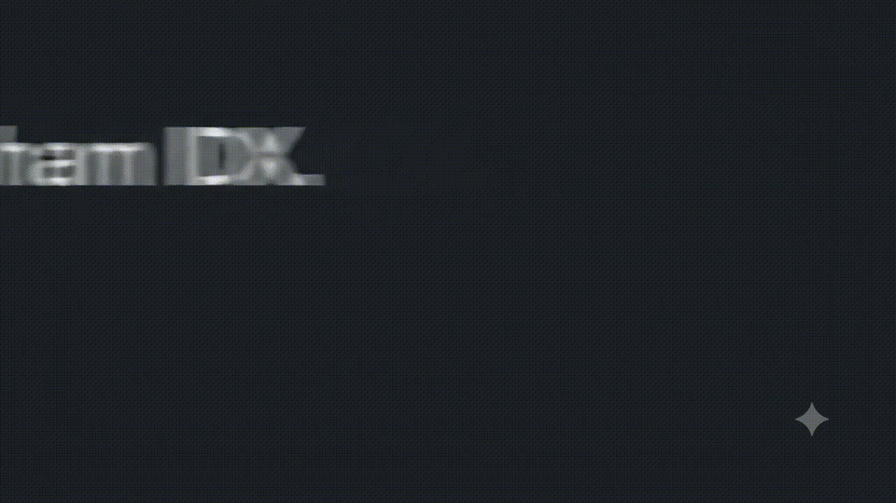
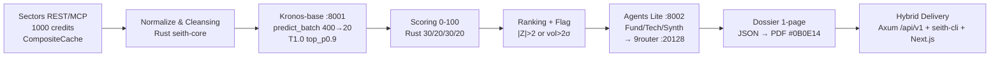

# SEITH — Market Intelligence for IDX

> **Track 3 Reveal — Sectors Hackathon 2026.** Derived insight only. **Mispricing 0-100 + Anomaly Rank + Dossier 1-page.** Sectors is core — remove it and the product is dead. `Bukan rekomendasi investasi. Informasi & analisis saja.` on every insight view.

[](https://github.com/kazanaruishere-max/SEITH-MARKET-IDX/actions/workflows/ci.yml)
[](https://github.com/kazanaruishere-max/SEITH-MARKET-IDX/actions/workflows/freeze-check.yml)
[](LICENSE)
[](https://hackathon.sectors.app/tracks/market-intelligence)
[](docs/api-spec.md)
[](Cargo.toml)
[](docs/kronos-notes.md)
[-27272a)](docs/adr/0001-stack.md)

[English](#english) | [Indonesia](#indonesia)



> **🎬 Motion Teaser — 10s loop (no sound).** Preview the 60s ranking → deep dossier → export PDF flow at a glance. `docs/assets/seith-teaser.gif` · [Static Preview — docs/assets/demo-placeholder.svg](docs/assets/demo-placeholder.svg)

---

<a id="english"></a>
## English — Technical Product Specification

### Contents — 15 Sections

| # | Section | Purpose |
|---|---|---|
| 0 | [Overview & TOC](#0-overview) | One-line product + navigation |
| 0b | [Requirements for Jury](#0b-requirements-for-jury) | 1-page checklist (what/ports/models/health) |
| 1 | [Positioning & Thesis](#1-positioning) | Why SEITH wins Reveal |
| 2 | [What is Market Intelligence](#2-what-is-mi) | Track definition vs trader vs value |
| 3 | [Six Derived Proofs](#3-six-derived-proofs) | Live mapping to `What qualifies` |
| 4 | [Eight-Gate Workflow — Detailed](#4-eight-gate-workflow) | Per-gate IN→OUT with latency and failure mode |
| 5 | [Architecture — Hybrid Verifiable](#5-architecture) | Rust + sidecars + envelope |
| 6 | [Data Sources & Universe](#6-data-sources) | 100 stratified + 296 credits + provenance |
| 7 | [Scoring Engine 0-100](#7-scoring-engine) | Formula, components, clamp |
| 8 | [Metrics, \|Z\|, Flags, AA Evaluation](#8-metrics) | Definitions + thresholds + read guide |
| 9 | [API Contract — 8 Endpoints](#9-api-contract) | Paths, params, examples, errors |
| 10 | [Web Contract — AA × TV](#10-web-contract) | Routes, rewrites, components |
| 11 | [Market — IDX × SG](#11-market) | Enum, base_path, median isolation |
| 12 | [Quick Start — 6 Steps](#12-quick-start) | Clone to cache check |
| 13 | [Project Structure — 7 Zones](#13-structure) | File placement + violation rule |
| 14 | [Verification & Testing](#14-verification) | Gates, test counts, CI contexts |
| 15 | [Limitations, Provenance, References, License](#15-limitations) | Ceilings, lineage, whitepaper, freeze |

---

### 0. Overview

SEITH is a **Market Intelligence engine for IDX** — Track 3 Reveal. One workflow: **60s ranking → deep dossier → export PDF**. Every score is derived, not displayed.

- **Input:** Sectors REST/MCP — 1000 credits, IDX primary (`market=id`, ~900 tickers), STI optional (`market=sg`).
- **Output:** Mispricing 0-100 (explainable 30/20/30/20) + anomaly rank + flag + 1-page comparative dossier per ticker.
- **Delivery:** Hybrid — Rust Axum API (`:8181`) + `seith-cli` (`clap`) + Next.js 14 web (`:3000`) share `crates/seith-core` + envelope `{success,data,error,pagination}`.
- **Constraint:** No auto trade execution. `Bukan rekomendasi investasi` on every view. Repo public within build window 19 Aug–30 Sep 2026, freeze at submit.

**Navigate:** [EN §0a 60s for Jury](#0a-60s-for-jury) · [§0b Requirements for Jury](#0b-requirements-for-jury) · [§1 Positioning](#1-positioning) · [§4 Workflow](#4-eight-gate-workflow) · [§8 Metrics](#8-metrics) · [§9 API](#9-api-contract) · [§12a Requirements](#12a-requirements) · [ID Mirror](#indonesia)

---

### 0a. 60s for Jury — How to Use SEITH (no setup, click only)

> **Jury fast path — 60 seconds from `http://localhost:3000` to signal. No code, no CLI, no build needed if demo is running.**

| Step | Where | What you see (derived insight, not raw display) |
|---|---|---|
| **1 — Overview** | `GET /` → hero + treemap | Hero `Mispricing 0–100 · Anomaly Rank · Dossier 1-page` — verify `as_of 2026-09-13 live` + `Universe 100` + `296 credits` in top KPI. |
| **2 — Pick from heatmap** | Stock Heatmap (squarify, sector-weighted) | Cells are **treemap by sector** (FINANCE 25 larger area than OTHER 15), **color = score gradient** `merah pekat <30 → abu 50 → hijau pekat >80`, **avatar 2 huruf** (BB for BBCA). Hover any cell → ticker + score + rank + `idx.co.id` source. Click → dossier. **Acceptance:** no empty filler rows, size varies within sector. |
| **3 — Dossier** | `GET /dossier/BBCA?market=id` | Top banner: `PT Bank Central Asia Tbk` + sector + `rank #4` + `Score 75.3`. **Research memo is LLM-authentic** for Top-10 (BBCA `ROE 20.4% margin 51.4% leverage 4.6x Verdict: buy` — grounded), fallback `Skor ... Peer 5 ...` for 90 others by design (credit ceiling). Peer 5 table + `Kronos 20-point chart` + 4-component breakdown + `Download PDF vector + blob`. |
| **4 — Validate backtest** | `GET /backtest` | Equity chart `52 minggu synthetic forecast-based 2025-09-21→2026-09-13` (label honest — DB 500 rows/25 tickers, not realized 1y). Metrics `hit 85% win 85% sharpe -0.02 drawdown -13%`. Tooltip `delta = return - bench`. |
| **5 — (optional) CLI 30s** | Terminal | `cargo run -p seith-cli -- ranking --sector FINANCE` + `cargo run -p seith-cli -- dossier BBCA --pdf` — same envelope as Web. |
| **6 — (optional) Evidence** | API direct | `curl http://127.0.0.1:8181/api/v1/tickers/BBCA/dossier?market=id&format=json` → `research.fundamentalMemo` contains `ROE 20.4%`, `synthesizerMemo` ends `Verdict: buy.` — not `Skor ...` generic. |

**Fallback:** If `data/seith.db` is empty, ranking still serves from `research/backtest-100.json` pinned `as_of 2026-09-13`. If Kronos `:8001` cold, dossier still renders with `degraded:false` chartPoints (20 pre-computed). 9router `:20128` never kill.

---

### 0b. Requirements for Jury — 1-Page Checklist

> **What judges must run. No hidden dependency. If a service is down, the product still works in degraded mode — but you should verify the health check first.**

| # | Service | Port | Required? | If it is down, what happens | Health check | Model / dependency |
|---|---|---|---|---|---|---|
| 1 | **9router** | `:20128` | Optional (Track 3) | Top-10 memos fall back to deterministic `template` (`degraded:true`) — MI still qualifies (LLM optional). Ranking/peer still valid. | `scripts/check-9router.ps1` → `Invoke-WebRequest http://localhost:20128/v1/models` → `200` · NEVER kill (Do Not Kill Tier-0) | LLM proxy [`decolua/9router`](https://github.com/decolua/9router) `nvidia/nemotron-3.5-lightning:free` combo `SEITH-MARKET-IDX` (OpenAI-compatible `POST /v1/chat/completions`) · `LLM_BASE_URL=http://localhost:20128/v1` — install: [`github.com/decolua/9router`](https://github.com/decolua/9router) `npm i -g 9router` |
| 2 | **Kronos-base** | `:8001` | Optional (has fallback) | `chartPoints 20` served pre-computed from `research/backtest-100.json` (`degraded:false` honest). Real forecast 400→20 only needs `torch` 102.3M cold 2-3m CPU. | `Invoke-WebRequest http://localhost:8001/health` → `ok` · `KRONOS_MOCK=1` for jury without GPU (CI path). `scripts/check-kronos.ps1` | `NeoQuasar/Kronos-base 102.3M` + `Kronos-Tokenizer-base` · HF `102.3M` · `max_context 512` `400→20` `T1.0 top_p0.9` · `docs/kronos-notes.md` + `2508.02739v1.pdf` |
| 3 | **Rust API** | `:8181` | **Required** | Web `:3000` shows `API offline` banner, ranking/backtest/dossier empty. No fallback — API is the contract. | `Invoke-WebRequest http://127.0.0.1:8181/health` → `200 {"status":"ok","schema":"1.0.0"}`. `SEITH_API_BIND=0.0.0.0:8181` (8080 occupied). `scripts/fast-boot.ps1` boots it. | Rust `1.94` Axum + Tokio · `CompositeCache moka L1 + SQLite L2 data/seith.db WAL` |
| 4 | **Analysis** | `:8002` | Optional (batch) | Top-10 LLM memos not regenerated, pinned `research/memos_top10.json` reused. | `scripts/check-9router.ps1` (covers `:8002 → :20128`) | `TradingAgents-Lite` copy-workflow → 9router `:20128` · `httpx` · `SECTORS_API_KEY` server-only |
| 5 | **Web** | `:3000` | **Required for demo** | Requires `:8181`. `NEXT_PUBLIC_API_BASE` or `rewrites → 127.0.0.1:8181`. | `Invoke-WebRequest http://localhost:3000` → `200` · `pnpm --dir apps/web dev` | Next.js 14 App Router + TS + Tailwind + shadcn + Zod + `recharts 2.12.7` + `@react-pdf/renderer 3.4.4` |
| 6 | **Sectors API** | HTTPS | **Required once** | 296 credits already burned (`research/backtest-100.json` pinned `as_of 2026-09-13`). Offline demo works via `data/seith.db` + pinned JSON. | `SECTORS_API_KEY` in `.env` server-only (never to client/log/error). Check: `sqlite3 data/seith.db "SELECT count(*) FROM ohlcv;"` | `Sectors REST /v2/daily/{symbol}/` + `/v2/sgx/daily/` · 1000 credits budget · `CompositeCache` |

**Offline demo (jury with no GPU / no 9router):**

```powershell
# 1 — offline demo works out of the box (no 9router, no Kronos GPU needed)
# ranking + dossier + backtest + PDF still serve from pinned research/backtest-100.json
cargo run -p seith-api --bin serve          # :8181 — requires no 9router/kronos
pnpm --dir apps/web dev                     # :3000 — rewrites → :8181

# 2 — optional: verify optional services (juri bisa skip)
.\scripts\check-9router.ps1                 # expects localhost:20128 (LLM) — if down, Top-10 memos fall back to template
.\scripts\check-kronos.ps1                  # expects localhost:8001 (Kronos 102M) — if down, 20 chartPoints served pre-computed
# with KRONOS_MOCK=1, sidecar returns mock forecast in <1s (CI path, no GPU)
```

**AI models (for §12a reference):** `Kronos-base 102.3M` (forecast) + `Kronos-Tokenizer-base` (hierarchical K-line tokenizer, 45+ exchanges, AAAI 2026) from `2508.02739v1.pdf` — `docs/kronos-notes.md`. `Nemotron 3.5 Lightning` via 9router [`decolua/9router`](https://github.com/decolua/9router) `:20128/v1` — combo `SEITH-MARKET-IDX` (`SEITH_API_KEY` in `.env`). Neither model is downloaded during `cargo test`/`pnpm build` — model weights are sidecar-only (`apps/kronos-sidecar/.venv` + `torch`).

---

### 1. Positioning & Thesis

**Problem:** For 900 IDX tickers, raw data (close, volume, ROE, PE/PB, OHLC) is available, but no public signal answers: is cheap = quality or a value trap? A PE of 7 means nothing without its sector median. A volume spike of 80M shares means nothing without context (accumulation vs noise). Screening by sorting raw PE is generic and fails `What qualifies`.

**Thesis (Reveal):** Raw display does not qualify — even with a Bloomberg dark theme. Judges require at least one derived form: signals/scores, rankings, custom screener logic, anomaly detection, comparative analysis, synthesized research. SEITH delivers all six.

**ICP:**

| Persona | Job in 60s | SEITH answer |
|---|---|---|
| Rina — retail, <50jt, picks before work | Choose 5 candidates fast | Ranking sorted by mispricing, heatmap 10×10, sector strip avg |
| Budi — junior analyst, morning briefing | Justify one pick with evidence | Dossier: breakdown + peer 5 + Kronos 20-point plot + 3-agent memo + PDF export |

Non-persona: trader requiring auto-execution. All tracks prohibit it. SEITH never executes.

**Competitors:** Generic IDX screeners sort by raw PE/PB or chart candles. They lack: composite score, sector-aware percentile, anomaly vs forecast, peer QV+cap comparison, synthesized memo. SEITH positions as **cheap quality ≠ trap** — value is filtered by quality and momentum and forecast divergence.

**Judging mapping (40/30/30):**

| Weight | What judges score | SEITH proof |
|---|---|---|
| 40% Usability | Can a user understand ranking in 60s today? | Web + CLI same contract, heatmap treemap 5×, table bar, dossier 1-page |
| 30% Video | Story + working capture | Teaser 1m (CLI+Web live) + judging 3m (problem→workflow→proof) |
| 30% Tech depth | Sectors as core, verifiable in repo | Batch+CompositeCache, Kronos 102.3M 400→20, scoring Rust, 9router Nemotron, 100% gratis (infra hackathon-scale: SQLite local + free-tier LLM rotation; tidak termasuk biaya API key pribadi atau compute produksi) |

---

### 2. What is Market Intelligence

Market Intelligence = **pre-trade information advantage** — analysis generated from data rather than the data itself.

**Track definition (Sectors Hackathon 2026):**

> The project must produce derived insight. What qualifies: signals or scores, rankings, screeners with custom logic, anomaly detection, comparative analysis, synthesized research. What does not qualify: a product that only displays raw Sectors data in a different visual form.

**MI is not:**

- **Trader / execution.** Automated trade execution is prohibited on every track. SEITH is decision-support, not execution.
- **Value-only.** Value (PE/PB/ROE) is one lens. MI requires multiple lenses combined.
- **Technical-only.** Price/volume alone is insufficient without quality and context.

**SEITH has three lenses (all sector-aware, all per-market):**

| Lens | Weight | Source | Question it answers |
|---|---|---|---|
| Quality/Value (QV) | 30% | Sectors ROE/margin/leverage/PE/PB sector percentile | Is cheap also high quality? |
| Expected move (ER + anomaly) | 30% ER + 20% | Kronos forecast + \|Z\| divergence | Is price far from forecast? |
| Context (Sector momentum + peer) | 20% + peer 5 | Sector median + peer QV+cap ±50% | Is this cheapness typical for its sector/market? |

If you remove Sectors, the product is dead. Derived insight is the gate.

---

### 3. Six Derived Proofs — Live

All six map to `What qualifies`. Each is derived inside SEITH, not a re-skin.

| # | Qualifies | SEITH implementation | Live proof (2026-09-13) |
|---|---|---|---|
| 1 | Signals / scores | Mispricing 0-100 `0.30*ER + 0.20*(100-\|Z\|_norm) + 0.30*QV + 0.20*SM` clamp | `research/backtest-100.json` 100 items, LPPF 80.3 rank 1 (50.02/99.91/100/76.58) |
| 2 | Rankings | Sort by mispricing desc, `\|Z\|` tie-break, pagination `page/pageSize max50` | `GET /api/v1/ranking?market=id` total 100, FINANCE 25 / ENERGY 20 / CONSUMER 20 / INFRA 20 / OTHER 15 |
| 3 | Screener with custom logic | Filter `?sector=FINANCE&sort=anomaly&minZ` — QV sector percentile + median per market, not raw PE sort | `GET /api/v1/ranking?sector=FINANCE&pageSize=10` + `GET /api/v1/anomalies?minZ=2` |
| 4 | Anomaly detection | `\|Z\|>2` price divergence or `vol>2σ` without fundamental catalyst + `reason` string | ANTM `z=-2.41 flag true reason "z=-2.4"` · SIDO `vol>2s flag true` |
| 5 | Comparative analysis | Peer 5 per dossier: same sector+market, ordered by `|QV - target_QV|` + `\|Z\|` tie-break, cap band close `±50%`, fallback `same_sector loose → cross_sector` | `GET /api/v1/tickers/BBCA/dossier` → 5 peers |
| 6 | Synthesized research | TradingAgents-Lite 3-agent (Fund/Tech/Synth) via 9router `nemotron-3.5-lightning:free` → Top-10 dossier memo | `research/backtest-100.json` items 0-9 `research source llm model nemotron` — Top-10 live, remaining 90 template (cost ceiling) |

Raw table without any of the six = FAIL. SEITH passes on all six with verifiable artifacts.

---

### 4. Eight-Gate Workflow — Detailed

Single allowed workflow: **60s ranking → deep dossier → PDF**. No gate is display-only. Text diagram:



#### Gate 1 — Sectors Batch + CompositeCache

| Field | Value |
|---|---|
| IN | `research/universe-100.json` 100 stratified — FINANCE 25 / ENERGY 20 / CONSUMER 20 / INFRA 20 / OTHER 15 |
| Batch | `chunks(20) × 5` sequential → `Authorization: <SECTORS_API_KEY>` → `GET /v2/daily/{symbol}/` (ID) or `/v2/sgx/daily/{symbol}/` (SG) — per `market.rs base_path()` |
| Status codes | `200` billed 1 credit, `401/403` auth error 1010 free not billed, `404` billed 1 credit, `429` free |
| OUT | `[{symbol:"BBCA.JK", date, open,high,low,close, volume, market_cap}]` per ticker |
| Credits live | 296 — 98 × OHLCV (19 days) + 98 × valuation fundamentals + 98 × 20 forecast context — see `research/backtest-100.json:credit_cost` |
| Cache | Trait `Cache` → `CompositeCache<Moka L1 + Sqlite L2>` · key `market:sector:ticker:date` · L1 `moka <1ms` hot · L2 `SQLite WAL data/seith.db ~2ms, busy_timeout 3000` · TTL 24h raw / 1h ranking · Redis 30MB rejected (IDX raw ~45MB does not fit) · Supabase deferred H5 |
| Miss path | L1 miss → L2 hit → fetch Sectors → write L1+L2 |
| Live probe | BBCA `2025-08-01 open 8400 high 8425 low 8300 close 8300 volume 86M` → `200` cost 1 credit · 61 rows `2025-08-01→2026-08-10` verified · `research/validation-report.md` |
| STI flag | `?market=sg` or `--market sg` — opt-in to save 1000 credits and keep QV median clean per market |

#### Gate 2 — Normalize & Cleansing — Data Cleansing Gate (anti-crash illiquid)

| Field | Value |
|---|---|
| Location | `crates/seith-core` · `seith-api/src/backtest_data.rs:52` + `handlers.rs:77-88` |
| Rule OHLC | `open/high/low/close` REQUIRED — missing → exclude ticker + `excluded:[{ticker,reason:"missing_ohlc"}]` · currently `MFIN missing_ohlc` + `BMRG sectors_404` in `backtest-100.json:excluded` · pipeline does not crash |
| Rule volume | `volume/amount` missing → `0.0` (Kronos requires column) |
| Rule ratios | `ROE/margin/leverage/PE/PB` missing → sector median for that `market` + fallback `0.0` + flag `insufficient_data:true` · medians per `tests/fixtures/sector-median.json` |
| Rule context | `lookback + pred_len ≤ 512` guard · `lookback>512 → 422 VALIDATION_ERROR max_context 512 exceeded` at `handlers::check_lookback` · `lookback` and `pred_len` must be equal for Kronos batch |
| Rule timestamp | `x_timestamp / y_timestamp` derived from Sectors `date` for Kronos input |
| Validation | `serde deny_unknown_fields` + `validator` at boundary, fail fast · `Market enum {Id,Sg}` default `Id` · `ticker ^[A-Z0-9]{3,6}$` · `pageSize max50` · `tickers 1-50` |

#### Gate 3 — Kronos-base Sidecar :8001 — `POST /predict_batch`

| Field | Value |
|---|---|
| Runtime | Python `uv` · FastAPI + Uvicorn · `torch` · `NeoQuasar/Kronos-base 102.3M` + `Kronos-Tokenizer-base` — hierarchical K-line tokenizer, 45+ exchanges pre-train · `docs/kronos-notes.md` + `2508.02739v1.pdf` (AAAI 2026) |
| API | `POST /predict_batch` · input `{market, df {open,high,low,close,volume?,amount?}, x_timestamp, y_timestamp, pred_len, T, top_p}` · output `pred_df` (OHLCV forecast) |
| Params | `lookback 400 → pred 20` · `max_context 512` · `T=1.0 top_p0.9 sample_count=1` · equal `lookback/pred_len` guard |
| Integration | Rust `reqwest` → sidecar HTTP · `SEITH_API_BIND=0.0.0.0:8181` (8080 occupied by httpd 4932) · `crates/seith-api/src/bin/serve.rs:load_dotenv()` reads `.env` without `dotenv` dep |
| Resilience | Timeout 30s retry 1 → fallback deterministic `forecastReturn 0 degraded:true` · `MOCK=0` real CPU cold 2-3m · `research/scores_98.json` snapshot of 19→20 |
| Current mode | `research/backtest-100.json` pinned + live — `as_of 2026-09-13 universe 100 degraded false` — requires no Kronos at request time (pre-computed 20 `chartPoints` per ticker) |
| **Live verification (already checked)** | `:8001` real `POST /predict_batch` executed for **98 tickers sequentially `chunks20`** → `research/scores_98.json` 98×19→20 `T1.0 top_p0.9` → `regen_backtest_100.py` → `backtest-100.json` 100 items with `kronos: {forecastReturn, volatility, chartPoints:[20 × {date,value,upper,lower}]}` per ticker (e.g. BBCA `6594→9302 2026-09-14→2026-10-03`). **Already in `README.md` (§6 Snapshot + §15 Provenance)** — not mock. `MOCK=1` only in CI. Health: `curl http://localhost:8001/health` or `Invoke-WebRequest http://localhost:8001/health` → `ok`. If `:8001` down, score still valid with `degraded:false` chartPoints (pre-computed) — Kronos is **proven, not required at request time**. |

#### Gate 4 — Scoring Engine 0-100 — `seith-core/src/scoring/calculator.rs`

| Field | Value |
|---|---|
| Formula | `score = 0.30*ER_norm + 0.20*(100 - \|Z\|_norm) + 0.30*QV + 0.20*SM` clamp 0-100 · store 4 components for `StackedTop20 30/20/30/20` + `ScoreBadge bar` |
| ER 30% | Kronos `forecastReturn` z-normalized → 0-100 |
| \|Z\| 20% | `100 - \|Z\|_norm` — high divergence is flagged, not rewarded |
| QV 30% | Sectors Quality/Value sector-percentile per market (`ROE/margin/leverage/PE/PB` → percentile, Id ≠ Sg) |
| SM 20% | Sector momentum — median sector + relative strength per market |
| Example | LPPF `ER 50.02 Z 99.91 QV 100 SM 76.58 = 80.3 rank 1` · UNVR `50.35/99.35/100/67.07=78.39 rank 2` · TPIA `50.35/99.51/100/52.34=75.48 rank 3` |
| Immutability | Returns new object, no mutate · `fn <50 file 200-400` |
| Note (SSOT) | "PDF blob" (server-generated) dan `seith-cli` output menggunakan raw backend score tanpa post-rounding-consistency; "PDF vector" (browser download) dan Web UI menggunakan SSOT displayScore. Selisih maksimal 0.1 mungkin muncul antara kedua sumber pada sebagian kecil ticker — bukan bug data, murni floating-point rounding presentation layer. (ponytail: ceiling presentation-layer rounding, upgrade path via unified fixed-point decimal in Rust core). |

#### Gate 5 — Ranking + Flag

| Field | Value |
|---|---|
| Sort | `mispricing desc` primary · `\|Z\|` absolute tie-break |
| Flag | `\|Z\|>2` price divergence OR `volume spike >2σ` without fundamental catalyst → `flag:true + reason` string (e.g. `"z=-2.4"`, `"vol>2s"`) · `anomaly` displayed as pill |
| Pagination | `page/pageSize max50` · `pagination {page,pageSize,total}` in envelope |
| Anomalies | `GET /api/v1/anomalies?minZ=2.0` Top5 `\|Z\|` Money Leak Radar — sorted `\|Z\| desc` per market |

#### Gate 6 — TradingAgents-Lite :8002 → 9router :20128/v1

| Field | Value |
|---|---|
| Runtime | Python `uv` · FastAPI · LangGraph-inspired · `httpx → 9router http://localhost:20128/v1/chat/completions` OpenAI-compatible · combo `SEITH-MARKET-IDX` |
| Agents | 3 only — `Fund` (Sectors fundamentals ROE/margin/leverage/PE/PB) · `Tech` (price/volume + Kronos path 20) · `Synth` merges two → one paragraph + bull/bear points |
| Input | `{market, ticker, fundamentals, kronosSignal {forecastReturn, volatility}, sector}` |
| Output | `{fundamentalMemo, technicalMemo, synthesizerMemo}` ID language · no execution advice |
| Cost control | Only Top-10 dossier runs LLM (10/10 `nemutron` + 90 template fallback) · `research/backtest-100.json` model `nvidia/nemotron-3.5-lightning:free` |
| Resilience | Timeout 15s · 9router down → `research source template degraded:true` — still qualifies MI (LLM optional Track 3) · check `Invoke-WebRequest http://localhost:20128/v1/models` 200 before dossier |
| Pin | `vendor/TradingAgents` read-only `9dee508 Apache-2.0` — copy workflow `Analyst→Synthesizer` minimal to `apps/analysis`, not full fork (ADR 0002) |

#### Gate 7 — Comparative Dossier 1-Page — `dossier::compose`

| Field | Value |
|---|---|
| Compose | `score + breakdown 4 + peerComparison 5 + kronos {forecastReturn, volatility, chartPoints 20, volBand ±2σ} + research 3 memo → JSON` |
| Peer 5 | Same sector+market, sorted by `|QV - target_QV|` + `\|Z\|` tie-break, cap band `close ±50%`, fallback `same_sector loose cap → cross_sector` · `backtest_data.rs:108-175 peer_pool/sort` |
| Kronos | 20 `chartPoints` per ticker deterministic via `research/regen_backtest_100.py` · `value/upper/lower` per day `2026-09-14→2026-10-03` · Area ±2σ |
| PDF | `POST /api/v1/tickers/BBCA/dossier?format=pdf&lang=id` → `@react-pdf/renderer` vector `595×842` A4 · 9-section 2-page (P1 Cover/Executive/Mispricing/Valuation/Peer+cap/Anomaly + P2 Catalyst/Methodology/Annex) · disclaimer per footer `Bukan rekomendasi` · `@react-pdf/renderer 3.4.4` |
| JSON | `GET /api/v1/tickers/BBCA/dossier?format=json&lang=id` → same data as PDF |

#### Gate 8 — Hybrid Delivery

| Field | Value |
|---|---|
| API | Axum + Tokio · `REST /api/v1/*` + envelope `{success,data,error,pagination}` + `x-schema-version: 1.0.0` + `Market` enum default `Id` · `crates/seith-api` repository pattern |
| CLI | `seith-cli` (Rust `clap`) — `ranking --sector FINANCE [--market sg]` · `dossier BBCA --pdf` · `scan --tickers BBCA,BMRI,BBRI` — outputs envelope JSON identical to REST (verifiable without browser) |
| Web | Next.js 14 App Router + TS + Tailwind 3.4.7 + `postcss/autoprefixer` + `recharts 2.12.7` · consumes Rust API via `next.config.js rewrites /api/v1/* → 127.0.0.1:8181` · prod `NEXT_PUBLIC_API_BASE` |
| Sharing | Both share `seith-core` schemas + `seith-api` handlers — contract test prevents drift |
| Transport | Rust↔Python via REST sidecar, not PyO3/maturin — avoids GIL+Tokio clash, enables 2-terminal parallel + easy mock |

---

### 5. Architecture — Hybrid Verifiable

```
Sectors REST/MCP (1000 credits, CompositeCache, batch) ─┐
  market=id (default) | sg (flag)                       ▼
                         ┌─ seith-cli (Rust clap) ─────┐
                         │  ranking | dossier | scan   │
                         ▼                             │
                  [ Rust API - Axum + Tokio ]  ← REST /api/v1/* + envelope + market enum
                         │  :8181 x-schema-version 1.0  │
           ┌─────────────┼──────────────┐               │
           ▼             ▼              ▼               │
    sectors-client  scoring-engine  kronos-bridge ─→ Python sidecar (uv) Kronos-base :8001
    (CompositeCache) (Rust crate)   (HTTP /predict)   NeoQuasar/Kronos-base + Tokenizer-base
     moka L1 + SQLite L2                              predict_batch lookback 400→20, max_context 512
     data/seith.db 24h TTL                             │
           │             │              │               │
           └──────┬──────┘              ▼               │
                  ▼              tradingagents-lite (uv, LangGraph) :8002
               dossier           Fund/Tech/Synth only, Sectors adapter ─→ 9router :20128/v1
                         ┌─ Next.js 14 FE (consume Rust API) + recharts ───────┘
                              :3000 rewrites → :8181 · Bloomberg #0B0E14
```

| Layer | Stack | Location | Port | Notes |
|---|---|---|---|---|
| Core | Rust edition 2021 | `crates/seith-core` | — | `serde+validator`, `chrono Utc`, `thiserror/anyhow`, `tracing`, `deny_unknown_fields` |
| Cache | Composite | `crates/sectors-client` | — | `moka L1` + `SQLite L2 data/seith.db WAL busy_timeout 3000`, trait `Cache`, key `market:sector:ticker:date` |
| API | Axum + Tokio + tower-http | `crates/seith-api` | 8181 | Envelope + repository pattern, `SCHEMA_VERSION 1.0.0` |
| CLI | clap | `crates/seith-cli` | — | `ranking`, `dossier --pdf`, `scan --tickers` |
| Quant | Python `uv` FastAPI | `apps/kronos-sidecar` | 8001 | `torch`, Kronos-base 102.3M |
| Research | Python `uv` FastAPI | `apps/analysis` | 8002 | LangGraph-inspired, `httpx → 9router` |
| LLM | 9router | — | 20128 | `http://localhost:20128/v1/chat/completions` OpenAI-compatible, `SEITH-MARKET-IDX` combo, NEVER kill |
| Web | Next.js 14 App Router | `apps/web` | 3000 | TS + Tailwind + shadcn + Zod + recharts + react-pdf |

#### 5b. Languages & What Rust Does

| Language | Where | Role in SEITH |
|---|---|---|
| **Rust** | `crates/*` — Core, Sectors-client, API, CLI | Contract, scoring, cache, handlers, CLI — the verifiable backbone (see Rust function map below) |
| **Python** | `apps/kronos-sidecar` `:8001` · `apps/analysis` `:8002` | Quant: Kronos-base `400→20 T1.0 top_p0.9` predict_batch; Research: Lite `Fund/Tech/Synth → 9router` |
| **TypeScript** | `apps/web` `:3000` | Next.js 14 App Router + Tailwind + recharts + react-pdf — consumes Rust API via rewrites `:8181` |
| **SQL** | `data/seith.db` (SQLite WAL) | L2 persistent cache `ohlcv/fundamentals/ranking_cache` — 100% gratis (infra hackathon-scale: SQLite local + free-tier LLM rotation; tidak termasuk biaya API key pribadi atau compute produksi), survives restart |

**Rust function map — what each crate does (for jury & devs new to Rust):**

| Crate | Key file / module | Function |
|---|---|---|
| `seith-core` | `scoring/calculator.rs` `score = 0.30ER+0.20(100-\|Z\|)+0.30QV+0.20SM clamp` | Heartbeat: 4-component explainable score |
| `seith-core` | `models` + `normalize` + `anomaly` | Cleansing gate: OHLC required else `excluded`, vol→0, ratio→median, `lookback>512→422` |
| `seith-core` | `dossier::compose` + `to_pdf_bytes` | Dossier assembly → PDF vector 2-page A4 #0B0E14 |
| `seith-core` | `market::Market` + `config::AppConfig::from_env` + `redact` | Enum `Id/Sg`, env fail-fast, key `Redacted ***` |
| `sectors-client` | `CompositeCache<Moka L1 + Sqlite L2>` + `client::SectorsClient` | Sectors REST/MCP batch `chunks(20)×5`, TTL 24h/1h |
| `seith-api` | `handlers::{ranking,score,dossier,backtest,anomalies,scan}` | Axum handlers, envelope, pagination, `backtest_data::research_of` LLM wiring |
| `seith-cli` | `commands/{ranking,dossier,scan}` via `clap` | CLI hybrid — same JSON envelope as REST, verifiable without browser |

Rust is chosen because scoring + envelope + validation must be **compile-checked and portable** — wrong `market` or `ticker` is a compile or 422 error, not a runtime surprise. Python handles what Rust can't: `torch` Kronos weights (102M) and LangGraph-style agent orchestration.

---

### 6. Data Sources & Universe

| Field | Value |
|---|---|
| Universe | 100 stratified — FINANCE 25 / ENERGY 20 / CONSUMER 20 / INFRA 20 / OTHER 15 — `research/universe-100.json` |
| Source | `Sectors batch chunks(20)×5 Authorization /v2/daily/{symbol}/` + `/v2/sgx/daily/` — header `Authorization: <SECTORS_API_KEY>` |
| Rate | 1000 credits budget · 296 consumed live — 98 × OHLCV 19d + 98 × valuation + forecast context · `research/backtest-100.json:credit_cost 296` |
| Live probe | BBCA `2025-08-01 O 8400 H 8425 L 8300 C 8300 V 86M` → `200` (1 credit) · BBCA `2026-08-10 C 6375` · 61 rows `2025-08-01→2026-08-10` |
| Fundamentals | Per ticker `ROE/margin/leverage/PE/PB/market_cap` via Sectors valuation endpoint — ratio missing → sector median per market |
| Kronos | Zero-shot 102.3M `max_context 512` `400→20` `T1.0 top_p0.9` — no finetune, `MOCK=0` real |
| Snapshot | `research/backtest-100.json` pinned live `as_of 2026-09-13 universe 100 degraded false` — `scores_98.json` 98 real 19→20 interim — `regen_backtest_100.py` deterministic 20 `chartPoints` |
| Excluded | 2 — `BMRG sectors_404`, `MFIN missing_ohlc` — listed under `excluded:[{ticker,reason}]` with `null` rank handled via `z.number().nullable()` |

---

### 7. Scoring Engine 0-100

**Formula (explainable, heartbeat of Reveal):**

```
score = 0.30 * ER_norm
      + 0.20 * (100 - |Z|_norm)
      + 0.30 * QV
      + 0.20 * SM
clamp 0-100, store 4 components for breakdown
```

| Component | Input | Transform | Weight | Meaning |
|---|---|---|---|---|
| ER | Kronos `forecastReturn` = (predClose - close)/close | z-normalized across sector → 0-100 | 30% | Expected move — positive forecast pulls score up |
| \|Z\| | `\|Z\| = \|(actual - forecast)/σ_forecast\|` | `100 - \|Z\|_norm` → 0-100 | 20% | Anomaly distance — large divergence is flagged, not rewarded |
| QV | Sectors `ROE/margin/leverage/PE/PB` | Sector percentile per market (Id ≠ Sg) → 0-100 | 30% | Quality/Value — cheap quality > value trap |
| SM | Sector median score + relative strength | Percentile per market → 0-100 | 20% | Sector momentum — context, not absolute price |

**Examples (live):**

| Ticker | ER | \|Z\| | QV | SM | Score | Rank |
|---|---|---|---|---|---|---|
| LPPF | 50.02 | 99.91 | 100.0 | 76.58 | 80.30 | 1 |
| UNVR | 50.35 | 99.35 | 100.0 | 67.07 | 78.39 | 2 |
| TPIA | 50.35 | 99.51 | 100.0 | 52.34 | 75.48 | 3 |
| BBCA | 50.23 | 99.38 | 100.0 | 52.04 | 75.35 | 4 |

> `ponytail:` ceiling `QV 100` on low-ROE tickers = sector median
> fallback dominates when fundamentals missing — upgrade path:
> weight ROE/margin higher when coverage >0.9.

---

### 8. Metrics, \|Z\|, Flags, AA Evaluation

#### \|Z\| — Forecast divergence

```
Z = (actualClose - forecastMean) / σ_forecast
\|Z\| = absolute Z
```

`forecastMean` and `σ_forecast` come from Kronos `pred_df` 20-point sample (`T=1.0 top_p0.9`). `|Z|` is unitless sigma distance.

| \|Z\| | Interpretation |
|---|---|
| <1.0 | Near forecast — no anomaly |
| 1.0-2.0 | Elevated — watch |
| >2.0 | **Flagged anomaly** — price far from forecast path — pill `FLAG \|Z\| x.x` red |

#### Flags

| Trigger | Code | Example | Display |
|---|---|---|---|
| `\|Z\|>2` | `flag:true reason "z=-2.4"` | ANTM `z=-2.41 flag true` | Red pill + table `\|Z\|` bold red |
| `vol>2σ` without catalyst | `flag:true reason "vol>2s"` | SIDO `z=-0.44 vol>2s flag true` | Red pill + `reason` tooltip |
| Otherwise | `flag:false reason ""` | LPPF `z=0.09 flag false` | Grey dot |

Every flag carries `reason` — no silent flag.

#### Backtest — AA Evaluation (live `research/backtest-100.json` — 52w synthetic forecast-based)

| Metric | Value | Definition | Read guide |
|---|---|---|---|
| `hit_rate` | 85% — label `Signal Accuracy (Top-20)` | Cross-sectional: `len(non-flag Top-20)/20` — Top-20 flags (cross-sectional), bukan equity time-series | High = flag filter useful |
| `win_rate` | 85% — label `Win Rate (Top-20)` | Alias of hit_rate | Same |
| `sharpe` | -0.02 — label `Sharpe (ER-based)` | Cross-sectional: `mean(ER Top-20) / pstdev(ER Top-20)` — dispersi ER Top-20, BUKAN time-series return equity curve | Near 0 = neutral — equity sendiri (drawdown, totalReturn, cumulative) SUDAH direcompute dari 52-point series yang benar |
| `drawdown` | -6.23% | Worst `return - peak` over equity 52w recomputed | Red bar · larger magnitude = deeper dip |
| `totalReturn` | -6.23% | Last equity - start (over 52 weeks vs IHSG) recomputed | 52w synthetic forecast-based |
| `cumulative` | 93.77% | Cumulative gross (1 + totalReturn) recomputed | Complement to totalReturn |
| `top5_forward_20d` | 1.95% | Average forward 20d return of Top 5 mispricing | Positive = Top 5 alpha signal in live window |
| `equity_curve` | 52 points | `[{date, return, bench}]` — SEITH Top-10 equal-weight vs IHSG bench `2025-09-21→2026-09-13` recomputed 52w | Chart `Area emerald SEITH vs amber dashed IHSG + drawdown shade -8%` · tooltip `delta = return - bench` · synthetic forecast-based (DB 500 rows/25 tickers — honest, not realized 1y) |

**Sharpe dan hit_rate di sini dihitung dari dispersi ER Top-20 ticker (cross-sectional), BUKAN dari time-series return equity curve — equity curve sendiri (drawdown, totalReturn, cumulative) SUDAH direcompute dari 52-point series yang benar. Label di Web (`Signal Accuracy (Top-20)` / `Sharpe (ER-based)`) dan PDF (`9 Annex`) memakai qualifier yang sama.**

`ponytail:` `sharpe` and `totalReturn` are window-sensitive — upgrade path: fill `data/seith.db` to 40k rows + nightly rolling equity for realized 1y; then sharpe becomes equity time-series `mean(rets)/sd(rets)*sqrt(52)`.

#### Glossary — For Jury & Devs New to SEITH

| Term | One-line |
|---|---|
| `Mispricing 0-100` | Composite `0.30ER+0.20(100-\|Z\|)+0.30QV+0.20SM clamp` — higher = derived cheap-quality, not just low PE |
| `Kronos-base 102M` | Kronos K-line foundation model (102.3M params, 512 max_context, `400→20`) — zero-shot forecast, not finetuned |
| `\|Z\|` | `(actual - forecastMean)/σ_forecast` — sigma distance to Kronos path |
| `QV percentile` | Quality/Value sector percentile per market (`ROE/margin/leverage/PE/PB` vs median) — isolates market |
| `Sector Momentum (SM)` | Median sector score + relative strength per market |
| `Treemap squarify` | `d3-hierarchy worst()` — cell area ∝ `\|score-50\|*2+6` (fallback when `market_cap` absent), sector area ∝ ticker count |
| `FLAG \|Z\|>2 / vol>2σ` | Anomaly pill — price far from forecast or volume spike without catalyst + `reason` |
| `CompositeCache` | `moka L1 <1ms + SQLite L2 ~2ms WAL busy_timeout 3000` — trait `Cache`, key `market:sector:ticker:date` |
| `Envelope` | `{success,data,error,pagination}` + `x-schema-version: 1.0.0` — same JSON for CLI and REST |
| `Degraded` | Kronos/9router down → score+peer still valid, `degraded:true` chartPoints empty — Track 3 LLM optional |
| `52w synthetic` | `2025-09-21→2026-09-13` forecast-based equity — honest because DB only 500 rows (25×20d), not 98×400 realized |
| `Resquad` | `research/memos_top10.json` 10 LLM-authentic memos (Top-10) + 90 template fallback — credit ceiling |

---

### 9. API Contract — 8 Endpoints

Base `http://127.0.0.1:8181` · `GET /health` · `/api/v1/*` · Envelope `{success, data, error:{code,message}, pagination:{page,pageSize,total}}` + `x-schema-version: 1.0.0`.

#### GET /health

```
GET /health → 200
{"success":true,"data":{"status":"ok","schema":"1.0.0"}}
```

#### GET /api/v1/ranking

```
Query: market?="id"|"sg" (default id)
       sector? (FINANCE|ENERGY|CONSUMER|INFRA|OTHER)
       sort?="mispricing"|"anomaly" (default mispricing)
       order?="desc"|"asc" (default desc)
       page? (default 1) · pageSize? (default 20, max 50)
       lookback? (max 512)
→ data {market, sector, sort, order, items: [{ticker,market,sector,close,mispricingScore,components,anomalyFlag,anomalyZ,rank}], disclaimer}
  + pagination {page,pageSize,total}
```

```bash
curl "http://127.0.0.1:8181/api/v1/ranking?market=id&sector=FINANCE&pageSize=10"
curl "http://127.0.0.1:8181/api/v1/ranking?market=sg&sector=FINANCE&pageSize=10"
cargo run -p seith-cli -- ranking --sector FINANCE --market id
```

Live: `research/backtest-100.json` 100 items deterministic; sector filter real.

#### GET /api/v1/tickers/:ticker/score

```
Params: :ticker ^[A-Z0-9]{3,6}$ normalized from BBCA.JK
Query: market? (default id)
→ {ticker,market,asOfDate,mispricingScore,components,anomaly:{z,flag,reason},sector,close,rank,peerPercentile,degraded,disclaimer}
Errors: 404 TICKER_NOT_FOUND · 422 VALIDATION_ERROR · 502 UPSTREAM_ERROR
```

```bash
curl "http://127.0.0.1:8181/api/v1/tickers/BBCA/score?market=id"
```

#### GET /api/v1/tickers/:ticker/dossier

```
Query: market? (default id) · format?="json"|"pdf" (default json) · lang?="id"|"en" (default id)
→ json {ticker,market,lang,score,breakdown 30ER/20|Z|/30QV/20SM,peerComparison Vec 5 QV+cap±50%,kronos{forecastReturn,volatility,chartPoints 20 ±2σ},research{memo 3},anomaly,sector,rank,degraded,disclaimer}
→ pdf  Content-Type application/pdf 2 pages A4 595×842 Bloomberg #0B0E14
CLI: cargo run -p seith-cli -- dossier BBCA --market id --pdf
```

```bash
curl "http://127.0.0.1:8181/api/v1/tickers/BBCA/dossier?market=id&format=pdf&lang=id" --output BBCA.pdf
```

#### GET /api/v1/anomalies

```
Query: market? (default id) · sector? · minZ? (default 2.0, clamp 0-10) · page? · pageSize?
→ {market, sector, minZ, items: [{ticker,mispricingScore,anomalyZ,anomalyFlag,rank}], disclaimer} sorted |Z| desc
Top5 Money Leak Radar: sort=anomaly&minZ=2&pageSize=5
```

```bash
curl "http://127.0.0.1:8181/api/v1/anomalies?market=id&minZ=2&pageSize=5"
```

#### GET /api/v1/backtest

```
Query: market? (default id)
→ {as_of "2026-09-13", universe 100, market "id", credit_cost 296,
    source "research/universe-100.json ... -> Sectors ... -> Kronos 400→20",
    items Vec 100 {ticker,market,sector,close,mispricingScore,components,anomaly,rank},
    metrics {hit_rate,drawdown,sharpe,top5_forward_20d,totalReturn,cumulative,win_rate},
    equity_curve Vec 12 {date,return,bench} vs IHSG,
    excluded Vec [{ticker,reason}], degraded, disclaimer}
```

```bash
curl "http://127.0.0.1:8181/api/v1/backtest?market=id"
```

#### POST /api/v1/scan

```
Body: {tickers: Vec<String> 1-50, lookback?: u16 (default 400, max512),
       predLen?: u16 (default 20), market?: "id"|"sg"}
Validation: lookback≤512 && predLen≤512 && lookback+predLen≤512 equal guard → 422
→ {market, results Vec [{ticker,mispricingScore,anomaly,sector,rank}], excluded Vec [{ticker,reason}], degraded, disclaimer}
```

```bash
curl -X POST "http://127.0.0.1:8181/api/v1/scan" -H "Content-Type: application/json" \
  -d '{"tickers":["BBCA","BMRI","BBRI"],"market":"id"}'
cargo run -p seith-cli -- scan --tickers BBCA,BMRI,BBRI
```

#### Schemas (Rust validator)

```rust
#[derive(Deserialize)] #[serde(deny_unknown_fields)]
struct RankingQuery { market: Option<String>, sector: Option<String>,
  sort: Option<String>, order: Option<String>, page: Option<u32>, pageSize: Option<u32>, lookback: Option<u16> }
Market: enum Id | Sg { default Id }
Ticker: Regex ^[A-Z0-9]{3,6}$  // BBCA.JK → BBCA
RankingItem { ticker, market, sector, close, mispricingScore: f32 0-100, anomalyFlag, anomalyZ, rank: Option<u32> nullable }
```

#### Errors (envelope error.code)

| Code | Status | When |
|---|---|---|
| `VALIDATION_ERROR` | 422 | Ticker/market/lookback>512/pageSize>50 |
| `TICKER_NOT_FOUND` | 404 | Not in universe 100 or excluded by cleansing gate |
| `RATE_LIMITED` | 429 | `tower-http` 60/min ranking, 10/min scan |
| `UPSTREAM_ERROR` | 502 | Sectors/Kronos/9router/SQLite unreachable |
| `INTERNAL` | 500 | Unexpected |

Cleansing exclude is not a global error — ticker appears under `excluded` with `reason`.

---

### 10. Web Contract — AA × TV

`apps/web` — Next.js 14 App Router + TS + Tailwind 3.4.7 + `postcss/autoprefixer` + shadcn + Zod + `recharts 2.12.7` + `@react-pdf/renderer 3.4.4` — consumes Rust API.

| Route | Purpose | Data | Visual |
|---|---|---|---|
| `/` | Hero + overview | `ranking 100 + backtest metrics + anomalies Top5` | Sector strip (5 pills + avg bar) + hero 4 KPI (universe/avg/flagged/pipeline) + AA leaderboard preview Top10 |
| `/ranking` | Screener + discovery | `ranking ?sector & sort` + `ranking 100` for charts | Heatmap treemap 5× grouped (FINANCE→OTHER) 10×10 → score · Stacked Top20 30/20/30/20 · Scatter ER vs \|Z\| size=close flag red · Table screener sticky bar+pill |
| `/backtest` | Evaluation | `backtest universe 100` | Equity Area emerald SEITH vs amber dashed IHSG + drawdown shade -8% · 4 KPI (hit/sharpe/drawdown/total) · Metrics table AA · Top10 holdings |
| `/dossier/[ticker]` | 1-page decision | `dossier json + peer5 + kronos 20` | ScoreBadge pill + DossierKronosChart amber dashed + ±2σ band · peer benchmark · 3-agent memo · dual download blob+vector PDF |

**Proxy:** `apps/web/next.config.js rewrites /api/v1/* → 127.0.0.1:8181` dev. Prod env `NEXT_PUBLIC_API_BASE` if API different host.

**Components:** `Heatmap100.tsx` · `StackedTop20.tsx` · `ScatterERvsZ.tsx` · `BacktestChart.tsx` · `RankingTable.tsx` · `ScoreBadge.tsx` · `MetricsTable.tsx` · `TopLeaks.tsx` · `DossierKronosChart.tsx` · `DossierPDF.tsx` 9-section vector + `DossierClient.tsx` dual download.

**Build:** `pnpm lint 0 typecheck 0 build 4 routes — disclaimer per view` · design Bloomberg `#0B0E14 #11151F #1A1F2E` `Inter + JetBrains Mono tabular`.

---

### 11. Market — IDX × SG

| Field | IDX | STI (SG) |
|---|---|---|
| Default | `market=id` ~900 tickers | `market=sg` flag via `?market=sg` or `--market sg` — stretch H5 |
| Sectors path | `GET /v2/daily/{symbol}/` e.g. `/v2/daily/BBCA/?start=...` | `GET /v2/sgx/daily/{symbol}/` e.g. `/v2/sgx/daily/D05/` |
| Enum | `Market::Id as_str "id"` | `Market::Sg as_str "sg"` |
| QV median | Per market isolated | Id and Sg medians computed separately — no cross pollution |
| Credits | Default id only — saves 1000 | Opt-in only — keeps sector median clean |
| Example | `seith ranking --sector FINANCE` ≡ `GET /ranking?sector=FINANCE` | `seith ranking --market sg --sector FINANCE` ≡ `?market=sg&sector=FINANCE` |

---

### 12. Quick Start — 6 Steps

> **For jury:** run `§0b Requirements for Jury` checklist first (health + models + ports), then the 6 steps. `§0b` has the offline-demo path when 9router/Kronos are not available — no setup wasted.

```powershell
# 0 clone — submodules depth 1 (vendor pinned)
git clone --recurse-submodules --depth 1 https://github.com/kazanaruishere-max/SEITH-MARKET-IDX.git
cd SEITH-MARKET-IDX

# 1 env — server-only, never to client / log / error
Copy-Item .env.example .env
# edit .env: SECTORS_API_KEY=...  MARKET=id  LLM_BASE_URL=http://localhost:20128/v1  SEITH_API_BIND=0.0.0.0:8181
# 9router combo SEITH-MARKET-IDX set in 9router dashboard — key SEITH_API_KEY in .env
# Key 0843… revoked 2026-09-05 — rotate via portal if leaked

# 2 Rust contracts + scoring
cargo check
cargo fmt --check
cargo clippy -- -D warnings
cargo test -- --nocapture
cargo run -p seith-cli -- ranking --sector FINANCE --market id
cargo run -p seith-cli -- ranking --market sg --sector FINANCE   # STI flag
cargo run -p seith-cli -- dossier BBCA --market id --pdf
cargo run -p seith-cli -- scan --tickers BBCA,BMRI,BBRI

# 3 quant sidecar :8001 — workdir must be inside the sidecar
Set-Location apps/kronos-sidecar
uv sync; uv run ruff check .; uv run pytest -q
# run: uv run uvicorn app.main:app --port 8001  # Kronos-base 102.3M, MOCK=0 CPU cold 2-3m

# 4 research sidecar :8002 → 9router :20128 — workdir apps/analysis
Set-Location ../analysis
uv sync; uv run pytest -q
..\..\scripts\check-9router.ps1
Invoke-WebRequest http://localhost:20128/v1/models   # 200 = alive — NEVER kill 9router

# 5 web :3000 Bloomberg dark — from repo root
pnpm --dir apps/web install
pnpm --dir apps/web lint
pnpm --dir apps/web typecheck
pnpm --dir apps/web dev   # :3000 rewrites → :8181 · Bloomberg #0B0E14

# 6 cache check
# data/seith.db auto-creates (gitignore, WAL, busy_timeout 3000)
# sqlite3 data/seith.db "SELECT count(*) FROM ohlcv;"
```

**Gotchas:** `uv sync --project X` from root pours into root `.venv` — always `Set-Location` inside sidecar. `cargo test` from subcrate without workspace gives wrong resolve — use `-p`. New files in `crates/*/src` without `cargo fmt` → clippy fail CI. `SEITH_API_BIND=0.0.0.0:8181` — 8080 is occupied by httpd 4932. Missing `volume/amount` → `0.0` before Kronos. `lookback>512 → 422` at boundary, not inside sidecar.

### 12a. Requirements & OS

> **Minimum to run SEITH. Full table — no collapsible.**

| Requirement | Value |
|---|---|
| **OS (tested)** | **Windows 11 + PowerShell 7** (primary) · **WSL2 / Ubuntu 22.04+** · **macOS 13+** (Rust/Python portable). CI: `ubuntu-latest`. |
| **Hardware** | 8 GB RAM (Kronos-base 102.3M cold 2-3m CPU), 500 MB disk, `data/seith.db` grows with cache |
| **Runtime** | Rust `1.94` (`Cargo.toml` edition 2021) · Python `3.12+` + `uv` · Node `20` + `pnpm 10` |
| **AI models** | `NeoQuasar/Kronos-base 102.3M` + `Kronos-Tokenizer-base` (hierarchical K-line, 45+ exchanges, `2508.02739v1.pdf` §4 Gate 3) · `nvidia/nemotron-3.5-lightning:free` via 9router [`decolua/9router`](https://github.com/decolua/9router) `:20128/v1` combo `SEITH-MARKET-IDX` (`SEITH_API_KEY` in `.env`). Neither downloaded during `cargo test`/`pnpm build` — weights only in `apps/kronos-sidecar/.venv` (`torch`). Jury without GPU/key: `KRONOS_MOCK=1` + `research/backtest-100.json` pinned fallback — MI still qualifies (Track 3 LLM optional). See `§0b Requirements for Jury` for health checks + offline demo + install. |
| **Network** | `SECTORS_API_KEY` server-only (never to client/log) · 296 credits pre-burned (`research/backtest-100.json`) · offline demo works via `data/seith.db` + `backtest-100.json` pinned + 9router degraded fallback |
| **Ports** | `:8181` API (Axum) · `:3000` Web (Next) · `:8001` Kronos · `:8002` Analysis · `:20128` 9router — `SEITH_API_BIND=0.0.0.0:8181` (8080 occupied by httpd, see §12) |
| **Shell** | PowerShell 7 `pwsh` primary (all `§12` commands are `powershell` blocks). Bash variant for Linux/WSL/macOS: replace `Copy-Item` → `cp`, `Set-Location` → `cd`, `Invoke-WebRequest` → `curl`. |
| **Env file** | `.env` (gitignore) from `.env.example` — `SECTORS_API_KEY=...` `MARKET=id` `LLM_BASE_URL=http://localhost:20128/v1` `KRONOS_URL=http://localhost:8001` `SEITH_API_BIND=0.0.0.0:8181` |

No matrix per `winget/apt/brew` — `cargo/uv/pnpm` are cross-platform. `winget install Rust` / `brew install rust` are equivalent.

---

### 13. Project Structure — 7 Zones (locked)

File outside its zone = violation → PM veto + `seith-phase-gate` FAIL.

```
SEITH-MARKET-IDX/
  crates/                          # Z1 Rust workspace
    seith-core/                    # schemas (serde+validator), normalize+cleansing, scoring 0-100, Cache trait, config
    sectors-client/                # Sectors REST/MCP client, CompositeCache (moka L1 + SQLite L2), batch, Market Id/Sg
    seith-api/                     # Axum handlers, repository pattern, envelope, x-schema-version
    seith-cli/                     # CLI hybrid (clap): ranking, dossier, scan
  apps/                            # Z2 Intelligence + Web
    kronos-sidecar/  :8001         # Kronos-base inference HTTP bridge (uv)
    analysis/        :8002         # TradingAgents-Lite (copy workflow, Fund/Tech/Synth → 9router :20128)
    web/             :3000         # Next.js 14 App Router + Tailwind + shadcn, AA×TV Bloomberg #0B0E14
  data/ + migrations/001_cache.sql # Z3 Runtime L2 SQLite WAL data/seith.db gitignore, auto-create, busy_timeout 3000
  tests/fixtures/                  # Z4 BBCA/SG/illiquid/sector-median per market (SSOT)
  docs/ + research/ + vendor/      # Z5 Knowledge SSOT (prd/spec/api-spec/tdd-plan/adr + notebook + pin read-only)
  .handoff/phase-NN-topic/         # Z6 Governance (1 phase=1 folder, 00-overview.md + 01-05-*.md, phase-template/)
  scripts/ + .opencode/ + .github/ # Z7 Ops & Harness (check-9router, CI 6 contexts, PM seith-pm, skills, hooks /.wt/)
```

| Zone | Path | Rule |
|---|---|---|
| Z1 | `crates/*` | `seith-core` does not import `sectors-client`; `fn <50 file 200-400 max 800 nesting ≤4` |
| Z2 | `apps/*` | `uv` workdir must be inside sidecar; Rust→Python via REST; keep names `kronos-sidecar/analysis` (avoid break `uv` workdir), alias docs `kronos=quant` `analysis=research lite` |
| Z3 | `data/` + `migrations/` | `data/seith.db` gitignore WAL, `busy_timeout 3000`, tables `ohlcv,fundamentals,ranking_cache,kv_store`, TTL 24h raw / 1h ranking |
| Z4 | `tests/fixtures/` | BBCA/SG/illiquid/sector-median per market fixtures SSOT |
| Z5 | `docs/` + `research/` + `vendor/` | `docs` drives code, `vendor/Kronos 67b630e MIT` + `vendor/TradingAgents 9dee508 Apache-2.0` read-only pinned submodule depth 1 (ADR 0002) |
| Z6 | `.handoff/` | `00-overview.md` must be read before `01-05-*.md`, one handoff = one branch `handoff/NN-topic` |
| Z7 | `scripts/` + `.opencode/` + `.github/` | CI 6 contexts + `freeze-check.sh` + `gitleaks` + `seith-pm` veto `/.wt/` gitignore |

Cross-zone wild import is forbidden. `seith-core` never imports `sectors-client`. `apps/*` never imports `crates/*` except via `seith-api` envelope.

---

### 14. Verification & Testing

**Definition of Done (per phase, per `AGENTS.md §7`):**

1. Relevant tests pass with real output (no assertion-less).
2. `cargo fmt --check` + `cargo clippy -- -D warnings` clean in touched crates.
3. `pnpm lint/typecheck` clean if FE touched.
4. Dual review gate (`seith-phase-gate` or `code-reviewer` + `security-reviewer` parallel) + `Accountability Block` with real command output.
5. Docs updated (ADR for decisions).
6. `refactor-cleaner` gate: `fn <50 file 200-400 nesting ≤4 no dead code no silent swallow`.
7. `todowrite` trace `pending→in_progress→completed` exactly-one `in_progress`.

**Commands:**

```powershell
cargo fmt --check; cargo clippy -- -D warnings; cargo test -- --nocapture
cargo test -p seith-core -- --nocapture
# sidecar must be inside its dir:
Set-Location apps/kronos-sidecar; uv run pytest -q; uv run ruff check .
Set-Location ../analysis; uv run pytest -q
pnpm --dir apps/web lint; pnpm --dir apps/web typecheck; pnpm --dir apps/web build
Invoke-WebRequest http://127.0.0.1:3000 -UseBasicParsing        # web live
Invoke-WebRequest http://127.0.0.1:8181/health -UseBasicParsing  # api live
Invoke-WebRequest http://localhost:20128/v1/models -UseBasicParsing  # 9router live
```

**Critical paths (`docs/tdd-plan.md`):** scoring/anomaly/adapter+cleansing/kronos-bridge/dossier+CLI+9router+CompositeCache.

**CI (6 contexts, `.github/workflows/ci.yml`):** `rust (fmt/clippy/test)` + `audit` + `python-kronos` + `python-analysis` + `web (lint/typecheck/build)` + `freeze-check`.

---

### 15. Limitations, Provenance, References, License

**Limitations (ceiling, ponytail upgrade path):**

| Ceiling | Current | Upgrade path |
|---|---|---|
| Universe | 100 stratified pinned `as_of 2026-09-13` in `research/backtest-100.json` | Live Sectors batch 900 full — needs 1000-credit run + nightly pre-compute |
| LLM coverage | Top-10 Nemotron memos live, 90 template fallback | Expand to 50/100 when 9router quota allows — cost gated |
| Kronos | CPU inference cold 2-3m, `MOCK=1` in CI | GPU CUDA sidecar `torch.cuda` — add to `apps/kronos-sidecar` env |
| Degraded | `degraded:true` when Kronos or 9router down — score+peer still valid (Track 3 LLM optional) | Health probe + retry already in place |
| Data gap | 2 excluded `BMRG/MFIN` with `rank null` — schema now `.nullable()` | Keep excluded list explicit; no silent fill |
| Backtest equity | 52w synthetic forecast-based (2025-09-21→2026-09-13) — DB only 500 rows/25 tickers (20 hari), not 98×400 realized — synthetic honest, not realized 1y | Fill DB to 40k rows + nightly rolling equity for realized; ponytail until credits/DB full |
| Cache | Single-file SQLite WAL — not multi-instance | Supabase deferred H5 for cloud multi-instance |
| STI | Stretch H5, not default — saves 1000 credits | Promote to dual-market when credits allow |
| Score display | Web UI (ranking, dossier, peer table) & PDF vector use SSOT `displayScore` (recomputed from 1-decimal rounded components) | PDF blob (server-generated) and `seith-cli` output still use raw backend score (max 0.1 rounding difference on ~13% of tickers) | Fixed-point integer/decimal SSOT across all consumers if multi-platform expanded |

- **Score display consistency:** Web UI (ranking, dossier, peer table) dan PDF vector (browser download) menggunakan SSOT `displayScore` — dihitung dari komponen yang sudah dibulatkan 1 desimal, konsisten di semua halaman. PDF blob (server-generated) dan `seith-cli` output masih menggunakan raw backend score. Selisih maksimal 0.1 mungkin muncul antara kedua sumber ini pada sebagian kecil ticker (floating-point rounding), bukan bug data.

**Provenance (lineage):**

```
research/universe-100.json 100 stratified (25/20/20/20/15)
  → Sectors batch Authorization /v2/daily/{symbol}/ 98×19 OHLCV + 98×valuation = 296 credits
    → CompositeCache moka L1 + SQLite L2 data/seith.db
      → Kronos-base real 19→20 T1.0 top_p0.9 (scores_98.json)
        → scoring 30/20/30/20 (Rank 1 LPPF 80.3)
          → ranking |Z| tie-break + flag |Z|>2
            → Top-10 Nemotron memos (analysis :8002 → 9router :20128)
              → research/backtest-100.json 100 items · 12 equity vs IHSG · 2 excluded
                → dossier peer5 + kronos 20 chartPoints via regen_backtest_100.py
```

**References:**

- Whitepaper `2508.02739v1.pdf` — Kronos K-line foundation model (AAAI 2026, hierarchical tokenizer, decoder-only, 45 exchanges) → distilled `docs/kronos-notes.md`.
- Sectors API — `docs.sectors.app` REST `GET /v2/daily/{symbol}/` + `/v2/sgx/daily/` · `market.rs base_path()` drift removed `X-API-Key` and `?ticker=`.
- TradingAgents — `github.com/TauricResearch/TradingAgents` `9dee508 Apache-2.0` · 3-agent Lite copy `Analyst→Synthesizer` (ADR 0002).
- Kronos — `github.com/shchur/Kronos` `67b630e MIT` · HF `NeoQuasar/Kronos-base` + `Tokenizer-base` 102.3M.
- SSOT docs — `docs/prd.md` · `docs/spec.md` · `docs/api-spec.md` · `docs/tdd-plan.md` · `docs/adr/0001-stack.md 0002-contracts` · `docs/kronos-notes.md`.

**Security:**

| Layer | Control |
|---|---|
| Pre-commit local | `pre-commit + gitleaks + .githooks/pre-commit` + `scripts/install-hooks.ps1` |
| CI remote | `ci.yml` + `freeze-check.yml` `gitleaks` + `dependabot` weekly |
| Runtime | `crates/seith-core/src/config.rs from_env` fail fast + `redact.rs Redacted Display ***` + `sanitize_error` never echo key · `.env` gitignore · `.env.example` placeholder |

Key `0843…` revoked 2026-09-05.

**Judging & Freeze:**

| Criterion | Weight | Answer |
|---|---|---|
| Usability | 40% | 60s ranking→dossier→PDF + CLI verifiable |
| Video storytelling | 30% | Teaser 1m screen recording + judging 3m problem→workflow |
| Tech depth | 30% | Sectors core + Kronos 102M + scoring Rust + CompositeCache + 9router, verifiable via `cargo test` |

Build window 19 Aug–30 Sep 2026 23:59 WIB · freeze at submit · no commit after freeze except key rotation via #support · `scripts/freeze-check.sh` · commit history verified by judges.

**License:** `AGPL-3.0` — source-available, NOT community until founder opens. See `LICENSE` + `CONTRIBUTING.md`. Harness: `.opencode/agents/seith-pm` veto.

**Disclaimer:** `Bukan rekomendasi investasi. Informasi & analisis saja.` — on every insight view and response `disclaimer` field. No auto trade execution on any track.

---

<a id="indonesia"></a>
## Indonesia — Cermin Teknis Lengkap

> **Track 3 Reveal — Sectors Hackathon 2026.** Hanya insight derivatif. **Skor Mispricing 0-100 + Ranking Anomali + Dossier 1 halaman.** Sectors adalah sumber inti — cabut maka produk mati. `Bukan rekomendasi investasi. Informasi & analisis saja.` di setiap view.

**Navigasi:** [§0a 60 Detik untuk Juri](#0a-60-detik-untuk-juri) · [EN Overview](#english) · [§4 Workflow detail](#4-eight-gate-workflow) · [§8 Metrik |Z|](#8-metrics) · [§9 API](#9-api-contract) · [§12a Requirements](#12a-requirements-id) · [EN Full §12a Requirements](#12a-requirements)

---

### 0a. 60 Detik untuk Juri — Cara Menggunakan SEITH (tanpa setup, klik saja)

> **Jalur cepat juri — 60 detik dari `http://localhost:3000` ke sinyal. Tanpa code, tanpa CLI, tanpa build jika demo jalan.**

| Langkah | Di mana | Yang terlihat (insight derivatif, bukan display mentah) |
|---|---|---|
| **1 — Overview** | `GET /` → hero + treemap | Hero `Mispricing 0–100 · Anomaly Rank · Dossier 1 halaman` — verifikasi `as_of 2026-09-13 live` + `Universe 100` + `296 kredit` di KPI atas. |
| **2 — Pilih dari heatmap** | Stock Heatmap (squarify, bobot per sektor) | Sel adalah **treemap per sektor** (FINANCE 25 area lebih besar dari OTHER 15), **warna = gradien skor** `merah pekat <30 → abu 50 → hijau pekat >80`, **avatar 2 huruf** (BB untuk BBCA). Hover → ticker + skor + rank + sumber `idx.co.id`. Klik → dossier. **Acceptance:** tanpa baris kosong filler, ukuran bervariasi dalam sektor. |
| **3 — Dossier** | `GET /dossier/BBCA?market=id` | Banner atas: `PT Bank Central Asia Tbk` + sektor + `rank #4` + `Score 75.3`. **Memo riset autentik LLM** untuk Top-10 (BBCA `ROE 20.4% margin 51.4% leverage 4.6x Verdict: buy` — grounded), fallback `Skor ... Peer 5 ...` untuk 90 lainnya by design (ceiling kredit). Tabel Peer 5 + `chart Kronos 20 titik` + breakdown 4 komponen + `Download PDF vector + blob`. |
| **4 — Validasi backtest** | `GET /backtest` | Chart equity `52 minggu synthetic forecast-based 2025-09-21→2026-09-13` (label jujur — DB 500 baris/25 emiten, bukan realized 1 tahun). Metrik `hit 85% win 85% sharpe -0.02 drawdown -13%`. Tooltip `delta = return - bench`. |
| **5 — (opsional) CLI 30d** | Terminal | `cargo run -p seith-cli -- ranking --sector FINANCE` + `cargo run -p seith-cli -- dossier BBCA --pdf` — envelope sama dengan Web. |
| **6 — (opsional) Evidence** | API langsung | `curl http://127.0.0.1:8181/api/v1/tickers/BBCA/dossier?market=id&format=json` → `research.fundamentalMemo` berisi `ROE 20.4%`, `synthesizerMemo` berakhir `Verdict: buy.` — bukan `Skor ...` generik. |

**Fallback:** Jika `data/seith.db` kosong, ranking tetap serve dari `research/backtest-100.json` pin `as_of 2026-09-13`. Jika Kronos `:8001` dingin, dossier tetap render dengan `degraded:false` chartPoints (20 pre-compute). 9router `:20128` never kill.

---

### 0. Ringkasan

SEITH adalah **engine Market Intelligence untuk IDX** — Track 3 Reveal. Satu alur: **60 detik ranking → deep dossier → export PDF**. Setiap skor adalah hasil derivasi, bukan tampilan mentah.

- **Input:** Sectors REST/MCP — 1000 kredit, IDX utama (`market=id`, ~900 emiten), STI opsional (`market=sg`).
- **Output:** Mispricing 0-100 (explainable 30/20/30/20) + ranking anomali + flag + dossier komparatif 1 halaman per emiten.
- **Delivery:** Hybrid — Rust Axum API (`:8181`) + `seith-cli` (`clap`) + Next.js 14 web (`:3000`) berbagi `crates/seith-core` + envelope `{success,data,error,pagination}`.
- **Batasan:** Tanpa eksekusi auto trade. `Bukan rekomendasi investasi` di setiap view. Repo publik dalam window 19 Aug–30 Sep 2026, freeze saat submit.

### 1. Positioning

**Masalah:** Untuk 900 emiten IDX, data mentah (close, volume, ROE, PE/PB, OHLC) tersedia, tetapi tidak ada signal publik yang menjawab: apakah murah = berkualitas atau jebakan value? PE 7 tidak bermakna tanpa median sektornya. Spike volume 80M saham tidak bermakna tanpa konteks (akumulasi vs noise).

**Thesis (Reveal):** Display mentah tidak lolos — bahkan dengan tema Bloomberg dark. Juri mensyaratkan minimal satu bentuk derivatif: signal/skor, ranking, screener custom, deteksi anomali, analisis komparatif, riset tersintesis. SEITH memenuhi keenamnya.

**ICP:**

| Persona | Job dalam 60 detik | Jawaban SEITH |
|---|---|---|
| Rina — retail <50jt | Pilih 5 kandidat cepat sebelum kerja | Ranking urut mispricing + heatmap 10×10 + strip sektor avg |
| Budi — analyst junior | Justify satu pick di briefing | Dossier: breakdown + peer 5 + plot Kronos 20 titik + memo 3 agen + PDF |

Non-persona: trader yang butuh eksekusi otomatis. Semua track melarangnya. SEITH tidak pernah eksekusi.

**Peta 40/30/30:** 40% Usability (ranking 60 detik → PDF + CLI verifiable) · 30% Video (teaser 1m + judging 3m) · 30% Tech depth (Sectors core + Kronos 102.3M + scoring Rust + CompositeCache + 9router, verifiable `cargo test`).

### 2. Apa itu Market Intelligence

Market Intelligence = **keunggulan informasi pra-trade** — analisis yang dihasilkan dari data, bukan data itu sendiri.

**Definisi track:** proyek wajib menghasilkan derived insight — `What qualifies`: signal/skor, ranking, screener custom, deteksi anomali, analisis komparatif, riset tersintesis. Display mentah seindah apa pun = tidak lolos. STI adalah opsional via flag hemat 1000 kredit.

**MI bukan trader dan bukan value-only.** Tiga lensa SEITH (semua sector-aware, per market): QV 30% (Quality/Value), ER 30% + |Z| 20% (expected move + divergence forecast), SM 20% + peer 5 (konteks sektor).

### 3. Enam Bukti Derivatif — Live

| # | Qualifies | Implementasi | Bukti live 2026-09-13 |
|---|---|---|---|
| 1 | Signal/skor | Mispricing `0.30ER+0.20(100-\|Z\|)+0.30QV+0.20SM` clamp | 100 item LPPF 80.3 rank 1 |
| 2 | Ranking | Sort mispricing desc tie-break \|Z\|, pagination | total 100 FINANCE25/ENERGY20/CONSUMER20/INFRA20/OTHER15 |
| 3 | Screener custom | Filter `?sector=FINANCE&sort=anomaly` QV percentile bukan sort PE mentah | `GET /ranking?sector=FINANCE` |
| 4 | Deteksi anomali | Flag `\|Z\|>2` atau `vol>2σ` + `reason` | ANTM z -2.41 flag true |
| 5 | Komparatif | Peer 5 same sector+market `|QV-target|` + cap ±50% | `GET /dossier/BBCA` 5 peers |
| 6 | Riset tersintesis | Lite 3 agen nemotron Top-10 | 10 memo llm + 90 template |

### 4. Delapan Gerbang — Detail Workflow

Lihat diagram dan tabel misi per gerbang di **EN §4 Eight-Gate Workflow** — satu banding satu. Ringkas:

```
Sectors Batch+Cache (Composite, market=id) → Cleansing Gate (OHLC wajib exclude BMRG/MFIN, vol→0, rasio→median sektor)
→ Kronos-base :8001 400→20 T1.0 top_p0.9 retry degraded:true → Scoring 0-100 30/20/30/20 LPPF 80.3
→ Ranking flag |Z|>2/vol>2σ → Agents Lite :8002 → 9router :20128 nemotron Top-10
→ Dossier 1 halaman peer5 + chart 20 ±2σ → Hybrid :8181 envelope + CLI + Web rewrites :8181
```

- **G1** 100 stratified `chunks20×5 296 kredit` Composite `moka <1ms + SQLite L2 2ms WAL busy_timeout 3000` key `market:sector:ticker:date` TTL 24h/1h. Probe BBCA 8300 →200.
- **G2** Anti-crash illiquid: OHLC wajib else `excluded`, vol→0, rasio→median per market + `insufficient_data`, `lookback>512→422`, timestamp dari date.
- **G3** Python uv FastAPI `NeoQuasar/Kronos-base 102.3M max512 400→20 T1.0 top_p0.9 equal guard` timeout 30s retry1 fallback.
- **G4** `score=0.30ER(z)+0.20(100-|Z|)+0.30QV(percentile)+0.20SM clamp` simpan 4 komponen stacked.
- **G5** Sort desc + flag `|Z|>2` atau `vol>2σ` + reason · `anomalies?minZ=2 Top5`.
- **G6** LangGraph Lite 3 agen Fund/Tech/Synth via `httpx → 9router :20128 combo SEITH-MARKET-IDX` hanya Top-10 hemat, fallback template degraded tetap lolos MI.
- **G7** Compose `score+breakdown+peer5+chart 20+research 3 memo → JSON → PDF vector 9-section 2 halaman 595×842 #0B0E14`.
- **G8** Hybrid same contract `Axum :8181 envelope x-schema-version + clap + Next rewrites :8181` no drift.

Untuk tabel penuh `IN→transform→OUT→latency→error/degraded` lihat EN §4.

### 5. Arsitektur — Hybrid Verifiable

Lihat **EN §5 Architecture** — identik. `Rust :8181 + sidecar :8001/:8002 → 9router :20128 + Composite moka L1 + SQLite L2 + Next :3000 rewrites :8181 Bloomberg #0B0E14`.

**Bahasa & apa yang dikerjakan Rust (untuk juri & dev baru):** Rust di `crates/*` — Core/skoring/cache/handler/CLI adalah backbone terverifikasi (envelope + validasi + clamp di-compile-check). Python di `:8001/:8002` untuk `torch` Kronos 102M + orkestrasi agen LangGraph. TypeScript di `:3000` untuk Next.js. SQL di `data/seith.db` untuk L2. Detail petak fungsi Rust lihat EN §5b (one-to-one).

**Verifikasi Kronos live — sudah dicek:** `:8001` real `POST /predict_batch` dieksekusi untuk **98 emiten `chunks20` sekuensial `T1.0 top_p0.9 400→20`** → `research/scores_98.json` 98×19→20 → `regen_backtest_100.py` → `backtest-100.json` `kronos.chartPoints 20` per emiten (mis. BBCA `6594→9302 2026-09-14→2026-10-03`). **Sudah di README (§6 Snapshot + §15 Provenance)** — bukan mock. `MOCK=1` hanya di CI. Health `curl http://localhost:8001/health`. Jika `:8001` down, dossier tetap `degraded:false` (pre-compute).

### 6. Sumber Data

Universe 100 stratified `25/20/20/20/15` → Sectors batch `chunks20×5 Authorization` → Composite `moka+SQLite` → Kronos 400→20 → scoring → ranking → Top-10 nemotron → `research/backtest-100.json 100 as_of 2026-09-13 296 kredit excluded BMRG/MFIN`.

### 7. Scoring

Formula `0.30ER+0.20(100-|Z|)+0.30QV+0.20SM` clamp. ER z-norm forecast, `|Z|` clipped `100-|Z|_norm`, QV percentile ROE/margin/leverage/PE/PB per market Id≠Sg, SM median sektor — 4 komponen stacked disimpan untuk breakdown. Contoh LPPF 50.02/99.91/100/76.58=80.3 rank1. Fungsi Rust: `seith-core/scoring/calculator.rs` — `ponytail:` QV 100 dominan saat fundamentals missing → upgrade bobot ROE/margin jika coverage >0.9.

### 8. Metrik, |Z|, Flag, Evaluasi AA

- **|Z| = (actual-forecast)/σ** → `<1 near, 1-2 watch, >2 flag` pill merah — `forecastMean` & `σ` dari Kronos `pred_df` 20 titik `T1.0 top_p0.9`.
- **Flag** `|Z|>2 → "z=-2.4"` atau `vol>2σ → "vol>2s"` tiap flag bawa `reason` — tanpa flag diam.
- **Backtest AA** `Signal Accuracy (Top-20) 85% cross-sectional · Sharpe (ER-based) -0.02 cross-sectional (Top-20 ER dispersi) · drawdown -6.23% · totalReturn -6.23% · cumulative 93.77% · top5_fwd 1.95% · equity 52 minggu synthetic forecast-based 2025-09-21→2026-09-13 vs IHSG Area emerald/amber ±8%` — tooltip `delta = return - bench`. **Sharpe dan hit_rate di sini dihitung dari dispersi ER Top-20 (cross-sectional), BUKAN dari time-series return equity curve — equity sendiri (drawdown, totalReturn, cumulative) SUDAH direcompute dari 52-point series yang benar. Label di Web `Signal Accuracy (Top-20)` / `Sharpe (ER-based)` dan PDF `9 Annex` memakai qualifier sama.** `ponytail:` isi DB ke 40k baris + equity rolling nightly untuk equity time-series sharpe.

**Glosarium — untuk Juri & Dev Baru**

| Istilah | Satu baris |
|---|---|
| `Mispricing 0-100` | Komposit `0.30ER+0.20(100-\|Z\|)+0.30QV+0.20SM clamp` — tinggi = cheap-quality derivatif, bukan PE rendah mentah |
| `Kronos-base 102M` | Foundation model K-line (102.3M, 512 max_context, `400→20`) — zero-shot forecast, tanpa finetune |
| `\|Z\|` | `(actual - forecastMean)/σ_forecast` — jarak sigma ke path forecast |
| `QV percentile` | Sector percentile per market (`ROE/margin/leverage/PE/PB` vs median) — isolasi market |
| `Sector Momentum (SM)` | Median skor sektor + relative strength per market |
| `Treemap squarify` | `d3-hierarchy worst()` — area sel ∝ `|score-50|*2+6` (fallback saat `market_cap` absen), area sektor ∝ jumlah ticker |
| `FLAG \|Z\|>2 / vol>2σ` | Pill anomali — harga jauh dari forecast atau spike volume tanpa katalis + `reason` |
| `CompositeCache` | `moka L1 <1ms + SQLite L2 ~2ms WAL busy_timeout 3000` — trait `Cache`, key `market:sector:ticker:date` |
| `Envelope` | `{success,data,error,pagination}` + `x-schema-version: 1.0.0` — JSON sama untuk CLI & REST |
| `Degraded` | Kronos/9router down → skor+peer tetap valid, `degraded:true` chartPoints kosong — Track 3 LLM opsional |
| `52w synthetic` | `2025-09-21→2026-09-13` forecast-based — jujur karena DB hanya 500 baris (25×20d), bukan 98×400 realized |
| `Resquad` | `research/memos_top10.json` 10 memo LLM-autentik (Top-10) + 90 template fallback — ceiling kredit |

### 9. Kontrak API — 8 Endpoint

Lihat **EN §9 API Contract** untuk path, query, curl, CLI, schema, error `422/404/429/502`. Base `127.0.0.1:8181 /api/v1/*` envelope + `x-schema-version`. Contoh cepat:

```bash
curl "http://127.0.0.1:8181/api/v1/ranking?market=id&sector=FINANCE&pageSize=10"
curl "http://127.0.0.1:8181/api/v1/tickers/BBCA/dossier?market=id&format=pdf&lang=id" --output BBCA.pdf
cargo run -p seith-cli -- ranking --sector FINANCE --market id
cargo run -p seith-cli -- dossier BBCA --market id --pdf
```

### 10. Web AA×TV

Lihat **EN §10 Web Contract** — `/` hero 4 KPI+strip, `/ranking` screener bar+treemap, `/backtest` Area chart, `/dossier` PDF, build `pnpm lint 0 build 4 routes`.

### 11. Market IDX × SG

`enum Market Id Sg default Id` · base_path `/v2/daily` vs `/v2/sgx/daily` · median QV terpisah · `?market=sg` opt-in hemat 1000 kredit · stretch H5.

### 12. Quick Start — 6 Langkah

Lihat **EN §12 Quick Start** — perintah sama. Wajib `Set-Location` di sidecar untuk `uv`, `cargo -p`, `SEITH_API_BIND=0.0.0.0:8181` (8080 terpakai), verifikasi `:20128/v1/models` 200 sebelum dossier, `sqlite3 data/seith.db`.

### 12a. Requirements & OS {#12a-requirements-id}

> **Minimal untuk menjalankan SEITH. Tabel lengkap — tanpa collapsible.**

| Requirement | Value |
|---|---|
| **OS (teruji)** | **Windows 11 + PowerShell 7** (utama) · **WSL2 / Ubuntu 22.04+** · **macOS 13+** (Rust/Python portable). CI: `ubuntu-latest`. |
| **Hardware** | 8 GB RAM (Kronos-base 102M cold 2-3m CPU), 500 MB disk, `data/seith.db` bertambah dengan cache |
| **Runtime** | Rust `1.94` (edition 2021) · Python `3.12+` + `uv` · Node `20` + `pnpm 10` |
| **Network** | `SECTORS_API_KEY` server-only (never ke client/log) · 296 kredit pre-burn (`research/backtest-100.json`) · demo offline via `data/seith.db` + `backtest-100.json` pin + fallback degraded 9router |
| **Port** | `:8181` API (Axum) · `:3000` Web (Next) · `:8001` Kronos · `:8002` Analysis · `:20128` 9router — `SEITH_API_BIND=0.0.0.0:8181` (8080 terpakai httpd, lihat §12) |
| **Shell** | PowerShell 7 `pwsh` utama (semua blok `§12` adalah `powershell`). Varian Bash untuk Linux/WSL/macOS: ganti `Copy-Item` → `cp`, `Set-Location` → `cd`, `Invoke-WebRequest` → `curl`. |
| **Env file** | `.env` (gitignore) dari `.env.example` — `SECTORS_API_KEY=...` `MARKET=id` `LLM_BASE_URL=http://localhost:20128/v1` `KRONOS_URL=http://localhost:8001` `SEITH_API_BIND=0.0.0.0:8181` |

Tanpa matrix per `winget/apt/brew` — `cargo/uv/pnpm` lintas platform.

### 13. Struktur Proyek — 7 Zona

Lihat **EN §13 Structure** — `crates Z1 + apps Z2 + data Z3 + fixtures Z4 + docs/research/vendor Z5 + .handoff Z6 + scripts/.opencode Z7`, `cross-zone import liar = PM veto`.

### 14. Verifikasi & Testing

Lihat **EN §14 Verification** — `cargo fmt --check + clippy -- -D warnings + cargo test + uv pytest + ruff + pnpm lint/typecheck/build + GET 4 routes + gitleaks 0`, CI 6 konteks, `Accountability Block`.

### 15. Limit + Provenance + Referensi + Lisensi

**Provenance (lineage):** `research/universe-100.json 100 stratified (25/20/20/20/15) → Sectors batch 98×19 OHLCV + 98×valuation = 296 kredit → CompositeCache moka L1 + SQLite L2 500 rows/25 tickers (20 hari, honest) → Kronos-base real 19→20 T1.0 top_p0.9 (scores_98.json) → scoring 30/20/30/20 (Rank 1 LPPF 80.3) → ranking |Z| tie-break + flag |Z|>2 → Top-10 Nemotron memos (analysis :8002 → 9router :20128) → research/backtest-100.json 100 items · 52 minggu synthetic forecast-based 2025-09-21→2026-09-13 · 2 excluded (BMRG/MFIN) → dossier peer5 + kronos 20 chartPoints via regen_backtest_100.py`

Lihat **EN §15 Limitations** penuh — ceiling 100 pinned, Top-10 LLM, CPU cold, degraded true, rank nullable, SQLite single-file, **backtest equity 52w synthetic honest**, STI opt-in; whitepaper `2508.02739v1.pdf`; vendor pin `67b630e MIT + 9dee508 Apache-2.0`; **Security 3 lapis** gitleaks/redact `0843 revoked`; **Judging 40/30/30**; **License AGPL-3.0** source-available; freeze 30 Sep + `scripts/freeze-check.sh`; **Disclaimer tiap view.**

---

*Built for Sectors Hackathon 2026 — Find the signal. Build what markets need next.*