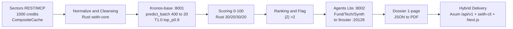

# SEITH  -  Market Intelligence for IDX

> **Track 3 Reveal  -  Sectors Hackathon 2026.** Derived insight only. **Mispricing Score 0-100 + Anomaly Rank + Comparative Dossier 1-page.** Raw display does not qualify.

[](https://github.com/kazanaruishere-max/SEITH-MARKET-IDX/actions/workflows/ci.yml)
[](https://github.com/kazanaruishere-max/SEITH-MARKET-IDX/actions/workflows/freeze-check.yml)
[](LICENSE)
[](https://hackathon.sectors.app/tracks/market-intelligence)
[](docs/api-spec.md)
[](Cargo.toml)
[](docs/kronos-notes.md)
[](docs/adr/0001-stack.md)

[English](#english) | [Indonesia](#indonesia)


---

<a id="english"></a>
## English

### Contents

1. [Why this exists](#why-this-exists)  -  Kaza 2025 commodity to IDX
2. [The problem every company and every person shares](#the-problem-every-company-and-every-person-shares)
3. [The thesis I raised early  -  raw display fails](#the-thesis-i-raised-early--raw-display-fails)
4. [What SEITH does](#what-seith-does)  -  60 seconds to a dossier
5. [How it works](#how-it-works)  -  eight gates as story beats
6. [Proof with real data](#proof-with-real-data)
7. [Architecture](#architecture)
8. [Tech stack](#tech-stack)
9. [Folder structure  -  7 zones](#folder-structure--7-zones)
10. [Market  -  IDX and STI](#market--idx-and-sti)
11. [Quick start](#quick-start)
12. [Security](#security)
13. [Workflow  -  handoff and branch](#workflow--handoff-and-branch)
14. [Judging and video](#judging-and-video)
15. [Roadmap H1 to H6](#roadmap-h1-to-h6)
16. [Contributing and license](#contributing-and-license)

### Why this exists

I am Kaza. Since 2025 I have traded commodity markets. XAUUSD and EURUSD every day. In those markets I had tools that told me when something was off. A composite score that weighed trend and mean reversion. A flag when price moved far from its forecast. A foreign flow read that said who was buying. The screen did not just show price. It showed what price meant.

When I moved to IDX the layer was missing. Screens showed PE. They showed PB. They showed OHLC candles. That was it. For 900 tickers you had to open each one by hand. Sixty seconds became sixty minutes. I kept thinking the market was not the problem. The intelligence layer was.

SEITH is that layer for IDX.

### The problem every company and every person shares

This is not a retail only problem.

Every listed company publishes similar raw numbers. Close, volume, ROE, margin. Every person looking at those numbers faces the same gap. Retail with less than fifty million rupiah needs to pick five names before work. A junior analyst needs to justify one pick at the morning briefing. A builder wants to ship a screener that helps instead of just sorting. A researcher wants to test a thesis without hand cleaning data.

All four hit the same wall. Raw numbers do not tell you if cheap is quality or a trap. A volume spike of eighty million shares means nothing without context. Was it foreign accumulation or just noise. A PE of seven means nothing without its sector median. A price of 8300 on BBCA on 2025-08-01 is a fact. Whether 8300 is expensive given its ROE and its distance from forecast is the question. No public IDX dashboard answered that question with a single score.

That is why Track 3 exists. Reveal.

### The thesis I raised early  -  raw display fails

While still trading XAUUSD I kept saying one thing. A dashboard that only displays raw data will fail as market intelligence. At the time people thought a pretty table was enough. I saw the split coming.

Track 3 now writes the same rule. You must produce derived insight. Scores, rankings, custom screeners, anomaly detection, comparative analysis, or synthesized research. At least one. Display alone does not qualify. Even a Bloomberg dark theme does not save it.

I was early on this. Not because I predicted the hackathon. Because I lived the pain on both sides. Commodity taught me what composite and anomaly and flow look like when they work. IDX showed me what happens when they do not exist. That gap is the whole product.

### What SEITH does

SEITH turns raw Sectors data into insight you can use today.

You open ranking. In sixty seconds you see who is cheap for its quality, who is flagged for anomaly, and where that anomaly sits in its sector. You pick one ticker. You open its dossier. One page. Score breakdown, peer comparison, twenty day Kronos forecast plotted, and a three agent memo that reads the fundamentals and the chart and then synthesizes. You export PDF. You bring it to the meeting.

That is the loop. Sixty second ranking to deep dive to PDF. No auto trade. Every insight carries the line Bukan rekomendasi investasi. Informasi dan analisis saja.

For Rina retail twenty six, it means she can pick five candidates before her shift. For Budi analyst twenty nine, it means his slide has a score with a reason and a peer table, not just a candle chart.

### How it works

Eight gates. Each one earns its place. No gate is just display.

First you fetch from Sectors. Batch per sector to save credits. Cache with CompositeCache. Moka L1 in memory answers in under one millisecond when hot. SQLite L2 in data/seith.db answers in about two milliseconds and survives restarts. Key is market, sector, ticker, date. Raw lives twenty four hours. Ranking lives one hour. Redis at thirty megabytes was rejected because IDX raw is about forty five megabytes.

Second you cleanse. Open high low close are required. If any is missing you exclude the ticker and list it in excluded with a reason. If volume or amount is missing you set zero. If a ratio like ROE or margin is missing you fall back to the sector median for that market and mark insufficient_data. If lookback is over five hundred twelve you return 422. Kronos max_context is five hundred twelve. You respect it at the boundary.

Third you forecast. Kronos-base sidecar on 8001. One hundred two point three million parameters. NeoQuasar Kronos-base plus Tokenizer-base. Hierarchical K-line tokenizer, trained on forty five exchanges. You call predict_batch with a window of four hundred closes and ask for twenty ahead. Temperature one point zero, top p zero point nine. Equal lookback and pred_len guard. Thirty second timeout with one retry. If it is down you mark degraded true and keep the score.

Fourth you score. Mispricing zero to one hundred. Thirty percent expected return from Kronos, twenty percent from anomaly distance as one hundred minus absolute Z, thirty percent quality value from Sectors, twenty percent sector momentum. You clamp. You store the four components so the bar stack can explain the number.

Fifth you rank and flag. Sort by mispricing descending. Flag when absolute Z is greater than two or when volume is more than two sigma without a fundamental catalyst. Every flag carries a reason.

Sixth you research. TradingAgents Lite on 8002. Three agents. Fund reads Sectors fundamentals. Tech reads price and volume and the Kronos path. Synth merges the two. All calls go through 9router on 20128. Combo SEITH-MARKET-IDX. You run only Top N to save calls.

Seventh you compose the dossier. Score plus breakdown plus peer five plus Kronos chart points plus the three agent memo. JSON then PDF.

Eighth you deliver the same contract two ways. Axum on api v1 with envelope success data error pagination and header x-schema-version, and seith-cli with clap, and Next.js fourteen that consumes the same envelope. Same core crate. No drift.

Rest sidecar keeps Rust and Python apart. No PyO3. That lets two terminals run in parallel and makes mocks easy.

### Proof with real data

We anchor on real Sectors data. Not fixtures alone. On probe 2025-08-01 BBCA closed at 8300 with open 8400 high 8425 low 8300 volume eighty six million on api.sectors.app v2 daily BBCA. That request returned 200. It cost one credit. The same endpoint serves every IDX ticker. BBCA on 2026-08-10 closed at 6375. Same shape, live.

Scoring uses that close series. Expected return comes from Kronos forecast minus current close. Z is actual minus forecast over sigma. When absolute Z passes two you flag. Volume uses the same sigma check. No flag without a reason string. Sector median for QV is computed per market so IDX and STI do not pollute each other.

Cache keeps it cheap and fast. One hundred credits for the budget. First fetch writes L1 and L2. Second fetch is free until TTL. Ranking is recomputed at most once per hour per sector. The dossier reads the same rows. No extra Sectors hit for the same date.

Kronos is zero shot. One hundred two point three million, max_context five hundred twelve, lookback four hundred to twenty, pred_len twenty. No finetune. Mock flag KRONOS_MOCK equals one lets CI run without GPU.

9router combo SEITH-MARKET-IDX holds eight free models. At probe it served nvidia nemotron three point five lightning free at zero cost and returned PONG on the health check via header x-model. The Lite three agent chain calls that combo. If it is down the dossier still renders with degraded true. The contract never lies.

### Architecture



Whitepaper 2508.02739v1.pdf AAAI 2026 distilled in docs/kronos-notes.md.

### Tech stack

| Layer | Stack | Notes |
|---|---|---|
| Core | Rust edition 2021 | Axum plus Tokio, serde, validator, chrono, reqwest, moka, thiserror anyhow, tracing, tower-http |
| Cache | Composite | moka L1 plus SQLite L2 data/seith.db, trait Cache, Redis thirty megabytes rejected |
| CLI | Rust | clap ranking dossier scan |
| Quant sidecar | Python uv | FastAPI plus Uvicorn, torch, Kronos-base on 8001 |
| Research sidecar | Python uv | FastAPI, LangGraph inspired, httpx to 9router on 8002 |
| LLM | 9router | http://localhost:20128/v1/chat/completions, OpenAI compatible, combo SEITH-MARKET-IDX |
| Web | Next.js 14 | App Router plus TS plus Tailwind plus shadcn, Zod, recharts |
| Test | Rust plus Python plus FE | cargo test plus mockito plus rusqlite, uv pytest plus ruff, pnpm test |

Design is Bloomberg dark 0B0E14 plus JetBrains Mono for numbers. Verified with design-taste-frontend at H5.

### Folder structure  -  7 zones

File outside its zone is a violation. PM veto.

```
SEITH-MARKET-IDX/
  crates/                          # Z1 Rust workspace
    seith-core/                    # schemas, normalize, scoring 0-100, Cache trait, config
    sectors-client/                # Sectors REST client, CompositeCache, batch, Market Id Sg
    seith-api/                     # Axum handlers, repository, envelope
    seith-cli/                     # CLI ranking dossier scan
  apps/                            # Z2 Intelligence plus Web
    kronos-sidecar/  :8001         # Kronos-base bridge
    analysis/        :8002         # Lite 3-agent to 9router
    web/             :3000         # Next.js App Router
  data/ + migrations/001_cache.sql # Z3 SQLite WAL data/seith.db
  tests/fixtures/                  # Z4 fixtures per market
  docs/ + research/ + vendor/      # Z5 knowledge and pins
  .handoff/phase-NN-topic/         # Z6 governance per phase
  scripts/ + .opencode/ + .github/ # Z7 ops and harness
```

| Zone | Path | Rule |
|---|---|---|
| Z1 | crates/* | seith-core does not import sectors-client |
| Z2 | apps/* | uv workdir must be inside the sidecar, Rust to Python via REST |
| Z3 | data/ plus migrations/ | data/seith.db gitignore, WAL, busy_timeout 3000 |
| Z4 | tests/fixtures/ | BBCA SG illiquid sector median fixtures |
| Z5 | docs/ plus vendor/ | docs drive code, vendor read only pinned |
| Z6 | .handoff/ | 00-overview must be read before 01 to 05 |
| Z7 | scripts/ plus .opencode/ | CI six contexts plus gitleaks |

See AGENTS.md 3c and docs/spec.md 7b.

### Market  -  IDX and STI

| Market | Sectors path | Default |
|---|---|---|
| IDX primary | v2/daily/{symbol}/ plus screener | market equals id, nine hundred tickers |
| STI stretch H5 | v2/daily/{symbol}/ SGX plus screener | market equals sg via flag |

Client enum Market Id Sg with as_str and base_path. STI is opt in to save credits and keep QV median clean. Example seith ranking minus market sg minus sector FINANCE and GET api v1 ranking question market equals sg and sector equals FINANCE.

### Quick start

```powershell
# 0 clone
git clone --recurse-submodules --depth 1 https://github.com/kazanaruishere-max/SEITH-MARKET-IDX.git
cd SEITH-MARKET-IDX

# 1 env server only, never to client or log
Copy-Item .env.example .env
# edit .env: SECTORS_API_KEY equals ..., MARKET equals id, LLM_BASE_URL equals http://localhost:20128/v1
# 9router combo SEITH-MARKET-IDX is set in 9router dashboard, key SEITH_API_KEY in .env

# 2 Rust contracts and scoring
cargo check
cargo fmt --check
cargo clippy -- -D warnings
cargo test -- --nocapture
cargo run -p seith-cli -- ranking --sector FINANCE --market id
cargo run -p seith-cli -- dossier BBCA --market id --pdf

# 3 quant sidecar 8001, workdir apps/kronos-sidecar
uv sync
uv run ruff check .
uv run pytest -q
# run: uv run uvicorn app.main:app --port 8001

# 4 research sidecar 8002 to 9router 20128, workdir apps/analysis
uv sync
uv run pytest -q
.\scripts\check-9router.ps1

# 5 web 3000 Bloomberg dark
pnpm --dir apps/web install
pnpm --dir apps/web lint
pnpm --dir apps/web typecheck
pnpm --dir apps/web dev

# 6 cache check
# data/seith.db auto creates
# sqlite3 data/seith.db "SELECT count(*) FROM ohlcv;"
```

Gotcha. uv sync with project X from root pours into root venv. Always set workdir to the sidecar. cargo test from sub crate without workspace gives wrong resolve. Use minus p.

### Security

Three layers. Key 0843 ff004 revoked 2026-09-05.

1. Pre commit local. pre-commit plus gitleaks plus githooks pre-commit and scripts install-hooks.ps1.
2. CI remote. ci.yml audit plus freeze-check gitleaks plus dependabot weekly.
3. Runtime. crates seith-core config from_env fail fast plus redact Redacted and sanitize_error never echo key.

See SECURITY.md.

### Workflow  -  handoff and branch

```
main protected, no direct push, only Lead squash merge after seith-phase-gate
  handoff/NN-topic short lived from main
    handoff/NN-topic/t1-subtask optional parallel disjoint
test/topic ephemeral   chore/docs/fix via PR
```

Default worktree add ../seith-wt/handoff-01 minus b handoff 01-sectors-adapter then Implement TDD then cargo fmt check and clippy and test then rust-reviewer and security-reviewer then Lead squash then remove worktree.

Every execution is a branch. Direct main push blocked by protection enforce_admins true and six checks rust audit python-kronos python-analysis web freeze and one review. PM veto if Accountability Block missing.

Skill git-worktree-manager for lifecycle.

### Judging and video

| Criterion | Weight | Answer |
|---|---|---|
| Real world usability | 40 percent | sixty second ranking to dossier and CLI verifiable |
| Video storytelling | 30 percent | teaser one minute screen recording plus judging three minute problem to workflow |
| Technical depth | 30 percent | Sectors core plus Kronos 102M plus custom scoring plus CompositeCache plus 9router, verifiable with cargo |

Submit freeze build 19 Aug to 30 Sep 23 59 WIB then public repo plus teaser plus judging plus one sentence problem. Freeze check scripts/freeze-check.sh.

### Roadmap H1 to H6

| Handoff | Focus | Branch | Gate |
|---|---|---|---|
| H1 | sectors-client CompositeCache plus Market plus cleansing | handoff/01-sectors-adapter | Cache trait |
| H2 | kronos-sidecar 8001 predict_batch 400 to 20 | handoff/02-kronos | max_context 512 |
| H3 | analysis 8002 Fund Tech Synth to 9router | handoff/03-agents | mock 9router |
| H4 | scoring 0 to 100 plus ranking | handoff/04-scoring | breakdown and flag |
| H5 | Axum plus seith-cli plus Next.js Bloomberg | handoff/05-product | taste audit |
| H6 | Freeze Kit plus video | handoff/06-freeze | security mandatory |

Plus H7 Top5 Leak radar and research notebook isolated via uv.

### Contributing and license

Source available, not community until founder opens. All collaborations closed until explicit open. See LICENSE and CONTRIBUTING.md.

Vendor pinned vendor Kronos 67b630e MIT plus vendor TradingAgents 9dee508 Apache 2.0 via submodule depth one read only. Weights via NeoQuasar on HF.

Clone correctly with recurse-submodules depth one.

Disclaimer. Bukan rekomendasi investasi. Informasi dan analisis saja. On every insight view.

---

<a id="indonesia"></a>
## Indonesia

> **Track 3 Reveal  -  Sektors Hackathon 2026.** Hanya insight derivatif. **Skor Mispricing 0-100 plus Ranking Anomali plus Dossier 1 halaman.** Display mentah tidak lolos.

*Untuk pipeline, arsitektur, tech stack, market, dan security lihat bagian English di atas. Bagian ini adalah narasi pendamping dengan suara Kaza. Command tetap ikut English agar tidak drift.*

### Kenapa ini ada

Saya Kaza. Sejak 2025 saya trading commodity. XAUUSD dan EURUSD setiap hari. Di market itu saya punya tool yang kasih tahu ketika ada yang tidak beres. Skor komposit yang menimbang trend dan mean reversion. Flag ketika harga menjauh dari forecast. Aliran dana asing yang bilang siapa yang beli. Layar tidak cuma menampilkan harga. Layar menjelaskan arti harga.

Waktu pindah ke IDX lapisan itu hilang. Layar menampilkan PE. Menampilkan PB. Menampilkan candle OHLC. Hanya itu. Untuk sembilan ratus ticker kamu harus buka satu per satu dengan tangan. Enam puluh detik jadi enam puluh menit. Saya terus berpikir marketnya bukan masalah. Lapisan intelligence nya yang hilang.

SEITH adalah lapisan itu untuk IDX.

### Masalah yang dirasakan semua perusahaan dan semua orang

Ini bukan masalah retail saja.

Setiap perusahaan tercatat menampilkan angka mentah yang mirip. Close, volume, ROE, margin. Setiap orang yang melihat angka itu mengalami gap yang sama. Retail dengan dana di bawah lima puluh juta harus memilih lima nama sebelum berangkat kerja. Analis junior harus justify satu pick di briefing pagi. Builder mau bikin screener yang membantu bukan cuma sorting. Peneliti mau menguji thesis tanpa bersih bersih data manual.

Keempatnya menabrak tembok yang sama. Angka mentah tidak menjawab apakah murah itu berkualitas atau jebakan. Lonjakan volume delapan puluh juta lembar tidak ada artinya tanpa konteks. Apakah itu akumulasi asing atau hanya noise. PE tujuh tidak ada artinya tanpa median sektornya. Harga BBCA 8300 pada 2025-08-01 adalah fakta. Apakah 8300 itu mahal dilihat dari ROE dan jaraknya terhadap forecast adalah pertanyaannya. Tidak ada dashboard IDX publik yang menjawab pertanyaan itu dengan satu skor.

Itu alasan Track 3 ada. Reveal.

### Thesis yang saya angkat lebih awal  -  display mentah gagal

Waktu masih trading XAUUSD saya sering bilang satu hal. Dashboard yang hanya menampilkan data mentah akan gagal sebagai market intelligence. Waktu itu banyak yang mengira tabel cantik sudah cukup. Saya melihat splitnya akan datang.

Track 3 sekarang menulis aturan yang sama. Kamu harus menghasilkan derived insight. Skor, ranking, screener custom, deteksi anomali, analisis komparatif, atau riset tersintesis. Minimal satu. Display saja tidak lolos. Bahkan tema Bloomberg dark tidak menyelamatkan.

Saya lebih awal di thesis ini. Bukan karena menebak hackathon. Karena saya hidup di dua sisi. Commodity mengajari saya seperti apa komposit dan anomali dan flow ketika bekerja. IDX menunjukkan apa yang terjadi ketika ketiganya tidak ada. Gap itu adalah keseluruhan produk.

### Apa yang SEITH lakukan

SEITH mengubah data mentah Sectors menjadi insight yang bisa dipakai hari ini.

Kamu buka ranking. Dalam enam puluh detik kamu melihat siapa murah karena kualitasnya, siapa ke flag anomali, dan posisi flag itu di sektornya. Kamu pilih satu ticker. Kamu buka dossiernya. Satu halaman. Breakdown skor, komparasi peer, forecast Kronos dua puluh hari dalam grafik, dan memo tiga agen yang membaca fundamental dan chart lalu mensintesis. Kamu export PDF. Kamu bawa ke meeting.

Itu loopnya. Ranking enam puluh detik ke deep dive ke PDF. Tanpa auto trade. Setiap insight membawa tulisan Bukan rekomendasi investasi. Informasi dan analisis saja.

Buat Rina retail dua puluh enam, artinya dia bisa memilih lima kandidat sebelum shift. Buat Budi analis dua puluh sembilan, artinya slidenya punya skor dengan alasan dan tabel peer, bukan cuma chart candle.

### Cara kerja

Delapan gerbang. Tiap gerbang ada alasannya. Tidak ada yang cuma display.

Pertama kamu tarik dari Sectors. Batch per sektor untuk hemat credit. Cache dengan CompositeCache. Moka L1 di memori jawab di bawah satu milidetik saat hot. SQLite L2 di data/seith.db jawab sekitar dua milidetik dan tetap hidup setelah restart. Kunci adalah market, sektor, ticker, tanggal. Raw hidup dua puluh empat jam. Ranking hidup satu jam. Redis tiga puluh megabyte ditolak karena raw IDX sekitar empat puluh lima megabyte.

Kedua kamu cleansing. Open high low close wajib. Jika ada yang hilang kamu exclude ticker itu dan tulis di excluded beserta reason. Jika volume atau amount hilang kamu isi nol. Jika rasio seperti ROE atau margin hilang kamu fallback ke median sektor untuk market itu dan tandai insufficient_data. Jika lookback lebih dari lima ratus dua belas kamu kembalikan 422. Kronos max_context lima ratus dua belas. Kamu jaga di boundary.

Ketiga kamu forecast. Sidecar Kronos-base di 8001. Seratus dua koma tiga juta parameter. NeoQuasar Kronos-base plus Tokenizer-base. Tokenizer hierarkis K-line, dilatih di empat puluh lima bursa. Kamu panggil predict_batch dengan window empat ratus close dan minta dua puluh ke depan. Temperature satu koma nol, top p nol koma sembilan. Guard lookback dan pred_len harus sama. Timeout tiga puluh detik dengan satu retry. Jika mati kamu tandai degraded true dan tetap kasih skor.

Keempat kamu scoring. Mispricing nol sampai seratus. Tiga puluh persen expected return dari Kronos, dua puluh persen dari jarak anomali sebagai seratus minus absolute Z, tiga puluh persen quality value dari Sectors, dua puluh persen momentum sektor. Kamu clamp. Kamu simpan empat komponen agar bar stack bisa menjelaskan angka.

Kelima kamu ranking dan flag. Sortir by mispricing descending. Flag ketika absolute Z lebih dari dua atau volume lebih dari dua sigma tanpa katalis fundamental. Setiap flag bawa reason.

Keenam kamu riset. TradingAgents Lite di 8002. Tiga agen. Fund membaca fundamental Sectors. Tech membaca harga dan volume dan jalur Kronos. Synth menggabung keduanya. Semua call lewat 9router di 20128. Combo SEITH-MARKET-IDX. Kamu hanya jalankan Top N untuk hemat call.

Ketujuh kamu susun dossier. Skor plus breakdown plus peer lima plus titik grafik Kronos plus memo tiga agen. JSON lalu PDF.

Kedelapan kamu kirim dengan kontrak yang sama dua cara. Axum di api v1 dengan envelope success data error pagination dan header x-schema-version, dan seith-cli dengan clap, dan Next.js empat belas yang konsumsi envelope yang sama. Satu core crate. Tidak ada drift.

Sisi REST menjaga Rust dan Python tetap terpisah. Tanpa PyO3. Dua terminal bisa jalan paralel dan mock jadi mudah.

### Bukti dengan data real

Kami berlabuh pada data Sectors yang real. Bukan hanya fixtures. Pada probe 2025-08-01 BBCA close di 8300 dengan open 8400 high 8425 low 8300 volume delapan puluh enam juta di api.sectors.app v2 daily BBCA. Request itu kembali 200. Biaya satu credit. Endpoint yang sama melayani semua ticker IDX. BBCA pada 2026-08-10 close di 6375. Bentuk sama, live.

Scoring memakai rangkaian close itu. Expected return dari forecast Kronos minus close sekarang. Z adalah actual minus forecast dibagi sigma. Ketika absolute Z lewat dua kamu flag. Volume pakai cek sigma yang sama. Tidak ada flag tanpa reason string. Median sektor untuk QV dihitung per market jadi IDX dan STI tidak saling mengotori.

Cache membuat murah dan cepat. Seratus credit untuk budget. Fetch pertama menulis L1 dan L2. Fetch kedua gratis sampai TTL. Ranking dihitung ulang paling sering satu jam sekali per sektor. Dossier membaca baris yang sama. Tidak ada hit Sectors tambahan untuk tanggal yang sama.

Kronos zero shot. Seratus dua koma tiga juta, max_context lima ratus dua belas, lookback empat ratus ke dua puluh, pred_len dua puluh. Tanpa finetune. Flag KRONOS_MOCK sama dengan satu membiarkan CI jalan tanpa GPU.

Combo 9router SEITH-MARKET-IDX berisi delapan model free. Pada probe dia melayani nvidia nemotron tiga point lima lightning free dengan biaya nol dan membalas PONG pada health check lewat header x-model. Rangkaian Lite tiga agen memanggil combo itu. Jika mati dossier tetap render dengan degraded true. Kontrak tidak pernah berbohong.

### Arsitektur dan pipeline

*Lihat diagram Mermaid di bagian English  -  satu banding satu.* Ringkas delapan gerbang. Sectors Batch plus CompositeCache market sama dengan id ke Cleansing Gate volume ke nol rasio ke median lookback lebih dari lima ratus dua belas ke 422 ke Kronos-base 8001 predict_batch 400 ke 20 ke Scoring 0 sampai 100 30 20 30 20 ke Ranking ke Agents Lite 8002 ke 9router 20128 ke Dossier 1 halaman ke Hybrid CLI plus Web. Integrasi via REST sidecar bukan PyO3. Dua terminal bisa paralel T1 Rust plus T2 Python.

### Tech stack dan market

*Stack terkunci.* Rust Axum plus Tokio dan clap, CompositeCache moka L1 plus SQLite L2 data/seith.db Redis tiga puluh megabyte ditolak, 9router 20128 OpenAI compatible Tier nol NEVER kill, Next.js 14 recharts plus react to pdf Bloomberg dark 0B0E14.

*Market.* IDX primary v2 daily symbol plus screener default market sama dengan id dan STI via flag question market sama dengan sg atau minus minus market sg v2 daily symbol SGX plus screener enum Market Id Sg terpisah agar median sektor tidak noise stretch H5 hemat seribu credit.

### Quick start  -  lihat English di atas

ID cukup link ke EN agar tidak drift command. Ikuti Quick Start English. Copy paste command sama. cargo run minus p seith-cli minus minus ranking minus minus market sg minus minus sector FINANCE, .env SECTORS_API_KEY server only, uv sync di apps kronos-sidecar dan apps analysis, pnpm minus minus dir apps web dev, cek sqlite3 data/seith.db plus Invoke-WebRequest http://localhost:20128/v1/models.

### Keamanan dan workflow

Keamanan tiga lapis. Pre commit lokal, CI audit plus freeze-check gitleaks plus dependabot, runtime config from_env fail fast plus redact tidak pernah echo key. Key 0843 ff004 sudah revoke 05 Sep 2026 lihat SECURITY.md.

Workflow. Setiap eksekusi sama dengan branch handoff NN-topic via git worktree add ../seith-wt/handoff-NN minus b handoff NN-topic. PM seith-pm autonomous plus veto merge jika gate fail. Tidak ada direct push ke main.

### Penilaian dan video plus roadmap

*Penilaian* empat puluh persen Usability plus tiga puluh persen Video teaser satu menit plus judging tiga menit plus tiga puluh persen Tech Depth. Lihat Judging and video. *Roadmap* H1 sectors-client ke H2 Kronos ke H3 Agents ke H4 Scoring ke H5 Hybrid Dossier ke H6 Freeze Kit. Lihat Roadmap H1 to H6. *Freeze* 19 Aug sampai 30 Sep 23 59 WIB plus scripts freeze-check.sh.

### Kontribusi dan lisensi

Source available, bukan community sampai founder membuka. Lihat LICENSE dan CONTRIBUTING.md. Vendor ter pin 67b630e plus 9dee508 via submodule depth satu read only. Bobot via NeoQuasar di HF.

Clone git clone minus minus recurse-submodules minus minus depth satu https://github.com/kazanaruishere-max/SEITH-MARKET-IDX.git

Disclaimer. Bukan rekomendasi investasi. Informasi dan analisis saja. Di setiap insight view.

---

*Built for Sectors Hackathon 2026  -  Find the signal. Build what markets need next.*
