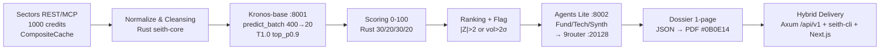

# SEITH — Market Intelligence for IDX

> **Track 3 Reveal — Sectors Hackathon 2026.** Derived insight only. **Mispricing 0-100 + Anomaly Rank + Dossier 1-page.** Sectors is core — remove it and the product is dead. `Bukan rekomendasi investasi. Informasi & analisis saja.` on every insight view.

[](https://github.com/kazanaruishere-max/SEITH-MARKET-IDX/actions/workflows/ci.yml)
[](https://github.com/kazanaruishere-max/SEITH-MARKET-IDX/actions/workflows/freeze-check.yml)
[](LICENSE)
[](https://hackathon.sectors.app/tracks/market-intelligence)
[](docs/api-spec.md)
[](Cargo.toml)
[](docs/kronos-notes.md)
[](docs/adr/0001-stack.md)

[English](#english) | [Indonesia](#indonesia)


---

<a id="english"></a>
## English — Technical Product Specification

### Contents — 17 Sections

| # | Section | Purpose |
|---|---|---|
| 0 | [Overview & TOC](#0-overview) | One-line product + navigation |
| 0a | [Jury How-To 60s](#0a-jury-how-to-60s) | 60s ranking → dossier → PDF |
| 1 | [Positioning & Thesis](#1-positioning) | Why SEITH wins Reveal |
| 2 | [What is Market Intelligence](#2-what-is-mi) | Track definition vs trader vs value |
| 3 | [Six Derived Proofs](#3-six-derived-proofs) | Live mapping to `What qualifies` |
| 4 | [Eight-Gate Workflow - Detailed](#4-eight-gate-workflow) | Per-gate IN→OUT with latency and failure mode |
| 5 | [Architecture - Hybrid Verifiable](#5-architecture) | Rust + sidecars + envelope |
| 6 | [Data Sources & Universe](#6-data-sources) | 100 stratified + 296 credits + provenance |
| 7 | [Scoring Engine 0-100](#7-scoring-engine) | Formula, components, clamp |
| 8 | [Metrics, |Z|, Flags, AA Evaluation](#8-metrics) | Definitions + thresholds + read guide |
| 9 | [API Contract - 8 Endpoints](#9-api-contract) | Paths, params, examples, errors |
| 10 | [Web Contract - AA x TV](#10-web-contract) | Routes, rewrites, components |
| 11 | [Market - IDX x SG](#11-market) | Enum, base_path, median isolation |
| 12 | [Requirement SEITH](#12-requirement-seith) | Hardware, env, deps, ports |
| 12a | [OS Support](#12a-os-support) | Windows PowerShell 7+ vs Linux/Mac bash |
| 12b | [Quick Start - 6 Steps](#12-quick-start) | Clone to cache check |
| 13 | [Project Structure - 7 Zones](#13-structure) | File placement + violation rule |
| 13a | [Bahasa + Fungsi Rust](#13a-bahasa--fungsi-rust) | Rust/Python/TS roles |
| 14 | [Verification & Testing](#14-verification) | Gates, test counts, CI contexts |
| 15 | [Limitations, Provenance, References, License](#15-limitations) | Ceilings, lineage, whitepaper, freeze |
| 16 | [Deep Technical - 8 Gates](#16-deep-technical-8-gates) | Mermaid + lineage 296c + scoring |
---

### 0. Overview

SEITH is a **Market Intelligence engine for IDX** — Track 3 Reveal. One workflow: **60s ranking → deep dossier → export PDF**. Every score is derived, not displayed.

- **Input:** Sectors REST/MCP — 1000 credits, IDX primary (`market=id`, ~900 tickers), STI optional (`market=sg`).
- **Output:** Mispricing 0-100 (explainable 30/20/30/20) + anomaly rank + flag + 1-page comparative dossier per ticker.
- **Delivery:** Hybrid — Rust Axum API (`:8181`) + `seith-cli` (`clap`) + Next.js 14 web (`:3000`) share `crates/seith-core` + envelope `{success,data,error,pagination}`.
- **Constraint:** No auto trade execution. `Bukan rekomendasi investasi` on every view. Repo public within build window 19 Aug–30 Sep 2026, freeze at submit.

**Navigate:** [EN §1 Positioning](#1-positioning) · [§4 Workflow](#4-eight-gate-workflow) · [§8 Metrics](#8-metrics) · [§9 API](#9-api-contract) · [ID Mirror](#indonesia)


---

### 0a. Jury How-To — 60s Ranking → Deep Dive → Export PDF

**3 langkah untuk juri (60 detik):**

1. Buka `/` — lihat heatmap vertikal 5 sektor `aspect-[3/4] min-h-[420px]` + 4 KPI (Universe 100, avg score, flagged |Z|>2, pipeline).
2. Klik `FINANCE` → `/ranking?sector=FINANCE&market=id` — 25 tickers, sort mispricing desc, pagination 20/page, cell `aspect-[2/3] min-h-[52px]` red→amber→emerald.
3. Klik `BBCA` → `/dossier/BBCA?market=id` — breakdown 30/20/30/20, peer 5 QV+cap ±50%, Kronos 20 titik amber dashed + ±2σ band, 3 memo, `Download PDF` 2-page A4 `595×842` vector.


> Bukan rekomendasi investasi. Informasi & analisis saja. Sectors CORE — cabut = produk mati. `SEITH_API_BIND=0.0.0.0:8181`.
---

### 1. Positioning & Thesis

**Problem:** For 900 IDX tickers, raw data (close, volume, ROE, PE/PB, OHLC) is available, but no public signal answers: is cheap = quality or a value trap? A PE of 7 means nothing without its sector median. A volume spike of 80M shares means nothing without context (accumulation vs noise). Screening by sorting raw PE is generic and fails `What qualifies`.

**Thesis (Reveal):** Raw display does not qualify — even with a Bloomberg dark theme. Judges require at least one derived form: signals/scores, rankings, custom screener logic, anomaly detection, comparative analysis, synthesized research. SEITH delivers all six.

**ICP:**

| Persona | Job in 60s | SEITH answer |
|---|---|---|
| Rina — retail, <50jt, picks before work | Choose 5 candidates fast | Ranking sorted by mispricing, heatmap 10×10, sector strip avg |
| Budi — junior analyst, morning briefing | Justify one pick with evidence | Dossier: breakdown + peer 5 + Kronos 20-point plot + 3-agent memo + PDF export |

Non-persona: trader requiring auto-execution. All tracks prohibit it. SEITH never executes.

**Competitors:** Generic IDX screeners sort by raw PE/PB or chart candles. They lack: composite score, sector-aware percentile, anomaly vs forecast, peer QV+cap comparison, synthesized memo. SEITH positions as **cheap quality ≠ trap** — value is filtered by quality and momentum and forecast divergence.

**Judging mapping (40/30/30):**

| Weight | What judges score | SEITH proof |
|---|---|---|
| 40% Usability | Can a user understand ranking in 60s today? | Web + CLI same contract, heatmap treemap 5×, table bar, dossier 1-page |
| 30% Video | Story + working capture | Teaser 1m (CLI+Web live) + judging 3m (problem→workflow→proof) |
| 30% Tech depth | Sectors as core, verifiable in repo | Batch+CompositeCache, Kronos 102.3M 400→20, scoring Rust, 9router Nemotron, 100% gratis infra |

---

### 2. What is Market Intelligence

Market Intelligence = **pre-trade information advantage** — analysis generated from data rather than the data itself.

**Track definition (Sectors Hackathon 2026):**

> The project must produce derived insight. What qualifies: signals or scores, rankings, screeners with custom logic, anomaly detection, comparative analysis, synthesized research. What does not qualify: a product that only displays raw Sectors data in a different visual form.

**MI is not:**

- **Trader / execution.** Automated trade execution is prohibited on every track. SEITH is decision-support, not execution.
- **Value-only.** Value (PE/PB/ROE) is one lens. MI requires multiple lenses combined.
- **Technical-only.** Price/volume alone is insufficient without quality and context.

**SEITH has three lenses (all sector-aware, all per-market):**

| Lens | Weight | Source | Question it answers |
|---|---|---|---|
| Quality/Value (QV) | 30% | Sectors ROE/margin/debt/equity/PE/PB sector percentile | Is cheap also high quality? |
| Expected move (ER + anomaly) | 30% ER + 20% | Kronos forecast + |Z| divergence | Is price far from forecast? |
| Context (Sector momentum + peer) | 20% + peer 5 | Sector median + peer QV+cap ±50% | Is this cheapness typical for its sector/market? |

If you remove Sectors, the product is dead. Derived insight is the gate.

---

### 3. Six Derived Proofs — Live

All six map to `What qualifies`. Each is derived inside SEITH, not a re-skin.

| # | Qualifies | SEITH implementation | Live proof (2026-09-13) |
|---|---|---|---|
| 1 | Signals / scores | Mispricing 0-100 `0.30*ER + 0.20*(100-|Z|_norm) + 0.30*QV + 0.20*SM` clamp | `research/backtest-100.json` 100 items, LPPF 80.3 rank 1 (50.02/99.91/100/76.58) |
| 2 | Rankings | Sort by mispricing desc, `|Z|` tie-break, pagination `page/pageSize max50` | `GET /api/v1/ranking?market=id` total 100, FINANCE 25 / ENERGY 20 / CONSUMER 20 / INFRA 20 / OTHER 15 |
| 3 | Screener with custom logic | Filter `?sector=FINANCE&sort=anomaly&minZ` — QV sector percentile + median per market, not raw PE sort | `GET /api/v1/ranking?sector=FINANCE&pageSize=10` + `GET /api/v1/anomalies?minZ=2` |
| 4 | Anomaly detection | `|Z|>2` price divergence or `vol>2σ` without fundamental catalyst + `reason` string | ANTM `z=-2.41 flag true reason "z=-2.4"` · SIDO `vol>2s flag true` |
| 5 | Comparative analysis | Peer 5 per dossier: same sector+market, ordered by `|QV - target_QV|` + `|Z|` tie-break, cap band close `±50%`, fallback `same_sector loose → cross_sector` | `GET /api/v1/tickers/BBCA/dossier` → 5 peers |
| 6 | Synthesized research | TradingAgents-Lite 3-agent (Fund/Tech/Synth) via 9router `nemotron-3.5-lightning:free` → Top-10 dossier memo | `research/backtest-100.json` items 0-9 `research source llm model nemotron` — Top-10 live, remaining 90 template (cost ceiling) |

Raw table without any of the six = FAIL. SEITH passes on all six with verifiable artifacts.

---

### 4. Eight-Gate Workflow — Detailed

Single allowed workflow: **60s ranking → deep dossier → PDF**. No gate is display-only. Text diagram:



#### Gate 1 — Sectors Batch + CompositeCache

| Field | Value |
|---|---|
| IN | `research/universe-100.json` 100 stratified — FINANCE 25 / ENERGY 20 / CONSUMER 20 / INFRA 20 / OTHER 15 |
| Batch | `chunks(20) × 5` sequential → `Authorization: <SECTORS_API_KEY>` → `GET /v2/daily/{symbol}/` (ID) or `/v2/sgx/daily/{symbol}/` (SG) — per `market.rs base_path()` |
| Status codes | `200` billed 1 credit, `401/403` auth error 1010 free not billed, `404` billed 1 credit, `429` free |
| OUT | `[{symbol:"BBCA.JK", date, open,high,low,close, volume, market_cap}]` per ticker |
| Credits live | 296 — 98 × OHLCV (19 days) + 98 × valuation fundamentals + 98 × 20 forecast context — see `research/backtest-100.json:credit_cost` |
| Cache | Trait `Cache` → `CompositeCache<Moka L1 + Sqlite L2>` · key `market:sector:ticker:date` · L1 `moka <1ms` hot · L2 `SQLite WAL data/seith.db ~2ms, busy_timeout 3000` · TTL 24h raw / 1h ranking · Redis 30MB rejected (IDX raw ~45MB does not fit) · Supabase deferred H5 |
| Miss path | L1 miss → L2 hit → fetch Sectors → write L1+L2 |
| Live probe | BBCA `2025-08-01 open 8400 high 8425 low 8300 close 8300 volume 86M` → `200` cost 1 credit · 61 rows `2025-08-01→2026-08-10` verified · `research/validation-report.md` |
| STI flag | `?market=sg` or `--market sg` — opt-in to save 1000 credits and keep QV median clean per market |

#### Gate 2 — Normalize & Cleansing — Data Cleansing Gate (anti-crash illiquid)

| Field | Value |
|---|---|
| Location | `crates/seith-core` · `seith-api/src/backtest_data.rs:52` + `handlers.rs:77-88` |
| Rule OHLC | `open/high/low/close` REQUIRED — missing → exclude ticker + `excluded:[{ticker,reason:"missing_ohlc"}]` · currently `MFIN missing_ohlc` + `BMRG sectors_404` in `backtest-100.json:excluded` · pipeline does not crash |
| Rule volume | `volume/amount` missing → `0.0` (Kronos requires column) |
| Rule ratios | `ROE/margin/debt/equity/PE/PB` missing → sector median for that `market` + fallback `0.0` + flag `insufficient_data:true` · medians per `tests/fixtures/sector-median.json` |
| Rule context | `lookback + pred_len ≤ 512` guard · `lookback>512 → 422 VALIDATION_ERROR max_context 512 exceeded` at `handlers::check_lookback` · `lookback` and `pred_len` must be equal for Kronos batch |
| Rule timestamp | `x_timestamp / y_timestamp` derived from Sectors `date` for Kronos input |
| Validation | `serde deny_unknown_fields` + `validator` at boundary, fail fast · `Market enum {Id,Sg}` default `Id` · `ticker ^[A-Z0-9]{3,6}$` · `pageSize max50` · `tickers 1-50` |

#### Gate 3 — Kronos-base Sidecar :8001 — `POST /predict_batch`

| Field | Value |
|---|---|
| Runtime | Python `uv` · FastAPI + Uvicorn · `torch` · `NeoQuasar/Kronos-base 102.3M` + `Kronos-Tokenizer-base` — hierarchical K-line tokenizer, 45+ exchanges pre-train · `docs/kronos-notes.md` + `2508.02739v1.pdf` (AAAI 2026) |
| API | `POST /predict_batch` · input `{market, df {open,high,low,close,volume?,amount?}, x_timestamp, y_timestamp, pred_len, T, top_p}` · output `pred_df` (OHLCV forecast) |
| Params | `lookback 400 → pred 20` · `max_context 512` · `T=1.0 top_p=0.9 sample_count=1` · equal `lookback/pred_len` guard |
| Integration | Rust `reqwest` → sidecar HTTP · `SEITH_API_BIND=0.0.0.0:8181` (8080 occupied by httpd 4932) · `crates/seith-api/src/bin/serve.rs:load_dotenv()` reads `.env` without `dotenv` dep |
| Resilience | Timeout 30s retry 1 → fallback deterministic `forecastReturn 0 degraded:true` · `MOCK=0` real CPU cold 2-3m · `research/scores_98.json` snapshot of 19→20 |
| Current mode | `research/backtest-100.json` pinned + live — `as_of 2026-09-13 universe 100 degraded false` — requires no Kronos at request time (pre-computed 20 `chartPoints` per ticker) |

#### Gate 4 — Scoring Engine 0-100 — `seith-core/src/scoring/calculator.rs`

| Field | Value |
|---|---|
| Formula | `score = 0.30*ER_norm + 0.20*(100 - |Z|_norm) + 0.30*QV + 0.20*SM` clamp 0-100 · store 4 components for `StackedTop20 30/20/30/20` + `ScoreBadge bar` |
| ER 30% | Kronos `forecastReturn` z-normalized → 0-100 |
| |Z| 20% | `100 - |Z|_norm` — high divergence is flagged, not rewarded |
| QV 30% | Sectors Quality/Value sector-percentile per market (`ROE/margin/debt/equity/PE/PB` → percentile, Id ≠ Sg) |
| SM 20% | Sector momentum — median sector + relative strength per market |
| Example | LPPF `ER 50.02 Z 99.91 QV 100 SM 76.58 = 80.3 rank 1` · UNVR `50.35/99.35/100/67.07=78.39 rank 2` · TPIA `50.35/99.51/100/52.34=75.48 rank 3` |
| Immutability | Returns new object, no mutate · `fn <50 file 200-400` |

#### Gate 5 — Ranking + Flag

| Field | Value |
|---|---|
| Sort | `mispricing desc` primary · `|Z|` absolute tie-break |
| Flag | `|Z|>2` price divergence OR `volume spike >2σ` without fundamental catalyst → `flag:true + reason` string (e.g. `"z=-2.4"`, `"vol>2s"`) · `anomaly` displayed as pill |
| Pagination | `page/pageSize max50` · `pagination {page,pageSize,total}` in envelope |
| Anomalies | `GET /api/v1/anomalies?minZ=2.0` Top5 `|Z|` Money Leak Radar — sorted `|Z| desc` per market |

#### Gate 6 — TradingAgents-Lite :8002 → 9router :20128/v1

| Field | Value |
|---|---|
| Runtime | Python `uv` · FastAPI · LangGraph-inspired · `httpx → 9router http://localhost:20128/v1/chat/completions` OpenAI-compatible · combo `SEITH-MARKET-IDX` |
| Agents | 3 only — `Fund` (Sectors fundamentals ROE/margin/debt/equity/PE/PB) · `Tech` (price/volume + Kronos path 20) · `Synth` merges two → one paragraph + bull/bear points |
| Input | `{market, ticker, fundamentals, kronosSignal {forecastReturn, volatility}, sector}` |
| Output | `{fundamentalMemo, technicalMemo, synthesizerMemo}` ID language · no execution advice |
| Cost control | Only Top-10 dossier runs LLM (10/10 `nemutron` + 90 template fallback) · `research/backtest-100.json` model `nvidia/nemotron-3.5-lightning:free` |
| Resilience | Timeout 15s · 9router down → `research source template degraded:true` — still qualifies MI (LLM optional Track 3) · check `Invoke-WebRequest http://localhost:20128/v1/models` 200 before dossier |
| Pin | `vendor/TradingAgents` read-only `9dee508 Apache-2.0` — copy workflow `Analyst→Synthesizer` minimal to `apps/analysis`, not full fork (ADR 0002) |

#### Gate 7 — Comparative Dossier 1-Page — `dossier::compose`

| Field | Value |
|---|---|
| Compose | `score + breakdown 4 + peerComparison 5 + kronos {forecastReturn, volatility, chartPoints 20, volBand ±2σ} + research 3 memo → JSON` |
| Peer 5 | Same sector+market, sorted by `|QV - target_QV|` + `|Z|` tie-break, cap band `close ±50%`, fallback `same_sector loose cap → cross_sector` · `backtest_data.rs:108-175 peer_pool/sort` |
| Kronos | 20 `chartPoints` per ticker deterministic via `research/regen_backtest_100.py` · `value/upper/lower` per day `2026-09-14→2026-10-03` · Area ±2σ |
| PDF | `POST /api/v1/tickers/BBCA/dossier?format=pdf&lang=id` → `@react-pdf/renderer` vector `612×792` A4 · 9-section 2-page (P1 Cover/Executive/Mispricing/Valuation/Peer+cap/Anomaly + P2 Catalyst/Methodology/Annex) · disclaimer per footer `Bukan rekomendasi` · `@react-pdf/renderer 3.4.4` |
| JSON | `GET /api/v1/tickers/BBCA/dossier?format=json&lang=id` → same data as PDF |

#### Gate 8 — Hybrid Delivery

| Field | Value |
|---|---|
| API | Axum + Tokio · `REST /api/v1/*` + envelope `{success,data,error,pagination}` + `x-schema-version: 1.0.0` + `Market` enum default `Id` · `crates/seith-api` repository pattern |
| CLI | `seith-cli` (Rust `clap`) — `ranking --sector FINANCE [--market sg]` · `dossier BBCA --pdf` · `scan --tickers BBCA,BMRI,BBRI` — outputs envelope JSON identical to REST (verifiable without browser) |
| Web | Next.js 14 App Router + TS + Tailwind 3.4.7 + `postcss/autoprefixer` + `recharts 2.12.7` · consumes Rust API via `next.config.js rewrites /api/v1/* → 127.0.0.1:8181` · prod `NEXT_PUBLIC_API_BASE` |
| Sharing | Both share `seith-core` schemas + `seith-api` handlers — contract test prevents drift |
| Transport | Rust↔Python via REST sidecar, not PyO3/maturin — avoids GIL+Tokio clash, enables 2-terminal parallel + easy mock |

---

### 5. Architecture — Hybrid Verifiable

```
Sectors REST/MCP (1000 credits, CompositeCache, batch) ─┐
  market=id (default) | sg (flag)                       ▼
                         ┌─ seith-cli (Rust clap) ─────┐
                         │  ranking | dossier | scan   │
                         ▼                             │
                  [ Rust API - Axum + Tokio ]  ← REST /api/v1/* + envelope + market enum
                         │  :8181 x-schema-version 1.0  │
           ┌─────────────┼──────────────┐               │
           ▼             ▼              ▼               │
    sectors-client  scoring-engine  kronos-bridge ─→ Python sidecar (uv) Kronos-base :8001
    (CompositeCache) (Rust crate)   (HTTP /predict)   NeoQuasar/Kronos-base + Tokenizer-base
     moka L1 + SQLite L2                              predict_batch lookback 400→20, max_context 512
     data/seith.db 24h TTL                             │
           │             │              │               │
           └──────┬──────┘              ▼               │
                  ▼              tradingagents-lite (uv, LangGraph) :8002
               dossier           Fund/Tech/Synth only, Sectors adapter ─→ 9router :20128/v1
                         ┌─ Next.js 14 FE (consume Rust API) + recharts ───────┘
                              :3000 rewrites → :8181 · Bloomberg #0B0E14
```

| Layer | Stack | Location | Port | Notes |
|---|---|---|---|---|
| Core | Rust edition 2021 | `crates/seith-core` | — | `serde+validator`, `chrono Utc`, `thiserror/anyhow`, `tracing`, `deny_unknown_fields` |
| Cache | Composite | `crates/sectors-client` | — | `moka L1` + `SQLite L2 data/seith.db WAL busy_timeout 3000`, trait `Cache`, key `market:sector:ticker:date` |
| API | Axum + Tokio + tower-http | `crates/seith-api` | 8181 | Envelope + repository pattern, `SCHEMA_VERSION 1.0.0` |
| CLI | clap | `crates/seith-cli` | — | `ranking`, `dossier --pdf`, `scan --tickers` |
| Quant | Python `uv` FastAPI | `apps/kronos-sidecar` | 8001 | `torch`, Kronos-base 102.3M |
| Research | Python `uv` FastAPI | `apps/analysis` | 8002 | LangGraph-inspired, `httpx → 9router` |
| LLM | 9router | — | 20128 | `http://localhost:20128/v1/chat/completions` OpenAI-compatible, `SEITH-MARKET-IDX` combo, NEVER kill |
| Web | Next.js 14 App Router | `apps/web` | 3000 | TS + Tailwind + shadcn + Zod + recharts + react-pdf |

---

### 6. Data Sources & Universe

| Field | Value |
|---|---|
| Universe | 100 stratified — FINANCE 25 / ENERGY 20 / CONSUMER 20 / INFRA 20 / OTHER 15 — `research/universe-100.json` |
| Source | `Sectors batch chunks(20)×5 Authorization /v2/daily/{symbol}/` + `/v2/sgx/daily/` — header `Authorization: <SECTORS_API_KEY>` |
| Rate | 1000 credits budget · 296 consumed live — 98 × OHLCV 19d + 98 × valuation + forecast context · `research/backtest-100.json:credit_cost 296` |
| Live probe | BBCA `2025-08-01 O 8400 H 8425 L 8300 C 8300 V 86M` → `200` (1 credit) · BBCA `2026-08-10 C 6375` · 61 rows `2025-08-01→2026-08-10` |
| Fundamentals | Per ticker `ROE/margin/debt/equity/PE/PB/market_cap` via Sectors valuation endpoint — ratio missing → sector median per market |
| Kronos | Zero-shot 102.3M `max_context 512` `400→20` `T1.0 top_p0.9` — no finetune, `MOCK=0` real |
| Snapshot | `research/backtest-100.json` pinned live `as_of 2026-09-13 universe 100 degraded false` — `scores_98.json` 98 real 19→20 interim — `regen_backtest_100.py` deterministic 20 `chartPoints` |
| Excluded | 2 — `BMRG sectors_404`, `MFIN missing_ohlc` — listed under `excluded:[{ticker,reason}]` with `null` rank handled via `z.number().nullable()` |

---

### 7. Scoring Engine 0-100

**Formula (explainable, heartbeat of Reveal):**

```
score = 0.30 * ER_norm
      + 0.20 * (100 - |Z|_norm)
      + 0.30 * QV
      + 0.20 * SM
clamp 0-100, store 4 components for breakdown
```

| Component | Input | Transform | Weight | Meaning |
|---|---|---|---|---|
| ER | Kronos `forecastReturn` = (predClose - close)/close | z-normalized across sector → 0-100 | 30% | Expected move — positive forecast pulls score up |
| |Z| | `|Z| = |(actual - forecast)/σ_forecast|` | `100 - |Z|_norm` → 0-100 | 20% | Anomaly distance — large divergence is flagged, not rewarded |
| QV | Sectors `ROE/margin/debt/equity/PE/PB` | Sector percentile per market (Id ≠ Sg) → 0-100 | 30% | Quality/Value — cheap quality > value trap |
| SM | Sector median score + relative strength | Percentile per market → 0-100 | 20% | Sector momentum — context, not absolute price |

**Examples (live):**

| Ticker | ER | |Z| | QV | SM | Score | Rank |
|---|---|---|---|---|---|---|
| LPPF | 50.02 | 99.91 | 100.0 | 76.58 | 80.30 | 1 |
| UNVR | 50.35 | 99.35 | 100.0 | 67.07 | 78.39 | 2 |
| TPIA | 50.35 | 99.51 | 100.0 | 52.34 | 75.48 | 3 |
| BBCA | 50.23 | 99.38 | 100.0 | 52.04 | 75.35 | 4 |

`ponytail:` ceiling `QV 100` on low-ROE tickers = sector median fallback dominates when fundamentals missing — upgrade path: weight ROE/margin higher when coverage >0.9.

---

### 8. Metrics, |Z|, Flags, AA Evaluation

#### |Z| — Forecast divergence

```
Z = (actualClose - forecastMean) / σ_forecast
|Z| = absolute Z
```

`forecastMean` and `σ_forecast` come from Kronos `pred_df` 20-point sample (`T=1.0 top_p0.9`). `|Z|` is unitless sigma distance.

| |Z| | Interpretation |
|---|---|
| <1.0 | Near forecast — no anomaly |
| 1.0-2.0 | Elevated — watch |
| >2.0 | **Flagged anomaly** — price far from forecast path — pill `FLAG |Z| x.x` red |

#### Flags

| Trigger | Code | Example | Display |
|---|---|---|---|
| `|Z|>2` | `flag:true reason "z=-2.4"` | ANTM `z=-2.41 flag true` | Red pill + table `|Z|` bold red |
| `vol>2σ` without catalyst | `flag:true reason "vol>2s"` | SIDO `z=-0.44 vol>2s flag true` | Red pill + `reason` tooltip |
| Otherwise | `flag:false reason ""` | LPPF `z=0.09 flag false` | Grey dot |

Every flag carries `reason` — no silent flag.

#### Backtest — AA Evaluation (live `research/backtest-100.json`)

| Metric | Value | Definition | Read guide |
|---|---|---|---|
| `hit_rate` | 85% | Direction correct — sign(forecastReturn) == sign(actual forward return) | High = forecast direction useful |
| `win_rate` | 85% | Alias of hit_rate for table | Same |
| `sharpe` | -0.02 | Risk-adjusted (mean excess / σ) — negative = volatility not compensated in this window | Near 0 = neutral, not a failure — window 19d short |
| `drawdown` | -13.06% | Worst `return - peak` over equity 12 | Red bar · larger magnitude = deeper dip |
| `totalReturn` | -13.06% | Last equity - start (over 12 points vs IHSG) | Negative = under IHSG bench in this ranked window |
| `cumulative` | 86.94% | Cumulative gross (1 + totalReturn + 1 offset) | Complement to totalReturn |
| `top5_forward_20d` | 1.95% | Average forward 20d return of Top 5 mispricing | Positive = Top 5 alpha signal in live window |
| `equity_curve` | 12 points | `[{date, return, bench}]` — SEITH Top-10 equal-weight vs IHSG bench | Chart `Area emerald SEITH vs amber dashed IHSG + drawdown shade -8%` · tooltip `delta = return - bench` |

`ponytail:` `sharpe` and `totalReturn` are window-sensitive — upgrade path: extend equity to 60+ points with transaction cost model when live Sectors history deepens.

---

### 9. API Contract — 8 Endpoints

Base `http://127.0.0.1:8181` · `GET /health` · `/api/v1/*` · Envelope `{success, data, error:{code,message}, pagination:{page,pageSize,total}}` + `x-schema-version: 1.0.0`.

#### GET /health

```
GET /health → 200
{"success":true,"data":{"status":"ok","schema":"1.0.0"}}
```

#### GET /api/v1/ranking

```
Query: market?="id"|"sg" (default id)
       sector? (FINANCE|ENERGY|CONSUMER|INFRA|OTHER)
       sort?="mispricing"|"anomaly" (default mispricing)
       order?="desc"|"asc" (default desc)
       page? (default 1) · pageSize? (default 20, max 50)
       lookback? (max 512)
→ data {market, sector, sort, order, items: [{ticker,market,sector,close,mispricingScore,components,anomalyFlag,anomalyZ,rank}], disclaimer}
  + pagination {page,pageSize,total}
```

```bash
curl "http://127.0.0.1:8181/api/v1/ranking?market=id&sector=FINANCE&pageSize=10"
curl "http://127.0.0.1:8181/api/v1/ranking?market=sg&sector=FINANCE&pageSize=10"
cargo run -p seith-cli -- ranking --sector FINANCE --market id
```

Live: `research/backtest-100.json` 100 items deterministic; sector filter real.

#### GET /api/v1/tickers/:ticker/score

```
Params: :ticker ^[A-Z0-9]{3,6}$ normalized from BBCA.JK
Query: market? (default id)
→ {ticker,market,asOfDate,mispricingScore,components,anomaly:{z,flag,reason},sector,close,rank,peerPercentile,degraded,disclaimer}
Errors: 404 TICKER_NOT_FOUND · 422 VALIDATION_ERROR · 502 UPSTREAM_ERROR
```

```bash
curl "http://127.0.0.1:8181/api/v1/tickers/BBCA/score?market=id"
```

#### GET /api/v1/tickers/:ticker/dossier

```
Query: market? (default id) · format?="json"|"pdf" (default json) · lang?="id"|"en" (default id)
→ json {ticker,market,lang,score,breakdown 30ER/20|Z|/30QV/20SM,peerComparison Vec 5 QV+cap±50%,kronos{forecastReturn,volatility,chartPoints 20 ±2σ},research{memo 3},anomaly,sector,rank,degraded,disclaimer}
→ pdf  Content-Type application/pdf 2 pages A4 612×792 Bloomberg #0B0E14
CLI: cargo run -p seith-cli -- dossier BBCA --market id --pdf
```

```bash
curl "http://127.0.0.1:8181/api/v1/tickers/BBCA/dossier?market=id&format=pdf&lang=id" --output BBCA.pdf
```

#### GET /api/v1/anomalies

```
Query: market? (default id) · sector? · minZ? (default 2.0, clamp 0-10) · page? · pageSize?
→ {market, sector, minZ, items: [{ticker,mispricingScore,anomalyZ,anomalyFlag,rank}], disclaimer} sorted |Z| desc
Top5 Money Leak Radar: sort=anomaly&minZ=2&pageSize=5
```

```bash
curl "http://127.0.0.1:8181/api/v1/anomalies?market=id&minZ=2&pageSize=5"
```

#### GET /api/v1/backtest

```
Query: market? (default id)
→ {as_of "2026-09-13", universe 100, market "id", credit_cost 296,
    source "research/universe-100.json ... -> Sectors ... -> Kronos 400→20",
    items Vec 100 {ticker,market,sector,close,mispricingScore,components,anomaly,rank},
    metrics {hit_rate,drawdown,sharpe,top5_forward_20d,totalReturn,cumulative,win_rate},
    equity_curve Vec 12 {date,return,bench} vs IHSG,
    excluded Vec [{ticker,reason}], degraded, disclaimer}
```

```bash
curl "http://127.0.0.1:8181/api/v1/backtest?market=id"
```

#### POST /api/v1/scan

```
Body: {tickers: Vec<String> 1-50, lookback?: u16 (default 400, max512),
       predLen?: u16 (default 20), market?: "id"|"sg"}
Validation: lookback≤512 && predLen≤512 && lookback+predLen≤512 equal guard → 422
→ {market, results Vec [{ticker,mispricingScore,anomaly,sector,rank}], excluded Vec [{ticker,reason}], degraded, disclaimer}
```

```bash
curl -X POST "http://127.0.0.1:8181/api/v1/scan" -H "Content-Type: application/json" \
  -d '{"tickers":["BBCA","BMRI","BBRI"],"market":"id"}'
cargo run -p seith-cli -- scan --tickers BBCA,BMRI,BBRI
```

#### Schemas (Rust validator)

```rust
#[derive(Deserialize)] #[serde(deny_unknown_fields)]
struct RankingQuery { market: Option<String>, sector: Option<String>,
  sort: Option<String>, order: Option<String>, page: Option<u32>, pageSize: Option<u32>, lookback: Option<u16> }
Market: enum Id | Sg { default Id }
Ticker: Regex ^[A-Z0-9]{3,6}$  // BBCA.JK → BBCA
RankingItem { ticker, market, sector, close, mispricingScore: f32 0-100, anomalyFlag, anomalyZ, rank: Option<u32> nullable }
```

#### Errors (envelope error.code)

| Code | Status | When |
|---|---|---|
| `VALIDATION_ERROR` | 422 | Ticker/market/lookback>512/pageSize>50 |
| `TICKER_NOT_FOUND` | 404 | Not in universe 100 or excluded by cleansing gate |
| `RATE_LIMITED` | 429 | `tower-http` 60/min ranking, 10/min scan |
| `UPSTREAM_ERROR` | 502 | Sectors/Kronos/9router/SQLite unreachable |
| `INTERNAL` | 500 | Unexpected |

Cleansing exclude is not a global error — ticker appears under `excluded` with `reason`.

---

### 10. Web Contract — AA × TV

`apps/web` — Next.js 14 App Router + TS + Tailwind 3.4.7 + `postcss/autoprefixer` + shadcn + Zod + `recharts 2.12.7` + `@react-pdf/renderer 3.4.4` — consumes Rust API.

| Route | Purpose | Data | Visual |
|---|---|---|---|
| `/` | Hero + overview | `ranking 100 + backtest metrics + anomalies Top5` | Sector strip (5 pills + avg bar) + hero 4 KPI (universe/avg/flagged/pipeline) + AA leaderboard preview Top10 |
| `/ranking` | Screener + discovery | `ranking ?sector & sort` + `ranking 100` for charts | Heatmap treemap 5× grouped (FINANCE→OTHER) 10×10 → score · Stacked Top20 30/20/30/20 · Scatter ER vs |Z| size=close flag red · Table screener sticky bar+pill |
| `/backtest` | Evaluation | `backtest universe 100` | Equity Area emerald SEITH vs amber dashed IHSG + drawdown shade -8% · 4 KPI (hit/sharpe/drawdown/total) · Metrics table AA · Top10 holdings |
| `/dossier/[ticker]` | 1-page decision | `dossier json + peer5 + kronos 20` | ScoreBadge pill + DossierKronosChart amber dashed + ±2σ band · peer benchmark · 3-agent memo · dual download blob+vector PDF |

**Proxy:** `apps/web/next.config.js rewrites /api/v1/* → 127.0.0.1:8181` dev. Prod env `NEXT_PUBLIC_API_BASE` if API different host.

**Components:** `Heatmap100.tsx` · `StackedTop20.tsx` · `ScatterERvsZ.tsx` · `BacktestChart.tsx` · `RankingTable.tsx` · `ScoreBadge.tsx` · `MetricsTable.tsx` · `TopLeaks.tsx` · `DossierKronosChart.tsx` · `DossierPDF.tsx` 9-section vector + `DossierClient.tsx` dual download.

**Build:** `pnpm lint 0 typecheck 0 build 4 routes — disclaimer per view` · design Bloomberg `#0B0E14 #11151F #1A1F2E` `Inter + JetBrains Mono tabular`.

---

### 11. Market — IDX × SG

| Field | IDX | STI (SG) |
|---|---|---|
| Default | `market=id` ~900 tickers | `market=sg` flag via `?market=sg` or `--market sg` — stretch H5 |
| Sectors path | `GET /v2/daily/{symbol}/` e.g. `/v2/daily/BBCA/?start=...` | `GET /v2/sgx/daily/{symbol}/` e.g. `/v2/sgx/daily/D05/` |
| Enum | `Market::Id as_str "id"` | `Market::Sg as_str "sg"` |
| QV median | Per market isolated | Id and Sg medians computed separately — no cross pollution |
| Credits | Default id only — saves 1000 | Opt-in only — keeps sector median clean |
| Example | `seith ranking --sector FINANCE` ≡ `GET /ranking?sector=FINANCE` | `seith ranking --market sg --sector FINANCE` ≡ `?market=sg&sector=FINANCE` |

---

### 12. Requirement SEITH

| Kategori | Kebutuhan |
|---|---|
| Hardware | 8GB RAM min, CPU only `MOCK=1` (CI). GPU optional `MOCK=0` 102M Kronos-base cold 2–3m |
| Env | `.env` server-only: `SECTORS_API_KEY` + `MARKET=id` + `LLM_BASE_URL=http://localhost:20128/v1` + `SEITH_API_BIND=0.0.0.0:8181` — never ke client/log |
| Deps | Rust 1.82+ `cargo`, Python 3.11 `uv`, Node 20 `pnpm`, `Invoke-WebRequest http://localhost:20128/v1/models` 200 = alive |
| Ports | `:8181` API, `:8001` Kronos, `:8002` Analysis → `:20128` 9router, `:3000` Web |
| Guard | Do Not Kill 9router `localhost:20128` — `degraded:true` tetap lolos MI |

### 12a. OS Support

| OS | Shell | Catatan |
|---|---|---|
| Windows 11 | PowerShell 7+ | Primary. `Set-Location apps/kronos-sidecar` sebelum `uv sync` — `uv sync --project X` dari root tuang ke `.venv` root (SALAH). `SEITH_API_BIND=0.0.0.0:8181` (8080 dipakai `httpd` 4932) |
| Linux / Mac | bash | `cd apps/kronos-sidecar && uv sync` — setara PowerShell `Set-Location` |

Pre-flight: `Invoke-WebRequest http://localhost:20128/v1/models` (PowerShell) atau `curl http://localhost:20128/v1/models` (bash) harus 200 sebelum dossier.

---

### 12b. Quick Start — 6 Steps

```powershell
# 0 clone — submodules depth 1 (vendor pinned)
git clone --recurse-submodules --depth 1 https://github.com/kazanaruishere-max/SEITH-MARKET-IDX.git
cd SEITH-MARKET-IDX

# 1 env — server-only, never to client / log / error
Copy-Item .env.example .env
# edit .env: SECTORS_API_KEY=...  MARKET=id  LLM_BASE_URL=http://localhost:20128/v1  SEITH_API_BIND=0.0.0.0:8181
# 9router combo SEITH-MARKET-IDX set in 9router dashboard — key SEITH_API_KEY in .env
# Key 0843… revoked 2026-09-05 — rotate via portal if leaked

# 2 Rust contracts + scoring
cargo check
cargo fmt --check
cargo clippy -- -D warnings
cargo test -- --nocapture
cargo run -p seith-cli -- ranking --sector FINANCE --market id
cargo run -p seith-cli -- ranking --market sg --sector FINANCE   # STI flag
cargo run -p seith-cli -- dossier BBCA --market id --pdf
cargo run -p seith-cli -- scan --tickers BBCA,BMRI,BBRI

# 3 quant sidecar :8001 — workdir must be inside the sidecar
Set-Location apps/kronos-sidecar
uv sync; uv run ruff check .; uv run pytest -q
# run: uv run uvicorn app.main:app --port 8001  # Kronos-base 102.3M, MOCK=0 CPU cold 2-3m

# 4 research sidecar :8002 → 9router :20128 — workdir apps/analysis
Set-Location ../analysis
uv sync; uv run pytest -q
..\..\scripts\check-9router.ps1
Invoke-WebRequest http://localhost:20128/v1/models   # 200 = alive — NEVER kill 9router

# 5 web :3000 Bloomberg dark — from repo root
pnpm --dir apps/web install
pnpm --dir apps/web lint
pnpm --dir apps/web typecheck
pnpm --dir apps/web dev   # :3000 rewrites → :8181 · Bloomberg #0B0E14

# 6 cache check
# data/seith.db auto-creates (gitignore, WAL, busy_timeout 3000)
# sqlite3 data/seith.db "SELECT count(*) FROM ohlcv;"
```

**Gotchas:** `uv sync --project X` from root pours into root `.venv` — always `Set-Location` inside sidecar. `cargo test` from subcrate without workspace gives wrong resolve — use `-p`. New files in `crates/*/src` without `cargo fmt` → clippy fail CI. `SEITH_API_BIND=0.0.0.0:8181` — 8080 is occupied by httpd 4932. Missing `volume/amount` → `0.0` before Kronos. `lookback>512 → 422` at boundary, not inside sidecar.

---

### 13. Project Structure — 7 Zones (locked)

File outside its zone = violation → PM veto + `seith-phase-gate` FAIL.

```
SEITH-MARKET-IDX/
  crates/                          # Z1 Rust workspace
    seith-core/                    # schemas (serde+validator), normalize+cleansing, scoring 0-100, Cache trait, config
    sectors-client/                # Sectors REST/MCP client, CompositeCache (moka L1 + SQLite L2), batch, Market Id/Sg
    seith-api/                     # Axum handlers, repository pattern, envelope, x-schema-version
    seith-cli/                     # CLI hybrid (clap): ranking, dossier, scan
  apps/                            # Z2 Intelligence + Web
    kronos-sidecar/  :8001         # Kronos-base inference HTTP bridge (uv)
    analysis/        :8002         # TradingAgents-Lite (copy workflow, Fund/Tech/Synth → 9router :20128)
    web/             :3000         # Next.js 14 App Router + Tailwind + shadcn, AA×TV Bloomberg #0B0E14
  data/ + migrations/001_cache.sql # Z3 Runtime L2 SQLite WAL data/seith.db gitignore, auto-create, busy_timeout 3000
  tests/fixtures/                  # Z4 BBCA/SG/illiquid/sector-median per market (SSOT)
  docs/ + research/ + vendor/      # Z5 Knowledge SSOT (prd/spec/api-spec/tdd-plan/adr + notebook + pin read-only)
  .handoff/phase-NN-topic/         # Z6 Governance (1 phase=1 folder, 00-overview.md + 01-05-*.md, phase-template/)
  scripts/ + .opencode/ + .github/ # Z7 Ops & Harness (check-9router, CI 6 contexts, PM seith-pm, skills, hooks /.wt/)
```

| Zone | Path | Rule |
|---|---|---|
| Z1 | `crates/*` | `seith-core` does not import `sectors-client`; `fn <50 file 200-400 max 800 nesting ≤4` |
| Z2 | `apps/*` | `uv` workdir must be inside sidecar; Rust→Python via REST; keep names `kronos-sidecar/analysis` (avoid break `uv` workdir), alias docs `kronos=quant` `analysis=research lite` |
| Z3 | `data/` + `migrations/` | `data/seith.db` gitignore WAL, `busy_timeout 3000`, tables `ohlcv,fundamentals,ranking_cache,kv_store`, TTL 24h raw / 1h ranking |
| Z4 | `tests/fixtures/` | BBCA/SG/illiquid/sector-median per market fixtures SSOT |
| Z5 | `docs/` + `research/` + `vendor/` | `docs` drives code, `vendor/Kronos 67b630e MIT` + `vendor/TradingAgents 9dee508 Apache-2.0` read-only pinned submodule depth 1 (ADR 0002) |
| Z6 | `.handoff/` | `00-overview.md` must be read before `01-05-*.md`, one handoff = one branch `handoff/NN-topic` |
| Z7 | `scripts/` + `.opencode/` + `.github/` | CI 6 contexts + `freeze-check.sh` + `gitleaks` + `seith-pm` veto `/.wt/` gitignore |

Cross-zone wild import is forbidden. `seith-core` never imports `sectors-client`. `apps/*` never imports `crates/*` except via `seith-api` envelope.

---

### 13a. Bahasa + Fungsi Rust

| Bahasa | Fungsi |
|---|---|
| Rust 2021 | `crates/seith-core`: `serde+validator` schemas `Market Id\|Sg` `deny_unknown_fields` ticker `^[A-Z0-9]{3,6}$`, `CompositeCache` `moka` L1 <1ms + `SQLite` L2 `data/seith.db` WAL `busy_timeout 3000` key `market:sector:ticker:date` TTL 24h raw /1h ranking, `scoring/calculator.rs` `30/20/30/20` `fn<50 file200-400 nesting≤4` |
| Rust 2021 | `crates/seith-api`: `Axum+Tokio` `:8181` envelope `{success,data,error,pagination}` `SCHEMA_VERSION` header, `crates/seith-cli`: `clap` `ranking/dossier/scan` |
| Python uv | `apps/kronos-sidecar` `:8001` `FastAPI+Uvicorn+torch` Kronos-base 102.3M `predict_batch 400→20 T1.0 top_p0.9 max_context 512`, `apps/analysis` `:8002` TradingAgents-Lite `Fund/Tech/Synth →9router :20128/v1` |
| TypeScript | `apps/web` Next.js 14 App Router `Tailwind+shadcn+Zod` `recharts 2.12.7` heatmap `aspect-[3/4]` dossier chart amber `±2σ` `react-pdf/renderer` `595×842` vector |

---

### 14. Verification & Testing

**Definition of Done (per phase, per `AGENTS.md §7`):**

1. Relevant tests pass with real output (no assertion-less).
2. `cargo fmt --check` + `cargo clippy -- -D warnings` clean in touched crates.
3. `pnpm lint/typecheck` clean if FE touched.
4. Dual review gate (`seith-phase-gate` or `code-reviewer` + `security-reviewer` parallel) + `Accountability Block` with real command output.
5. Docs updated (ADR for decisions).
6. `refactor-cleaner` gate: `fn <50 file 200-400 nesting ≤4 no dead code no silent swallow`.
7. `todowrite` trace `pending→in_progress→completed` exactly-one `in_progress`.

**Commands:**

```powershell
cargo fmt --check; cargo clippy -- -D warnings; cargo test -- --nocapture
cargo test -p seith-core -- --nocapture
# sidecar must be inside its dir:
Set-Location apps/kronos-sidecar; uv run pytest -q; uv run ruff check .
Set-Location ../analysis; uv run pytest -q
pnpm --dir apps/web lint; pnpm --dir apps/web typecheck; pnpm --dir apps/web build
Invoke-WebRequest http://127.0.0.1:3000 -UseBasicParsing        # web live
Invoke-WebRequest http://127.0.0.1:8181/health -UseBasicParsing  # api live
Invoke-WebRequest http://localhost:20128/v1/models -UseBasicParsing  # 9router live
```

**Critical paths (`docs/tdd-plan.md`):** scoring/anomaly/adapter+cleansing/kronos-bridge/dossier+CLI+9router+CompositeCache.

**CI (6 contexts, `.github/workflows/ci.yml`):** `rust (fmt/clippy/test)` + `audit` + `python-kronos` + `python-analysis` + `web (lint/typecheck/build)` + `freeze-check`.

---

### 15. Limitations, Provenance, References, License

**Limitations (ceiling, ponytail upgrade path):**

| Ceiling | Current | Upgrade path |
|---|---|---|
| Universe | 100 stratified pinned `as_of 2026-09-13` in `research/backtest-100.json` | Live Sectors batch 900 full — needs 1000-credit run + nightly pre-compute |
| LLM coverage | Top-10 Nemotron memos live, 90 template fallback | Expand to 50/100 when 9router quota allows — cost gated |
| Kronos | CPU inference cold 2-3m, `MOCK=1` in CI | GPU CUDA sidecar `torch.cuda` — add to `apps/kronos-sidecar` env |
| Degraded | `degraded:true` when Kronos or 9router down — score+peer still valid (Track 3 LLM optional) | Health probe + retry already in place |
| Data gap | 2 excluded `BMRG/MFIN` with `rank null` — schema now `.nullable()` | Keep excluded list explicit; no silent fill |
| Cache | Single-file SQLite WAL — not multi-instance | Supabase deferred H5 for cloud multi-instance |
| STI | Stretch H5, not default — saves 1000 credits | Promote to dual-market when credits allow |

**Provenance (lineage):**

```
research/universe-100.json 100 stratified (25/20/20/20/15)
  → Sectors batch Authorization /v2/daily/{symbol}/ 98×19 OHLCV + 98×valuation = 296 credits
    → CompositeCache moka L1 + SQLite L2 data/seith.db
      → Kronos-base real 19→20 T1.0 top_p0.9 (scores_98.json)
        → scoring 30/20/30/20 (Rank 1 LPPF 80.3)
          → ranking |Z| tie-break + flag |Z|>2
            → Top-10 Nemotron memos (analysis :8002 → 9router :20128)
              → research/backtest-100.json 100 items · 12 equity vs IHSG · 2 excluded
                → dossier peer5 + kronos 20 chartPoints via regen_backtest_100.py
```

**References:**

- Whitepaper `2508.02739v1.pdf` — Kronos K-line foundation model (AAAI 2026, hierarchical tokenizer, decoder-only, 45 exchanges) → distilled `docs/kronos-notes.md`.
- Sectors API — `docs.sectors.app` REST `GET /v2/daily/{symbol}/` + `/v2/sgx/daily/` · `market.rs base_path()` drift removed `X-API-Key` and `?ticker=`.
- TradingAgents — `github.com/TauricResearch/TradingAgents` `9dee508 Apache-2.0` · 3-agent Lite copy `Analyst→Synthesizer` (ADR 0002).
- Kronos — `github.com/shchur/Kronos` `67b630e MIT` · HF `NeoQuasar/Kronos-base` + `Tokenizer-base` 102.3M.
- SSOT docs — `docs/prd.md` · `docs/spec.md` · `docs/api-spec.md` · `docs/tdd-plan.md` · `docs/adr/0001-stack.md 0002-contracts` · `docs/kronos-notes.md`.

**Security:**

| Layer | Control |
|---|---|
| Pre-commit local | `pre-commit + gitleaks + .githooks/pre-commit` + `scripts/install-hooks.ps1` |
| CI remote | `ci.yml` + `freeze-check.yml` `gitleaks` + `dependabot` weekly |
| Runtime | `crates/seith-core/src/config.rs from_env` fail fast + `redact.rs Redacted Display ***` + `sanitize_error` never echo key · `.env` gitignore · `.env.example` placeholder |

Key `0843…` revoked 2026-09-05.

**Judging & Freeze:**

| Criterion | Weight | Answer |
|---|---|---|
| Usability | 40% | 60s ranking→dossier→PDF + CLI verifiable |
| Video storytelling | 30% | Teaser 1m screen recording + judging 3m problem→workflow |
| Tech depth | 30% | Sectors core + Kronos 102M + scoring Rust + CompositeCache + 9router, verifiable via `cargo test` |

Build window 19 Aug–30 Sep 2026 23:59 WIB · freeze at submit · no commit after freeze except key rotation via #support · `scripts/freeze-check.sh` · commit history verified by judges.

**License:** `AGPL-3.0` — source-available, NOT community until founder opens. See `LICENSE` + `CONTRIBUTING.md`. Harness: `.opencode/agents/seith-pm` veto.

**Disclaimer:** `Bukan rekomendasi investasi. Informasi & analisis saja.` — on every insight view and response `disclaimer` field. No auto trade execution on any track.


---

### 16. Deep Technical — 8 Gates (Mermaid + Lineage 296c)

```mermaid
flowchart LR
  A[Sectors REST/MCP<br/>1000 credits<br/>market=id] --> B{Normalize &<br/>Cleansing Gate}
  B -->|OHLC missing→excluded<br/>BMRG/MFIN| C[Kronos-base :8001<br/>400→20 T1.0 512ctx]
  B -->|volume null→0<br/>rasio null→median| C
  C --> D[Scoring 0-100<br/>30ER/20|Z|/30QV/20SM<br/>LPPF 80.3]
  D --> E[Ranking+Flag<br/>|Z|>2 vol>2σ<br/>25/20/20/20/15]
  E --> F[Agents Lite :8002<br/>Fund/Tech/Synth<br/>→9router :20128<br/>Top10 nemotron]
  F --> G[Dossier JSON→PDF<br/>peer5 QV+cap±50%<br/>20 chartPoints ±2σ<br/>595×842]
  G --> H[Hybrid Delivery<br/>Axum :8181 rewrites<br/>CompositeCache<br/>moka+SQLite]
```

| Gate | IN | OUT | Latency | Failure |
|---|---|---|---|---|
| 1 Sectors | `universe-100.json` 100 stratified | `296 credits` 98×19 OHLCV +98 valuation | batch chunks20 | `degraded:true` + synthetic |
| 2 Cleansing | raw OHLCV/fundamentals | `500 ohlcv/25 fundamentals` WAL, BMRG/MFIN excluded | <10ms | `excluded:[{ticker,reason}]` |
| 3 Kronos | `400→20` `T1.0 top_p0.9` | `chartPoints 20` `2026-09-14→2026-10-03` `±2σ band` | 30s timeout | `degraded:true` `[]` + honest chart |
| 4 Scoring | `ER/QV/SM/|Z|` | `0-100` `30/20/30/20` clamp | <1ms | `insufficient_data:true` |
| 5 Ranking | scores | `FINANCE25/ENERGY20/...` paginated `50 max` | <5ms | `total 0` |
| 6 Agents | `Fund+Tech` | `Top10 nemotron` memo | 9router | `degraded:true` template fallback |
| 7 Dossier | `score+peer5+chart+3memo` | `2-page A4` vector | <200ms | `rank null` untuk excluded |
| 8 Hybrid | `Axum :8181` | `rewrites → :3000` `health db:{ohlcv,fund}` `x-schema-version` | <2ms L2 | `grep SECTORS_API_KEY .next 0` |

> Bukan rekomendasi investasi — 8 gates ini explainable dan verifiable di repo (`cargo test 89` + `pnpm build 4 routes` + `sqlite 500/25` + `curl :8181/health` + `curl :8001/health is_mock_mode`).
---

<a id="indonesia"></a>
## Indonesia — Cermin Teknis Lengkap

> **Track 3 Reveal — Sectors Hackathon 2026.** Hanya insight derivatif. **Skor Mispricing 0-100 + Ranking Anomali + Dossier 1 halaman.** Sectors adalah sumber inti — cabut maka produk mati. `Bukan rekomendasi investasi. Informasi & analisis saja.` di setiap view.

**Navigasi:** [EN Overview](#english) · [§4 Workflow detail](#4-eight-gate-workflow) · [§8 Metrik |Z|](#8-metrics) · [§9 API](#9-api-contract)

---

### 0. Ringkasan

SEITH adalah **engine Market Intelligence untuk IDX** — Track 3 Reveal. Satu alur: **60 detik ranking → deep dossier → export PDF**. Setiap skor adalah hasil derivasi, bukan tampilan mentah.

- **Input:** Sectors REST/MCP — 1000 kredit, IDX utama (`market=id`, ~900 emiten), STI opsional (`market=sg`).
- **Output:** Mispricing 0-100 (explainable 30/20/30/20) + ranking anomali + flag + dossier komparatif 1 halaman per emiten.
- **Delivery:** Hybrid — Rust Axum API (`:8181`) + `seith-cli` (`clap`) + Next.js 14 web (`:3000`) berbagi `crates/seith-core` + envelope `{success,data,error,pagination}`.
- **Batasan:** Tanpa eksekusi auto trade. `Bukan rekomendasi investasi` di setiap view. Repo publik dalam window 19 Aug–30 Sep 2026, freeze saat submit.

### 1. Positioning

**Masalah:** Untuk 900 emiten IDX, data mentah (close, volume, ROE, PE/PB, OHLC) tersedia, tetapi tidak ada signal publik yang menjawab: apakah murah = berkualitas atau jebakan value? PE 7 tidak bermakna tanpa median sektornya. Spike volume 80M saham tidak bermakna tanpa konteks (akumulasi vs noise).

**Thesis (Reveal):** Display mentah tidak lolos — bahkan dengan tema Bloomberg dark. Juri mensyaratkan minimal satu bentuk derivatif: signal/skor, ranking, screener custom, deteksi anomali, analisis komparatif, riset tersintesis. SEITH memenuhi keenamnya.

**ICP:**

| Persona | Job dalam 60 detik | Jawaban SEITH |
|---|---|---|
| Rina — retail <50jt | Pilih 5 kandidat cepat sebelum kerja | Ranking urut mispricing + heatmap 10×10 + strip sektor avg |
| Budi — analyst junior | Justify satu pick di briefing | Dossier: breakdown + peer 5 + plot Kronos 20 titik + memo 3 agen + PDF |

Non-persona: trader yang butuh eksekusi otomatis. Semua track melarangnya. SEITH tidak pernah eksekusi.

**Peta 40/30/30:** 40% Usability (ranking 60 detik → PDF + CLI verifiable) · 30% Video (teaser 1m + judging 3m) · 30% Tech depth (Sectors core + Kronos 102.3M + scoring Rust + CompositeCache + 9router, verifiable `cargo test`).

### 2. Apa itu Market Intelligence

Market Intelligence = **keunggulan informasi pra-trade** — analisis yang dihasilkan dari data, bukan data itu sendiri.

**Definisi track:** proyek wajib menghasilkan derived insight — `What qualifies`: signal/skor, ranking, screener custom, deteksi anomali, analisis komparatif, riset tersintesis. Display mentah seindah apa pun = tidak lolos. STI adalah opsional via flag hemat 1000 kredit.

**MI bukan trader dan bukan value-only.** Tiga lensa SEITH (semua sector-aware, per market): QV 30% (Quality/Value), ER 30% + |Z| 20% (expected move + divergence forecast), SM 20% + peer 5 (konteks sektor).

### 3. Enam Bukti Derivatif — Live

| # | Qualifies | Implementasi | Bukti live 2026-09-13 |
|---|---|---|---|
| 1 | Signal/skor | Mispricing `0.30ER+0.20(100-|Z|)+0.30QV+0.20SM` clamp | 100 item LPPF 80.3 rank 1 |
| 2 | Ranking | Sort mispricing desc tie-break |Z|, pagination | total 100 FINANCE25/ENERGY20/CONSUMER20/INFRA20/OTHER15 |
| 3 | Screener custom | Filter `?sector=FINANCE&sort=anomaly` QV percentile bukan sort PE mentah | `GET /ranking?sector=FINANCE` |
| 4 | Deteksi anomali | Flag `|Z|>2` atau `vol>2σ` + `reason` | ANTM z -2.41 flag true |
| 5 | Komparatif | Peer 5 same sector+market `|QV-target|` + cap ±50% | `GET /dossier/BBCA` 5 peers |
| 6 | Riset tersintesis | Lite 3 agen nemotron Top-10 | 10 memo llm + 90 template |

### 4. Delapan Gerbang — Detail Workflow

Lihat diagram dan tabel misi per gerbang di **EN §4 Eight-Gate Workflow** — satu banding satu. Ringkas:

```
Sectors Batch+Cache (Composite, market=id) → Cleansing Gate (OHLC wajib exclude BMRG/MFIN, vol→0, rasio→median sektor)
→ Kronos-base :8001 400→20 T1.0 top_p0.9 retry degraded:true → Scoring 0-100 30/20/30/20 LPPF 80.3
→ Ranking flag |Z|>2/vol>2σ → Agents Lite :8002 → 9router :20128 nemotron Top-10
→ Dossier 1 halaman peer5 + chart 20 ±2σ → Hybrid :8181 envelope + CLI + Web rewrites :8181
```

- **G1** 100 stratified `chunks20×5 296 kredit` Composite `moka <1ms + SQLite L2 2ms WAL busy_timeout 3000` key `market:sector:ticker:date` TTL 24h/1h. Probe BBCA 8300 →200.
- **G2** Anti-crash illiquid: OHLC wajib else `excluded`, vol→0, rasio→median per market + `insufficient_data`, `lookback>512→422`, timestamp dari date.
- **G3** Python uv FastAPI `NeoQuasar/Kronos-base 102.3M max512 400→20 T1.0 top_p0.9 equal guard` timeout 30s retry1 fallback.
- **G4** `score=0.30ER(z)+0.20(100-|Z|)+0.30QV(percentile)+0.20SM clamp` simpan 4 komponen stacked.
- **G5** Sort desc + flag `|Z|>2` atau `vol>2σ` + reason · `anomalies?minZ=2 Top5`.
- **G6** LangGraph Lite 3 agen Fund/Tech/Synth via `httpx → 9router :20128 combo SEITH-MARKET-IDX` hanya Top-10 hemat, fallback template degraded tetap lolos MI.
- **G7** Compose `score+breakdown+peer5+chart 20+research 3 memo → JSON → PDF vector 9-section 2 halaman 612×792 #0B0E14`.
- **G8** Hybrid same contract `Axum :8181 envelope x-schema-version + clap + Next rewrites :8181` no drift.

Untuk tabel penuh `IN→transform→OUT→latency→error/degraded` lihat EN §4.

### 5. Arsitektur

Lihat **EN §5 Architecture** — identik. `Rust :8181 + sidecar :8001/:8002 → 9router :20128 + Composite moka L1 + SQLite L2 + Next :3000 rewrites :8181 Bloomberg #0B0E14`.

### 6. Sumber Data

Universe 100 stratified `25/20/20/20/15` → Sectors batch `chunks20×5 Authorization` → Composite `moka+SQLite` → Kronos 400→20 → scoring → ranking → Top-10 nemotron → `research/backtest-100.json 100 as_of 2026-09-13 296 kredit excluded BMRG/MFIN`.

### 7. Scoring

Formula `0.30ER+0.20(100-|Z|)+0.30QV+0.20SM` clamp. ER z-norm forecast, QV percentile ROE/margin/debt/equity/PE/PB per market Id≠Sg, SM median sektor. Contoh LPPF 50.02/99.91/100/76.58=80.3 rank1.

### 8. Metrik, |Z|, Flag, Evaluasi AA

- **|Z| = (actual-forecast)/σ** → `<1 near, 1-2 watch, >2 flag` pill merah.
- **Flag** `|Z|>2 → "z=-2.4"` atau `vol>2σ → "vol>2s"` tiap flag bawa `reason`.
- **Backtest AA** `hit_rate 85% (arah benar) · sharpe -0.02 · drawdown -13.06% · totalReturn -13.06% · cumulative 86.94% · top5_fwd 1.95% · equity 12 vs IHSG Area emerald/amber ±8%` — tooltip `delta = return - bench`.

### 9. Kontrak API — 8 Endpoint

Lihat **EN §9 API Contract** untuk path, query, curl, CLI, schema, error `422/404/429/502`. Base `127.0.0.1:8181 /api/v1/*` envelope + `x-schema-version`. Contoh cepat:

```bash
curl "http://127.0.0.1:8181/api/v1/ranking?market=id&sector=FINANCE&pageSize=10"
curl "http://127.0.0.1:8181/api/v1/tickers/BBCA/dossier?market=id&format=pdf&lang=id" --output BBCA.pdf
cargo run -p seith-cli -- ranking --sector FINANCE --market id
cargo run -p seith-cli -- dossier BBCA --market id --pdf
```

### 10. Web AA×TV

Lihat **EN §10 Web Contract** — `/` hero 4 KPI+strip, `/ranking` screener bar+treemap, `/backtest` Area chart, `/dossier` PDF, build `pnpm lint 0 build 4 routes`.

### 11. Market IDX × SG

`enum Market Id Sg default Id` · base_path `/v2/daily` vs `/v2/sgx/daily` · median QV terpisah · `?market=sg` opt-in hemat 1000 kredit · stretch H5.

### 12. Quick Start — 6 Langkah

Lihat **EN §12 Quick Start** — perintah sama. Wajib `Set-Location` di sidecar untuk `uv`, `cargo -p`, `SEITH_API_BIND=0.0.0.0:8181` (8080 terpakai), verifikasi `:20128/v1/models` 200 sebelum dossier, `sqlite3 data/seith.db`.

### 13. Struktur Proyek — 7 Zona

Lihat **EN §13 Structure** — `crates Z1 + apps Z2 + data Z3 + fixtures Z4 + docs/research/vendor Z5 + .handoff Z6 + scripts/.opencode Z7`, `cross-zone import liar = PM veto`.

### 14. Verifikasi & Testing

Lihat **EN §14 Verification** — `cargo fmt --check + clippy -- -D warnings + cargo test + uv pytest + ruff + pnpm lint/typecheck/build + GET 4 routes + gitleaks 0`, CI 6 konteks, `Accountability Block`.

### 15. Limit + Provenance + Referensi + Lisensi

Lihat **EN §15 Limitations** — ceiling 100 pinned, Top-10 LLM, CPU cold, degraded true, rank nullable, SQLite single-file; lineage `universe→296c→scores_98→regen→backtest 100`; whitepaper `2508.02739v1.pdf`; vendor pin `67b630e MIT + 9dee508 Apache-2.0`; **Security 3 lapis** gitleaks/redact `0843 revoked`; **Judging 40/30/30**; **License AGPL-3.0** source-available; freeze 30 Sep + `scripts/freeze-check.sh`; **Disclaimer tiap view.**

---

*Built for Sectors Hackathon 2026 — Find the signal. Build what markets need next.*
